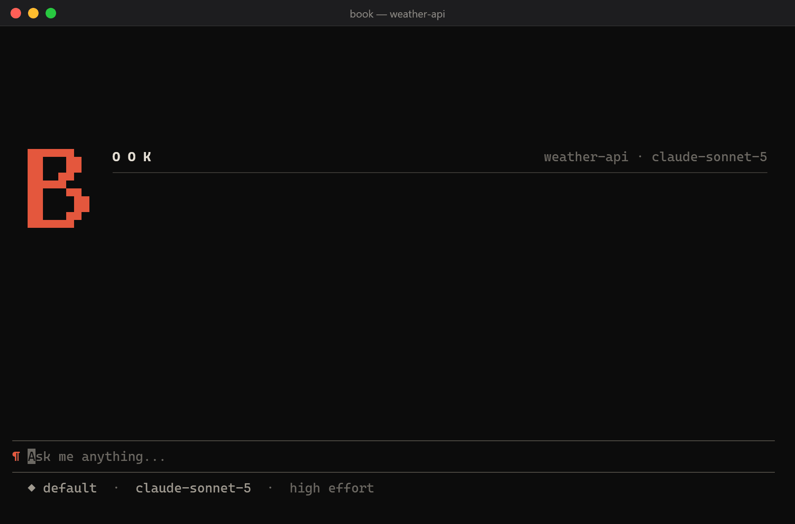
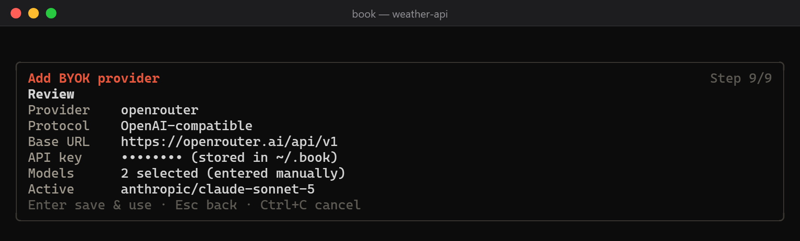
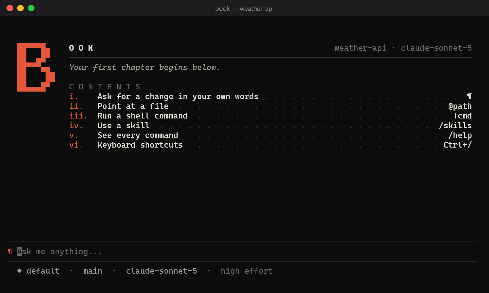
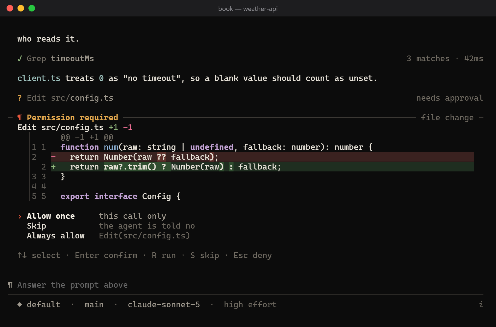

# Book

**An AI coding agent for your terminal. Bring any model.**

Book reads your code, makes the change you ask for, runs your tests, and tells you what it did —
asking before it touches anything. It talks to the Anthropic API and to any OpenAI-compatible
endpoint, so the model is your choice: Claude, GPT, Gemini, GLM, Qwen, a local model, or a router
in front of all of them.

<p align="center">
  
</p>

## Why Book

- **Any model, one workflow.** Anthropic and OpenAI-compatible APIs, with prompt caching and
  thinking effort where the provider has them. Switch models mid-session with `/model`.
- **You stay in charge.** Book asks before it edits a file or runs a command, and shows you the
  exact diff or command first. Allow it once, skip it, or allow that kind of call from then on.
- **Built for long sessions.** Conversations are saved and resumable, compaction keeps long work
  inside the context window without losing what you told it, and `/rewind` takes back a turn —
  code included.
- **It learns your project.** Book reads `AGENTS.md` and `CLAUDE.md` instructions, and keeps a small
  memory of facts and corrections between sessions.
- **Scriptable.** `book -p` runs one prompt with no UI and prints the answer — or JSON — for CI and
  shell scripts. There is a TypeScript SDK too.
- **Extensible.** Your own slash commands, skills, MCP servers, lifecycle hooks, and background
  agents that explore, patch, and validate in isolated worktrees.

## Install

You need **Node.js 22.19 or newer**.

```bash
npm install -g @letrquan/book
book --version
```

The command is `book` (the package is scoped because the plain name was taken on npm).

> **On macOS or Linux?** npm 11 skips install scripts by default, so Book falls back to its
> full-frame renderer, which is correct but redraws more. To get the faster incremental one, run
> `npm approve-scripts @letrquan/book` once, then reinstall (or `npm rebuild @letrquan/book`).

## Connect a model

**The easy way: from inside Book.** Run `book`, type `/model`, and press **Alt+A**. A short wizard
asks for a name, the protocol (OpenAI-compatible or Anthropic), the base URL, and your API key,
then fetches the endpoint's model list so you can pick (or you type the model IDs yourself). It
is saved to `~/.book/settings.json`, so every project can use it.



**Or with environment variables:**

```bash
# Any OpenAI-compatible endpoint (OpenAI, OpenRouter, a local server, …)
export BOOK_API_KEY=sk-...
export BOOK_BASE_URL=https://api.openai.com/v1
export BOOK_MODEL=gpt-5

# Anthropic
export BOOK_API_KEY=sk-ant-...
export BOOK_BASE_URL=https://api.anthropic.com
export BOOK_MODEL=claude-sonnet-5
```

If something is off, `book doctor` checks your setup and says what is missing. It works even
before a key is configured.

## Your first session

Open a terminal in your project and run `book`.



Then just say what you want, in your own words:

```text
The login form accepts an empty password. Find out why and fix it.
```

A few things make the conversation go further:

| Type                     | To                                                       |
| ------------------------ | -------------------------------------------------------- |
| `@path`                  | point Book at a file (its contents go with your message) |
| `!command`               | run a shell command yourself and send its output along   |
| `/`                      | open the command menu (`/help` lists every command)      |
| `Esc`                    | stop the current turn                                    |
| `Enter` while Book works | queue a follow-up; it is sent when the turn ends         |
| `Ctrl+/`                 | show all keyboard shortcuts                              |

When Book wants to change a file or run a command, it stops and shows you exactly what it will do:



Press **Enter** to allow it once, **S** to skip it (Book is told no and carries on), or choose
**Always allow** to stop being asked for that kind of call. `Alt+M` cycles the permission mode
shown at the bottom left — for example _accept edits_, which lets file edits through but still asks
before commands, or _plan_, where Book proposes a plan and changes nothing until you approve it.

## Handy commands

| Command             | What it does                                                 |
| ------------------- | ------------------------------------------------------------ |
| `/help`             | every command, grouped                                       |
| `/model`, `/effort` | switch model or thinking effort                              |
| `/resume`, `/clear` | pick up an earlier session, or start fresh                   |
| `/compact`          | shrink the conversation to free up context                   |
| `/rewind`           | undo back to an earlier turn — conversation, code, or both   |
| `/diff`             | see what changed in the working tree                         |
| `/review`           | review your uncommitted changes (or a branch) for bugs       |
| `/init`             | write a `CLAUDE.md` that tells Book about this project       |
| `/context`, `/cost` | see what fills the context window, and what the session cost |
| `/memory`           | see and manage what Book remembers                           |
| `/permissions`      | see and remove the rules you have allowed or denied          |
| `/agents`           | watch background agents at work                              |

From your shell, `book --continue` resumes the latest session in this directory and
`book --resume <name>` a specific one.

## Use it from scripts

`-p` runs one prompt without the UI and prints only the final answer, so it composes with pipes:

```bash
book -p "What does this codebase do?"
book -p "Write a commit message for the staged changes"
book -p "List the TODOs in src/" --output-format json
```

`--output-format stream-json` emits every event as it happens, and the SDK gives you the same
stream in TypeScript:

```ts
import { query } from '@letrquan/book';

for await (const event of query('Explain this code', { workspace: process.cwd() })) {
  if (event.type === 'text') process.stdout.write(event.content);
}
```

## Make it yours

- **Settings** live in `~/.book/settings.json` (yours), `.book/settings.json` (the project's,
  checked in), and `.book/settings.local.json` (yours, for this checkout). `/config` and
  `book config` edit them.
- **Project instructions** go in `AGENTS.md` or `CLAUDE.md`, in the project or any folder above
  it; `~/.book/AGENTS.md` applies to every project. Files you already wrote for Claude Code or
  Codex work as they are.
- **Custom commands** are Markdown files in `.book/commands/`: `/deploy` runs `deploy.md`.
- **Skills** are folders with a `SKILL.md` in `.book/skills/` (or `.claude/skills/`, or
  `.agents/skills/`) that Book picks up when a task calls for one.
- **MCP servers** add tools: `book mcp add github npx -- -y @modelcontextprotocol/server-github`.
- **Hooks** run your own scripts before or after a tool call, or when a session starts or ends.

A repository cannot quietly switch these on for you: hooks, MCP servers, permission rules, and
shell-running commands that a project declares wait for your one-time approval (`book trust`).

## Documentation

The full reference lives in [`docs/guide/`](docs/guide/README.md):

- [Command line, print mode, and the SDK](docs/guide/cli.md)
- [Configuration](docs/guide/configuration.md) — settings files, every environment variable, themes
- [Tools, permissions, and safety](docs/guide/tools-and-safety.md) — file edits, the shell,
  permission rules and modes, hooks, the sandbox
- [Slash commands and skills](docs/guide/commands-and-skills.md)
- [MCP servers](docs/guide/mcp.md)
- [Managed agents and code review](docs/guide/agents-and-review.md)
- [Long and unattended runs](docs/guide/long-runs.md) — continuation, compaction, carried
  constraints
- [Feature reference](docs/guide/features.md) — everything in one list

What works today is tracked in [docs/current-state.md](docs/current-state.md), what is next in
[MILESTONES.md](MILESTONES.md), and what changed in [CHANGELOG.md](CHANGELOG.md).

## Contributing

```bash
git clone https://github.com/letrquan/book.git
cd book
npm install
npm run build
npm link        # your checkout's `book` becomes the global one
npm run check   # format, lint, types, architecture, unit and contract tests
```

See [Developing Book](docs/guide/development.md) for the test tiers, benchmarks, and releases.
Bugs and ideas go to [GitHub Issues](https://github.com/letrquan/book/issues).

## License

Copyright (c) 2026 letrquan.

[PolyForm Small Business License 1.0.0](LICENSE). Source-available: read it, change it, and use it
for your own work or your company's, provided the company has fewer than 100 people and under
1,000,000 USD (2019, inflation-adjusted) revenue in the prior tax year. Larger companies, and anyone
wanting terms beyond that, need a separate licence — open an issue.

This is not an open-source licence: it restricts who may use the software commercially. It does not
restrict reading, modifying, or redistributing it under the same terms.
