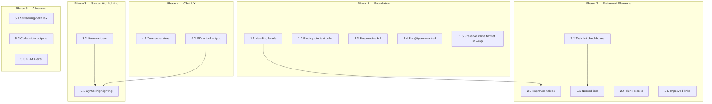

# Plan: Improve AI Agent Message & Markdown Rendering

**Date:** 2026-07-09  
**Status:** Draft  
**Scope:** `src/tui/components/MarkdownBlock.tsx`, `AgentMessage.tsx`, `ChatPanel.tsx`, theme system, and related files

---

## Current State Analysis

The current rendering pipeline works as:

```
Raw markdown string (message.content)
  → marked.lexer() tokenization (in MarkdownBlock.tsx)
  → Custom renderBlockToken() / renderInlineTokens() → Ink <Text>/<Box> components
```

### What Works Well
- ✅ `marked.lexer()` tokenization is solid (no HTML generation overhead)
- ✅ `useThrottledValue` hook prevents over-re-lexing during streaming (~17×/sec cap)
- ✅ Theme system with `ThemeTokens` for markdown-specific colors (md* tokens)
- ✅ Word-wrapping for paragraphs and list items
- ✅ Code blocks with rounded borders and background colors
- ✅ Basic inline formatting (bold, italic, strikethrough, code, links)
- ✅ `trimPartialClosingFences` prevents streaming jitter
- ✅ `React.memo` with custom comparator on AgentMessage avoids unnecessary re-renders
- ✅ Tool call grouping (consecutive same-name calls collapsed)

### What Needs Improvement

| Area | Issue | Severity |
|------|-------|----------|
| **Code blocks** | No syntax highlighting — just monochrome `mdCodeText` | High |
| **Headings** | All heading levels (h1–h6) render identically (bold, same color) | Medium |
| **Nested lists** | Sublists are flat — no recursive indentation | Medium |
| **Tables** | No separator row, no alignment, no borders | Medium |
| **Inline code** | Only background color, no padding/spacing cues | Low |
| **Links** | Show underlined text only — no URL hint, no clickability | Low |
| **Blockquotes** | No text color differentiation (uses `theme.text`, not `mdBlockquoteText`) | Low |
| **Think blocks** | No rendering for `<think>` / reasoning blocks from models | Medium |
| **Task lists** | No `- [x]` / `- [ ]` checkbox rendering | Low |
| **Paragraph wrapping** | Word-wrap path flattens inline tokens to raw text (loses bold/italic) | Medium |
| **`@types/marked` mismatch** | Package is `@types/marked@^5.0.2` but `marked` is `^18.0.5` | Low |
| **HR width** | Hardcoded `repeat(40)` instead of adapting to `terminalWidth` | Low |

---

## Plan Phases

### Phase 1: Foundation Fixes (Low Risk, High Impact)

> Quick wins that fix bugs and inconsistencies without architectural changes.

#### 1.1 — Differentiate heading levels (h1–h6)

**File:** [MarkdownBlock.tsx](file:///I:/MyProject/02-AI-ML-Projects/book/src/tui/components/MarkdownBlock.tsx#L200-L209)

Currently all headings render as `<Text bold color={theme.mdHeading}>`. Add visual differentiation:

```
h1: ═══ HEADING ═══  (double-line border, bold, brand color)
h2: ── Heading ──    (single-line border, bold, mdHeading color)
h3: ### Heading      (prefix marker, bold)
h4–h6: #### Heading  (prefix marker, bold, dimmed progressively)
```

**Changes:**
- Add `mdHeadingH1`, `mdHeadingH2` to `ThemeTokens` (or reuse `brand` for h1)
- Update `renderBlockToken` `case 'heading'` to branch on `t.depth`

#### 1.2 — Fix blockquote text color

**File:** [MarkdownBlock.tsx](file:///I:/MyProject/02-AI-ML-Projects/book/src/tui/components/MarkdownBlock.tsx#L269-L283)

Blockquotes already have `mdBlockquoteText` in the theme but the inner tokens still render with `theme.text`. Wrap in a context or pass a color override to `renderBlockToken` for blockquote children.

#### 1.3 — Responsive horizontal rules

**File:** [MarkdownBlock.tsx](file:///I:/MyProject/02-AI-ML-Projects/book/src/tui/components/MarkdownBlock.tsx#L339-L347)

Replace `'─'.repeat(40)` with `'─'.repeat(Math.min(terminalWidth ?? 40, 60))`.

#### 1.4 — Fix `@types/marked` version mismatch

**File:** [package.json](file:///I:/MyProject/02-AI-ML-Projects/book/package.json#L34)

Move `@types/marked` to devDependencies and update to match `marked@^18`. Since `marked` v18 ships its own types, the `@types/marked` package may be removable entirely.

#### 1.5 — Preserve inline formatting in word-wrapped paragraphs

**File:** [MarkdownBlock.tsx](file:///I:/MyProject/02-AI-ML-Projects/book/src/tui/components/MarkdownBlock.tsx#L211-L234)

The `terminalWidth` word-wrap path currently flattens all inline tokens to raw `.text` — losing **bold**, *italic*, and `code` formatting. Fix by:
1. Building a flat array of `{ text, style }` runs from `renderInlineTokens`
2. Feeding the concatenated text to `wordWrap()`
3. Re-slicing the styled runs to match wrapped line boundaries

---

### Phase 2: Enhanced Markdown Elements (Medium Risk)

#### 2.1 — Nested list support

**File:** [MarkdownBlock.tsx](file:///I:/MyProject/02-AI-ML-Projects/book/src/tui/components/MarkdownBlock.tsx#L286-L337)

`marked.lexer()` already parses nested lists — list item tokens can contain child `list` tokens. The current code only handles `text` and falls through to `renderBlockToken` for other types, which should handle nested lists. Verify and fix:

- Ensure `case 'list'` in `renderBlockToken` respects depth by tracking an `indent` parameter
- Pass `depth` through the recursive calls and increase `marginLeft` by `2 * depth`

#### 2.2 — Task list checkboxes

**File:** [MarkdownBlock.tsx](file:///I:/MyProject/02-AI-ML-Projects/book/src/tui/components/MarkdownBlock.tsx#L286-L337)

`marked` tokens include `item.task: true` and `item.checked: boolean`. Render:
- `☑` (green) for checked items
- `☐` (gray) for unchecked items

Replace the bullet/number marker when `item.task === true`.

#### 2.3 — Improved table rendering

**File:** [MarkdownBlock.tsx](file:///I:/MyProject/02-AI-ML-Projects/book/src/tui/components/MarkdownBlock.tsx#L349-L383)

Add:
- A separator row after the header (`─` characters)
- Column alignment support (`t.align[]` — left/center/right)
- Unicode box-drawing borders (`│`, `─`, `┌`, `┐`, etc.) for cleaner look
- Theme token `mdTableBorder` for border color

#### 2.4 — Think/reasoning block rendering

**File:** New logic in [MarkdownBlock.tsx](file:///I:/MyProject/02-AI-ML-Projects/book/src/tui/components/MarkdownBlock.tsx) or [AgentMessage.tsx](file:///I:/MyProject/02-AI-ML-Projects/book/src/tui/components/AgentMessage.tsx)

Some models (Claude, DeepSeek) emit `<think>...</think>` blocks. These arrive as `html` tokens from `marked.lexer()`. Add:

1. A pre-processing step in `AgentMessage` that extracts `<think>` blocks before passing to `MarkdownBlock`
2. Render think blocks as a collapsible, dimmed section with a `💭 Thinking...` header
3. Add `mdThinkBg`, `mdThinkBorder`, `mdThinkText` to `ThemeTokens`

#### 2.5 — Improved link rendering

**File:** [MarkdownBlock.tsx](file:///I:/MyProject/02-AI-ML-Projects/book/src/tui/components/MarkdownBlock.tsx#L144-L151)

Currently only shows underlined text. Add the URL in parentheses when different from text:
```
Text (https://example.com)
```
Use OSC 8 hyperlink escape if terminal supports it (wrap with `\e]8;;URL\e\\text\e]8;;\e\\`).

---

### Phase 3: Code Block Syntax Highlighting (High Impact, Higher Risk)

#### 3.1 — Add syntax highlighting to fenced code blocks

**Files:**
- New: `src/tui/components/syntax-highlight.ts` 
- Modified: [MarkdownBlock.tsx](file:///I:/MyProject/02-AI-ML-Projects/book/src/tui/components/MarkdownBlock.tsx#L237-L267)

**Approach Options:**

| Option | Library | Bundle Size | Languages | Perf |
|--------|---------|-------------|-----------|------|
| A (Recommended) | `cli-highlight` | ~50KB | 190+ (highlight.js) | Fast, built for terminals |
| B | Custom regex tokenizer | 0 (zero-dep) | ~10 common langs | Fastest, limited coverage |
| C | `shiki` (via WASM) | ~2MB | 200+ (TextMate grammars) | Accurate, heavy init |

**Recommended:** Option A (`cli-highlight`) — it's purpose-built for terminal output and wraps `highlight.js` with ANSI color output. Alternatively, Option B for zero-dependency with a custom tokenizer for the top 10 languages (JS/TS, Python, Rust, Go, Bash, JSON, YAML, SQL, CSS, HTML).

**Implementation:**
1. Create `syntax-highlight.ts` with a `highlightCode(code: string, lang: string): StyledLine[]` function
2. Each `StyledLine` is an array of `{ text: string, color: string }` segments
3. Memoize the highlight result keyed by `code + lang` (avoid re-highlighting during streaming)
4. In `renderBlockToken case 'code'`, replace monochrome text with highlighted segments
5. Add theme tokens: `mdCodeKeyword`, `mdCodeString`, `mdCodeComment`, `mdCodeNumber`, `mdCodeFunction` (or keep it simple with a single `syntaxTheme` setting)

**Performance guard:** Highlight only the *final* content (not streaming intermediate). While streaming, show monochrome; on stream completion, re-render with highlighting.

#### 3.2 — Line numbers in code blocks (optional)

Add opt-in line numbers for code blocks > 5 lines:
```
 1 │ function hello() {
 2 │   return "world";
 3 │ }
```

Add `mdCodeLineNumber` theme token. Gutter width is `Math.ceil(Math.log10(lineCount + 1))` chars.

---

### Phase 4: Chat-Level UX Improvements (Medium Risk)

#### 4.1 — Visual conversation turn separator

**File:** [ChatPanel.tsx](file:///I:/MyProject/02-AI-ML-Projects/book/src/tui/components/ChatPanel.tsx#L218-L232)

Add a subtle divider or timestamp between conversation turns:
```
── 14:22 ─────────────────────────
```

Add `mdTurnSeparator` theme token.

#### 4.2 — Markdown rendering in tool call output

**File:** [ToolCallBlock.tsx](file:///I:/MyProject/02-AI-ML-Projects/book/src/tui/components/ToolCallBlock.tsx)

Tool outputs (e.g., WebFetch, Read) contain markdown or code but are rendered as plain text. For expanded tool results:
- If the output looks like code (Read tool), render with syntax highlighting
- If the output is from WebFetch, render as markdown via `<MarkdownBlock>`

#### 4.3 — Copy-to-clipboard hint for code blocks

Show a subtle `[Copy: code]` hint or keybinding when a code block is in view. This requires tracking which code block is "focused" (cursor proximity), which is complex in Ink. **Defer to Phase 5.**

---

### Phase 5: Advanced & Polish (Lower Priority)

#### 5.1 — Streaming-aware progressive markdown rendering
Currently, `useThrottledValue` throttles the entire content string. Optimize to only re-lex the *delta* (new tokens at the end) rather than re-parsing the full content.

#### 5.2 — Collapsible long outputs
For agent messages or tool results over N lines, render a summary with an expand/collapse toggle.

#### 5.3 — GFM Alerts
Detect GitHub-style alert blocks (`> [!NOTE]`, `> [!WARNING]`, etc.) inside blockquotes and render them with colored borders and icons:
- `ℹ️ NOTE` — blue border
- `⚠️ WARNING` — yellow border
- `🔴 CAUTION` — red border

#### 5.4 — Footnotes
Render `[^1]` references and footnote definitions at the bottom with superscript-style numbering.

---

## Execution Order & Dependency Graph



## Files to be Modified

| File | Changes |
|------|---------|
| [MarkdownBlock.tsx](file:///I:/MyProject/02-AI-ML-Projects/book/src/tui/components/MarkdownBlock.tsx) | Core rendering improvements (Phases 1–3) |
| [AgentMessage.tsx](file:///I:/MyProject/02-AI-ML-Projects/book/src/tui/components/AgentMessage.tsx) | Think block extraction, line numbers toggle |
| [ChatPanel.tsx](file:///I:/MyProject/02-AI-ML-Projects/book/src/tui/components/ChatPanel.tsx) | Turn separators |
| [ToolCallBlock.tsx](file:///I:/MyProject/02-AI-ML-Projects/book/src/tui/components/ToolCallBlock.tsx) | Markdown in tool output |
| [types.ts](file:///I:/MyProject/02-AI-ML-Projects/book/src/types.ts) | New ThemeTokens |
| [theme.ts](file:///I:/MyProject/02-AI-ML-Projects/book/src/tui/theme.ts) | Light theme token values |
| [package.json](file:///I:/MyProject/02-AI-ML-Projects/book/package.json) | Fix @types/marked, optional syntax highlight dep |
| New: `syntax-highlight.ts` | Syntax highlighting engine |
| [MarkdownBlock.test.tsx](file:///I:/MyProject/02-AI-ML-Projects/book/src/tui/components/MarkdownBlock.test.tsx) | Updated tests for all new rendering |

## New Theme Tokens

```typescript
// Add to ThemeTokens interface in types.ts
mdHeadingH1: string;       // h1 color (brand color for emphasis)
mdHeadingH2: string;       // h2 color
mdTableBorder: string;     // table border/separator color
mdThinkBg: string;         // think block background
mdThinkBorder: string;     // think block border
mdThinkText: string;       // think block text
mdCodeLineNumber: string;  // line number gutter color
mdTurnSeparator: string;   // conversation turn separator
mdCheckboxChecked: string; // task list checked color
mdCheckboxUnchecked: string; // task list unchecked color
mdAlertNote: string;       // GFM alert: note
mdAlertWarning: string;    // GFM alert: warning
mdAlertCaution: string;    // GFM alert: caution
```

## Testing Strategy

- **Unit tests:** Update [MarkdownBlock.test.tsx](file:///I:/MyProject/02-AI-ML-Projects/book/src/tui/components/MarkdownBlock.test.tsx) for each new rendering case
- **Snapshot tests:** Add ink-testing-library snapshot comparisons for complex elements (tables, nested lists, think blocks)
- **Benchmark:** Update [ui.bench.tsx](file:///I:/MyProject/02-AI-ML-Projects/book/src/tui/__benchmarks__/ui.bench.tsx) to cover syntax highlighting perf
- **Manual:** Visual verification with sample markdown covering all elements

## Risk Assessment

| Risk | Mitigation |
|------|------------|
| Syntax highlighting slows streaming | Only highlight on final render; stream in monochrome |
| New dependency (`cli-highlight`) increases bundle | Option B (custom tokenizer) as fallback |
| Theme token explosion | Group under namespaced objects if count grows |
| Breaking existing tests | Phased rollout, one PR per phase |
