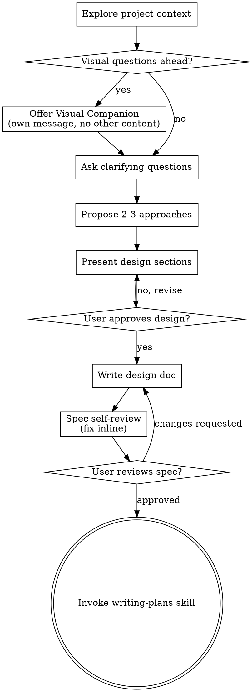

# Command code inspection

**Session ID:** ses_1039fd0a7ffeR89Pq7q0Gpxjeb
**Created:** 6/25/2026, 8:23:42 AM
**Updated:** 6/25/2026, 9:51:04 AM

---

## User

Check cmdc command code on current machine, which language which it use to write code

---

## Assistant (Build · glm-5.2 · 10.6s)

**Tool: bash**

**Input:**
```json
{
  "command": "where cmdc",
  "description": "Find cmdc executable location"
}
```

**Output:**
```
(no output)
```

---

## Assistant (Build · glm-5.2 · 5.5s)

**Tool: bash**

**Input:**
```json
{
  "command": "Get-Command cmdc -ErrorAction SilentlyContinue | Format-List *",
  "description": "Search for cmdc command in PowerShell"
}
```

**Output:**
```

HelpUri            : 
Path               : I:\Tools\npm-global\cmdc.ps1
Definition         : I:\Tools\npm-global\cmdc.ps1
Source             : I:\Tools\npm-global\cmdc.ps1
Visibility         : Public
ScriptBlock        : #!/usr/bin/env pwsh
                     $basedir=Split-Path $MyInvocation.MyCommand.Definition -Parent
                     
                     $exe=""
                     if ($PSVersionTable.PSVersion -lt "6.0" -or $IsWindows) {
                       # Fix case when both the Windows and Linux builds of Node
                       # are installed in the same directory
                       $exe=".exe"
                     }
                     $ret=0
                     if (Test-Path "$basedir/node$exe") {
                       # Support pipeline input
                       if ($MyInvocation.ExpectingInput) {
                         $input | & "$basedir/node$exe"  "$basedir/node_modules/command-code/dist/index.mjs" $args
                       } else {
                         & "$basedir/node$exe"  "$basedir/node_modules/command-code/dist/index.mjs" $args
                       }
                       $ret=$LASTEXITCODE
                     } else {
                       # Support pipeline input
                       if ($MyInvocation.ExpectingInput) {
                         $input | & "node$exe"  "$basedir/node_modules/command-code/dist/index.mjs" $args
                       } else {
                         & "node$exe"  "$basedir/node_modules/command-code/dist/index.mjs" $args
                       }
                       $ret=$LASTEXITCODE
                     }
                     exit $ret
                     
OutputType         : {}
ScriptContents     : #!/usr/bin/env pwsh
                     $basedir=Split-Path $MyInvocation.MyCommand.Definition -Parent
                     
                     $exe=""
                     if ($PSVersionTable.PSVersion -lt "6.0" -or $IsWindows) {
                       # Fix case when both the Windows and Linux builds of Node
                       # are installed in the same directory
                       $exe=".exe"
                     }
                     $ret=0
                     if (Test-Path "$basedir/node$exe") {
                       # Support pipeline input
                       if ($MyInvocation.ExpectingInput) {
                         $input | & "$basedir/node$exe"  "$basedir/node_modules/command-code/dist/index.mjs" $args
                       } else {
                         & "$basedir/node$exe"  "$basedir/node_modules/command-code/dist/index.mjs" $args
                       }
                       $ret=$LASTEXITCODE
                     } else {
                       # Support pipeline input
                       if ($MyInvocation.ExpectingInput) {
                         $input | & "node$exe"  "$basedir/node_modules/command-code/dist/index.mjs" $args
                       } else {
                         & "node$exe"  "$basedir/node_modules/command-code/dist/index.mjs" $args
                       }
                       $ret=$LASTEXITCODE
                     }
                     exit $ret
                     
OriginalEncoding   : System.Text.UTF8Encoding+UTF8EncodingSealed
Name               : cmdc.ps1
CommandType        : ExternalScript
Version            : 
ModuleName         : 
Module             : 
RemotingCapability : PowerShell
Parameters         : {}
ParameterSets      : {}


```

---

## Assistant (Build · glm-5.2 · 20.9s)

`cmdc` is a Node.js-based CLI tool. The entry point is `I:\Tools\npm-global\node_modules\command-code\dist\index.mjs` — an ES module (`.mjs`) written in **JavaScript/Node.js**, invoked via a PowerShell wrapper script (`cmdc.ps1`).

---

## User

it fully writtern in js ?

---

## Assistant (Build · glm-5.2 · 10.8s)

**Tool: bash**

**Input:**
```json
{
  "command": "Get-ChildItem -Path \"I:\\Tools\\npm-global\\node_modules\\command-code\" -Recurse -File | Select-Object Extension, FullName",
  "description": "List all files in command-code package"
}
```

**Output:**
```
...output truncated...

Full output saved to: C:\Users\ADMIN\.local\share\opencode\tool-output\tool_efc614d9d001TkFZeMRHEu5adC

.ts       I:\Tools\npm-global\node_modules\command-code\node_modules\zod\src\v4\core\to-json-schema.ts
.ts       I:\Tools\npm-global\node_modules\command-code\node_modules\zod\src\v4\core\util.ts
.ts       I:\Tools\npm-global\node_modules\command-code\node_modules\zod\src\v4\core\versions.ts
.ts       I:\Tools\npm-global\node_modules\command-code\node_modules\zod\src\v4\core\zsf.ts
.ts       I:\Tools\npm-global\node_modules\command-code\node_modules\zod\src\v4\core\tests\extend.test.ts
.ts       I:\Tools\npm-global\node_modules\command-code\node_modules\zod\src\v4\core\tests\index.test.ts
.ts       I:\Tools\npm-global\node_modules\command-code\node_modules\zod\src\v4\core\tests\record-constructor.test.ts
.ts       I:\Tools\npm-global\node_modules\command-code\node_modules\zod\src\v4\core\tests\recursive-tuples.test.ts
.ts       I:\Tools\npm-global\node_modules\command-code\node_modules\zod\src\v4\core\tests\locales\be.test.ts
.ts       I:\Tools\npm-global\node_modules\command-code\node_modules\zod\src\v4\core\tests\locales\el.test.ts
.ts       I:\Tools\npm-global\node_modules\command-code\node_modules\zod\src\v4\core\tests\locales\en.test.ts
.ts       I:\Tools\npm-global\node_modules\command-code\node_modules\zod\src\v4\core\tests\locales\es.test.ts
.ts       I:\Tools\npm-global\node_modules\command-code\node_modules\zod\src\v4\core\tests\locales\fr.test.ts
.ts       I:\Tools\npm-global\node_modules\command-code\node_modules\zod\src\v4\core\tests\locales\he.test.ts
.ts       I:\Tools\npm-global\node_modules\command-code\node_modules\zod\src\v4\core\tests\locales\hr.test.ts
.ts       I:\Tools\npm-global\node_modules\command-code\node_modules\zod\src\v4\core\tests\locales\nl.test.ts
.ts       I:\Tools\npm-global\node_modules\command-code\node_modules\zod\src\v4\core\tests\locales\ru.test.ts
.ts       I:\Tools\npm-global\node_modules\command-code\node_modules\zod\src\v4\core\tests\locales\tr.test.ts
.ts       I:\Tools\npm-global\node_modules\command-code\node_modules\zod\src\v4\core\tests\locales\uz.test.ts
.ts       I:\Tools\npm-global\node_modules\command-code\node_modules\zod\src\v4\locales\ar.ts
.ts       I:\Tools\npm-global\node_modules\command-code\node_modules\zod\src\v4\locales\az.ts
.ts       I:\Tools\npm-global\node_modules\command-code\node_modules\zod\src\v4\locales\be.ts
.ts       I:\Tools\npm-global\node_modules\command-code\node_modules\zod\src\v4\locales\bg.ts
.ts       I:\Tools\npm-global\node_modules\command-code\node_modules\zod\src\v4\locales\ca.ts
.ts       I:\Tools\npm-global\node_modules\command-code\node_modules\zod\src\v4\locales\cs.ts
.ts       I:\Tools\npm-global\node_modules\command-code\node_modules\zod\src\v4\locales\da.ts
.ts       I:\Tools\npm-global\node_modules\command-code\node_modules\zod\src\v4\locales\de.ts
.ts       I:\Tools\npm-global\node_modules\command-code\node_modules\zod\src\v4\locales\el.ts
.ts       I:\Tools\npm-global\node_modules\command-code\node_modules\zod\src\v4\locales\en.ts
.ts       I:\Tools\npm-global\node_modules\command-code\node_modules\zod\src\v4\locales\eo.ts
.ts       I:\Tools\npm-global\node_modules\command-code\node_modules\zod\src\v4\locales\es.ts
.ts       I:\Tools\npm-global\node_modules\command-code\node_modules\zod\src\v4\locales\fa.ts
.ts       I:\Tools\npm-global\node_modules\command-code\node_modules\zod\src\v4\locales\fi.ts
.ts       I:\Tools\npm-global\node_modules\command-code\node_modules\zod\src\v4\locales\fr-CA.ts
.ts       I:\Tools\npm-global\node_modules\command-code\node_modules\zod\src\v4\locales\fr.ts
.ts       I:\Tools\npm-global\node_modules\command-code\node_modules\zod\src\v4\locales\he.ts
.ts       I:\Tools\npm-global\node_modules\command-code\node_modules\zod\src\v4\locales\hr.ts
.ts       I:\Tools\npm-global\node_modules\command-code\node_modules\zod\src\v4\locales\hu.ts
.ts       I:\Tools\npm-global\node_modules\command-code\node_modules\zod\src\v4\locales\hy.ts
.ts       I:\Tools\npm-global\node_modules\command-code\node_modules\zod\src\v4\locales\id.ts
.ts       I:\Tools\npm-global\node_modules\command-code\node_modules\zod\src\v4\locales\index.ts
.ts       I:\Tools\npm-global\node_modules\command-code\node_modules\zod\src\v4\locales\is.ts
.ts       I:\Tools\npm-global\node_modules\command-code\node_modules\zod\src\v4\locales\it.ts
.ts       I:\Tools\npm-global\node_modules\command-code\node_modules\zod\src\v4\locales\ja.ts
.ts       I:\Tools\npm-global\node_modules\command-code\node_modules\zod\src\v4\locales\ka.ts
.ts       I:\Tools\npm-global\node_modules\command-code\node_modules\zod\src\v4\locales\kh.ts
.ts       I:\Tools\npm-global\node_modules\command-code\node_modules\zod\src\v4\locales\km.ts
.ts       I:\Tools\npm-global\node_modules\command-code\node_modules\zod\src\v4\locales\ko.ts
.ts       I:\Tools\npm-global\node_modules\command-code\node_modules\zod\src\v4\locales\lt.ts
.ts       I:\Tools\npm-global\node_modules\command-code\node_modules\zod\src\v4\locales\mk.ts
.ts       I:\Tools\npm-global\node_modules\command-code\node_modules\zod\src\v4\locales\ms.ts
.ts       I:\Tools\npm-global\node_modules\command-code\node_modules\zod\src\v4\locales\nl.ts
.ts       I:\Tools\npm-global\node_modules\command-code\node_modules\zod\src\v4\locales\no.ts
.ts       I:\Tools\npm-global\node_modules\command-code\node_modules\zod\src\v4\locales\ota.ts
.ts       I:\Tools\npm-global\node_modules\command-code\node_modules\zod\src\v4\locales\pl.ts
.ts       I:\Tools\npm-global\node_modules\command-code\node_modules\zod\src\v4\locales\ps.ts
.ts       I:\Tools\npm-global\node_modules\command-code\node_modules\zod\src\v4\locales\pt.ts
.ts       I:\Tools\npm-global\node_modules\command-code\node_modules\zod\src\v4\locales\ro.ts
.ts       I:\Tools\npm-global\node_modules\command-code\node_modules\zod\src\v4\locales\ru.ts
.ts       I:\Tools\npm-global\node_modules\command-code\node_modules\zod\src\v4\locales\sl.ts
.ts       I:\Tools\npm-global\node_modules\command-code\node_modules\zod\src\v4\locales\sv.ts
.ts       I:\Tools\npm-global\node_modules\command-code\node_modules\zod\src\v4\locales\ta.ts
.ts       I:\Tools\npm-global\node_modules\command-code\node_modules\zod\src\v4\locales\th.ts
.ts       I:\Tools\npm-global\node_modules\command-code\node_modules\zod\src\v4\locales\tr.ts
.ts       I:\Tools\npm-global\node_modules\command-code\node_modules\zod\src\v4\locales\ua.ts
.ts       I:\Tools\npm-global\node_modules\command-code\node_modules\zod\src\v4\locales\uk.ts
.ts       I:\Tools\npm-global\node_modules\command-code\node_modules\zod\src\v4\locales\ur.ts
.ts       I:\Tools\npm-global\node_modules\command-code\node_modules\zod\src\v4\locales\uz.ts
.ts       I:\Tools\npm-global\node_modules\command-code\node_modules\zod\src\v4\locales\vi.ts
.ts       I:\Tools\npm-global\node_modules\command-code\node_modules\zod\src\v4\locales\yo.ts
.ts       I:\Tools\npm-global\node_modules\command-code\node_modules\zod\src\v4\locales\zh-CN.ts
.ts       I:\Tools\npm-global\node_modules\command-code\node_modules\zod\src\v4\locales\zh-TW.ts
.ts       I:\Tools\npm-global\node_modules\command-code\node_modules\zod\src\v4\mini\checks.ts
.ts       I:\Tools\npm-global\node_modules\command-code\node_modules\zod\src\v4\mini\coerce.ts
.ts       I:\Tools\npm-global\node_modules\command-code\node_modules\zod\src\v4\mini\external.ts
.ts       I:\Tools\npm-global\node_modules\command-code\node_modules\zod\src\v4\mini\index.ts
.ts       I:\Tools\npm-global\node_modules\command-code\node_modules\zod\src\v4\mini\iso.ts
.ts       I:\Tools\npm-global\node_modules\command-code\node_modules\zod\src\v4\mini\parse.ts
.ts       I:\Tools\npm-global\node_modules\command-code\node_modules\zod\src\v4\mini\schemas.ts
.ts       I:\Tools\npm-global\node_modules\command-code\node_modules\zod\src\v4\mini\tests\apply.test.ts
.ts       I:\Tools\npm-global\node_modules\command-code\node_modules\zod\src\v4\mini\tests\assignability.test.ts
.ts       I:\Tools\npm-global\node_modules\command-code\node_modules\zod\src\v4\mini\tests\brand.test.ts
.ts       I:\Tools\npm-global\node_modules\command-code\node_modules\zod\src\v4\mini\tests\checks.test.ts
.ts       I:\Tools\npm-global\node_modules\command-code\node_modules\zod\src\v4\mini\tests\codec.test.ts
.ts       I:\Tools\npm-global\node_modules\command-code\node_modules\zod\src\v4\mini\tests\computed.test.ts
.ts       I:\Tools\npm-global\node_modules\command-code\node_modules\zod\src\v4\mini\tests\error.test.ts
.ts       I:\Tools\npm-global\node_modules\command-code\node_modules\zod\src\v4\mini\tests\functions.test.ts
.ts       I:\Tools\npm-global\node_modules\command-code\node_modules\zod\src\v4\mini\tests\index.test.ts
.ts       I:\Tools\npm-global\node_modules\command-code\node_modules\zod\src\v4\mini\tests\number.test.ts
.ts       I:\Tools\npm-global\node_modules\command-code\node_modules\zod\src\v4\mini\tests\object.test.ts
.ts       I:\Tools\npm-global\node_modules\command-code\node_modules\zod\src\v4\mini\tests\prototypes.test.ts
.ts       I:\Tools\npm-global\node_modules\command-code\node_modules\zod\src\v4\mini\tests\recursive-types.test.ts
.ts       I:\Tools\npm-global\node_modules\command-code\node_modules\zod\src\v4\mini\tests\standard-schema.test.ts
.ts       I:\Tools\npm-global\node_modules\command-code\node_modules\zod\src\v4\mini\tests\string.test.ts
.ts       I:\Tools\npm-global\node_modules\command-code\node_modules\zod\src\v4-mini\index.ts
.cjs      I:\Tools\npm-global\node_modules\command-code\node_modules\zod\v3\errors.cjs
.cts      I:\Tools\npm-global\node_modules\command-code\node_modules\zod\v3\errors.d.cts
.ts       I:\Tools\npm-global\node_modules\command-code\node_modules\zod\v3\errors.d.ts
.js       I:\Tools\npm-global\node_modules\command-code\node_modules\zod\v3\errors.js
.cjs      I:\Tools\npm-global\node_modules\command-code\node_modules\zod\v3\external.cjs
.cts      I:\Tools\npm-global\node_modules\command-code\node_modules\zod\v3\external.d.cts
.ts       I:\Tools\npm-global\node_modules\command-code\node_modules\zod\v3\external.d.ts
.js       I:\Tools\npm-global\node_modules\command-code\node_modules\zod\v3\external.js
.cjs      I:\Tools\npm-global\node_modules\command-code\node_modules\zod\v3\index.cjs
.cts      I:\Tools\npm-global\node_modules\command-code\node_modules\zod\v3\index.d.cts
.ts       I:\Tools\npm-global\node_modules\command-code\node_modules\zod\v3\index.d.ts
.js       I:\Tools\npm-global\node_modules\command-code\node_modules\zod\v3\index.js
.json     I:\Tools\npm-global\node_modules\command-code\node_modules\zod\v3\package.json
.cjs      I:\Tools\npm-global\node_modules\command-code\node_modules\zod\v3\standard-schema.cjs
.cts      I:\Tools\npm-global\node_modules\command-code\node_modules\zod\v3\standard-schema.d.cts
.ts       I:\Tools\npm-global\node_modules\command-code\node_modules\zod\v3\standard-schema.d.ts
.js       I:\Tools\npm-global\node_modules\command-code\node_modules\zod\v3\standard-schema.js
.cjs      I:\Tools\npm-global\node_modules\command-code\node_modules\zod\v3\types.cjs
.cts      I:\Tools\npm-global\node_modules\command-code\node_modules\zod\v3\types.d.cts
.ts       I:\Tools\npm-global\node_modules\command-code\node_modules\zod\v3\types.d.ts
.js       I:\Tools\npm-global\node_modules\command-code\node_modules\zod\v3\types.js
.cjs      I:\Tools\npm-global\node_modules\command-code\node_modules\zod\v3\ZodError.cjs
.cts      I:\Tools\npm-global\node_modules\command-code\node_modules\zod\v3\ZodError.d.cts
.ts       I:\Tools\npm-global\node_modules\command-code\node_modules\zod\v3\ZodError.d.ts
.js       I:\Tools\npm-global\node_modules\command-code\node_modules\zod\v3\ZodError.js
.cjs      I:\Tools\npm-global\node_modules\command-code\node_modules\zod\v3\helpers\enumUtil.cjs
.cts      I:\Tools\npm-global\node_modules\command-code\node_modules\zod\v3\helpers\enumUtil.d.cts
.ts       I:\Tools\npm-global\node_modules\command-code\node_modules\zod\v3\helpers\enumUtil.d.ts
.js       I:\Tools\npm-global\node_modules\command-code\node_modules\zod\v3\helpers\enumUtil.js
.cjs      I:\Tools\npm-global\node_modules\command-code\node_modules\zod\v3\helpers\errorUtil.cjs
.cts      I:\Tools\npm-global\node_modules\command-code\node_modules\zod\v3\helpers\errorUtil.d.cts
.ts       I:\Tools\npm-global\node_modules\command-code\node_modules\zod\v3\helpers\errorUtil.d.ts
.js       I:\Tools\npm-global\node_modules\command-code\node_modules\zod\v3\helpers\errorUtil.js
.cjs      I:\Tools\npm-global\node_modules\command-code\node_modules\zod\v3\helpers\parseUtil.cjs
.cts      I:\Tools\npm-global\node_modules\command-code\node_modules\zod\v3\helpers\parseUtil.d.cts
.ts       I:\Tools\npm-global\node_modules\command-code\node_modules\zod\v3\helpers\parseUtil.d.ts
.js       I:\Tools\npm-global\node_modules\command-code\node_modules\zod\v3\helpers\parseUtil.js
.cjs      I:\Tools\npm-global\node_modules\command-code\node_modules\zod\v3\helpers\partialUtil.cjs
.cts      I:\Tools\npm-global\node_modules\command-code\node_modules\zod\v3\helpers\partialUtil.d.cts
.ts       I:\Tools\npm-global\node_modules\command-code\node_modules\zod\v3\helpers\partialUtil.d.ts
.js       I:\Tools\npm-global\node_modules\command-code\node_modules\zod\v3\helpers\partialUtil.js
.cjs      I:\Tools\npm-global\node_modules\command-code\node_modules\zod\v3\helpers\typeAliases.cjs
.cts      I:\Tools\npm-global\node_modules\command-code\node_modules\zod\v3\helpers\typeAliases.d.cts
.ts       I:\Tools\npm-global\node_modules\command-code\node_modules\zod\v3\helpers\typeAliases.d.ts
.js       I:\Tools\npm-global\node_modules\command-code\node_modules\zod\v3\helpers\typeAliases.js
.cjs      I:\Tools\npm-global\node_modules\command-code\node_modules\zod\v3\helpers\util.cjs
.cts      I:\Tools\npm-global\node_modules\command-code\node_modules\zod\v3\helpers\util.d.cts
.ts       I:\Tools\npm-global\node_modules\command-code\node_modules\zod\v3\helpers\util.d.ts
.js       I:\Tools\npm-global\node_modules\command-code\node_modules\zod\v3\helpers\util.js
.cjs      I:\Tools\npm-global\node_modules\command-code\node_modules\zod\v3\locales\en.cjs
.cts      I:\Tools\npm-global\node_modules\command-code\node_modules\zod\v3\locales\en.d.cts
.ts       I:\Tools\npm-global\node_modules\command-code\node_modules\zod\v3\locales\en.d.ts
.js       I:\Tools\npm-global\node_modules\command-code\node_modules\zod\v3\locales\en.js
.cjs      I:\Tools\npm-global\node_modules\command-code\node_modules\zod\v4\index.cjs
.cts      I:\Tools\npm-global\node_modules\command-code\node_modules\zod\v4\index.d.cts
.ts       I:\Tools\npm-global\node_modules\command-code\node_modules\zod\v4\index.d.ts
.js       I:\Tools\npm-global\node_modules\command-code\node_modules\zod\v4\index.js
.json     I:\Tools\npm-global\node_modules\command-code\node_modules\zod\v4\package.json
.cjs      I:\Tools\npm-global\node_modules\command-code\node_modules\zod\v4\classic\checks.cjs
.cts      I:\Tools\npm-global\node_modules\command-code\node_modules\zod\v4\classic\checks.d.cts
.ts       I:\Tools\npm-global\node_modules\command-code\node_modules\zod\v4\classic\checks.d.ts
.js       I:\Tools\npm-global\node_modules\command-code\node_modules\zod\v4\classic\checks.js
.cjs      I:\Tools\npm-global\node_modules\command-code\node_modules\zod\v4\classic\coerce.cjs
.cts      I:\Tools\npm-global\node_modules\command-code\node_modules\zod\v4\classic\coerce.d.cts
.ts       I:\Tools\npm-global\node_modules\command-code\node_modules\zod\v4\classic\coerce.d.ts
.js       I:\Tools\npm-global\node_modules\command-code\node_modules\zod\v4\classic\coerce.js
.cjs      I:\Tools\npm-global\node_modules\command-code\node_modules\zod\v4\classic\compat.cjs
.cts      I:\Tools\npm-global\node_modules\command-code\node_modules\zod\v4\classic\compat.d.cts
.ts       I:\Tools\npm-global\node_modules\command-code\node_modules\zod\v4\classic\compat.d.ts
.js       I:\Tools\npm-global\node_modules\command-code\node_modules\zod\v4\classic\compat.js
.cjs      I:\Tools\npm-global\node_modules\command-code\node_modules\zod\v4\classic\errors.cjs
.cts      I:\Tools\npm-global\node_modules\command-code\node_modules\zod\v4\classic\errors.d.cts
.ts       I:\Tools\npm-global\node_modules\command-code\node_modules\zod\v4\classic\errors.d.ts
.js       I:\Tools\npm-global\node_modules\command-code\node_modules\zod\v4\classic\errors.js
.cjs      I:\Tools\npm-global\node_modules\command-code\node_modules\zod\v4\classic\external.cjs
.cts      I:\Tools\npm-global\node_modules\command-code\node_modules\zod\v4\classic\external.d.cts
.ts       I:\Tools\npm-global\node_modules\command-code\node_modules\zod\v4\classic\external.d.ts
.js       I:\Tools\npm-global\node_modules\command-code\node_modules\zod\v4\classic\external.js
.cjs      I:\Tools\npm-global\node_modules\command-code\node_modules\zod\v4\classic\from-json-schema.cjs
.cts      I:\Tools\npm-global\node_modules\command-code\node_modules\zod\v4\classic\from-json-schema.d.cts
.ts       I:\Tools\npm-global\node_modules\command-code\node_modules\zod\v4\classic\from-json-schema.d.ts
.js       I:\Tools\npm-global\node_modules\command-code\node_modules\zod\v4\classic\from-json-schema.js
.cjs      I:\Tools\npm-global\node_modules\command-code\node_modules\zod\v4\classic\index.cjs
.cts      I:\Tools\npm-global\node_modules\command-code\node_modules\zod\v4\classic\index.d.cts
.ts       I:\Tools\npm-global\node_modules\command-code\node_modules\zod\v4\classic\index.d.ts
.js       I:\Tools\npm-global\node_modules\command-code\node_modules\zod\v4\classic\index.js
.cjs      I:\Tools\npm-global\node_modules\command-code\node_modules\zod\v4\classic\iso.cjs
.cts      I:\Tools\npm-global\node_modules\command-code\node_modules\zod\v4\classic\iso.d.cts
.ts       I:\Tools\npm-global\node_modules\command-code\node_modules\zod\v4\classic\iso.d.ts
.js       I:\Tools\npm-global\node_modules\command-code\node_modules\zod\v4\classic\iso.js
.json     I:\Tools\npm-global\node_modules\command-code\node_modules\zod\v4\classic\package.json
.cjs      I:\Tools\npm-global\node_modules\command-code\node_modules\zod\v4\classic\parse.cjs
.cts      I:\Tools\npm-global\node_modules\command-code\node_modules\zod\v4\classic\parse.d.cts
.ts       I:\Tools\npm-global\node_modules\command-code\node_modules\zod\v4\classic\parse.d.ts
.js       I:\Tools\npm-global\node_modules\command-code\node_modules\zod\v4\classic\parse.js
.cjs      I:\Tools\npm-global\node_modules\command-code\node_modules\zod\v4\classic\schemas.cjs
.cts      I:\Tools\npm-global\node_modules\command-code\node_modules\zod\v4\classic\schemas.d.cts
.ts       I:\Tools\npm-global\node_modules\command-code\node_modules\zod\v4\classic\schemas.d.ts
.js       I:\Tools\npm-global\node_modules\command-code\node_modules\zod\v4\classic\schemas.js
.cjs      I:\Tools\npm-global\node_modules\command-code\node_modules\zod\v4\core\api.cjs
.cts      I:\Tools\npm-global\node_modules\command-code\node_modules\zod\v4\core\api.d.cts
.ts       I:\Tools\npm-global\node_modules\command-code\node_modules\zod\v4\core\api.d.ts
.js       I:\Tools\npm-global\node_modules\command-code\node_modules\zod\v4\core\api.js
.cjs      I:\Tools\npm-global\node_modules\command-code\node_modules\zod\v4\core\checks.cjs
.cts      I:\Tools\npm-global\node_modules\command-code\node_modules\zod\v4\core\checks.d.cts
.ts       I:\Tools\npm-global\node_modules\command-code\node_modules\zod\v4\core\checks.d.ts
.js       I:\Tools\npm-global\node_modules\command-code\node_modules\zod\v4\core\checks.js
.cjs      I:\Tools\npm-global\node_modules\command-code\node_modules\zod\v4\core\core.cjs
.cts      I:\Tools\npm-global\node_modules\command-code\node_modules\zod\v4\core\core.d.cts
.ts       I:\Tools\npm-global\node_modules\command-code\node_modules\zod\v4\core\core.d.ts
.js       I:\Tools\npm-global\node_modules\command-code\node_modules\zod\v4\core\core.js
.cjs      I:\Tools\npm-global\node_modules\command-code\node_modules\zod\v4\core\doc.cjs
.cts      I:\Tools\npm-global\node_modules\command-code\node_modules\zod\v4\core\doc.d.cts
.ts       I:\Tools\npm-global\node_modules\command-code\node_modules\zod\v4\core\doc.d.ts
.js       I:\Tools\npm-global\node_modules\command-code\node_modules\zod\v4\core\doc.js
.cjs      I:\Tools\npm-global\node_modules\command-code\node_modules\zod\v4\core\errors.cjs
.cts      I:\Tools\npm-global\node_modules\command-code\node_modules\zod\v4\core\errors.d.cts
.ts       I:\Tools\npm-global\node_modules\command-code\node_modules\zod\v4\core\errors.d.ts
.js       I:\Tools\npm-global\node_modules\command-code\node_modules\zod\v4\core\errors.js
.cjs      I:\Tools\npm-global\node_modules\command-code\node_modules\zod\v4\core\index.cjs
.cts      I:\Tools\npm-global\node_modules\command-code\node_modules\zod\v4\core\index.d.cts
.ts       I:\Tools\npm-global\node_modules\command-code\node_modules\zod\v4\core\index.d.ts
.js       I:\Tools\npm-global\node_modules\command-code\node_modules\zod\v4\core\index.js
.cjs      I:\Tools\npm-global\node_modules\command-code\node_modules\zod\v4\core\json-schema-generator.cjs
.cts      I:\Tools\npm-global\node_modules\command-code\node_modules\zod\v4\core\json-schema-generator.d.cts
.ts       I:\Tools\npm-global\node_modules\command-code\node_modules\zod\v4\core\json-schema-generator.d.ts
.js       I:\Tools\npm-global\node_modules\command-code\node_modules\zod\v4\core\json-schema-generator.js
.cjs      I:\Tools\npm-global\node_modules\command-code\node_modules\zod\v4\core\json-schema-processors.cjs
.cts      I:\Tools\npm-global\node_modules\command-code\node_modules\zod\v4\core\json-schema-processors.d.cts
.ts       I:\Tools\npm-global\node_modules\command-code\node_modules\zod\v4\core\json-schema-processors.d.ts
.js       I:\Tools\npm-global\node_modules\command-code\node_modules\zod\v4\core\json-schema-processors.js
.cjs      I:\Tools\npm-global\node_modules\command-code\node_modules\zod\v4\core\json-schema.cjs
.cts      I:\Tools\npm-global\node_modules\command-code\node_modules\zod\v4\core\json-schema.d.cts
.ts       I:\Tools\npm-global\node_modules\command-code\node_modules\zod\v4\core\json-schema.d.ts
.js       I:\Tools\npm-global\node_modules\command-code\node_modules\zod\v4\core\json-schema.js
.json     I:\Tools\npm-global\node_modules\command-code\node_modules\zod\v4\core\package.json
.cjs      I:\Tools\npm-global\node_modules\command-code\node_modules\zod\v4\core\parse.cjs
.cts      I:\Tools\npm-global\node_modules\command-code\node_modules\zod\v4\core\parse.d.cts
.ts       I:\Tools\npm-global\node_modules\command-code\node_modules\zod\v4\core\parse.d.ts
.js       I:\Tools\npm-global\node_modules\command-code\node_modules\zod\v4\core\parse.js
.cjs      I:\Tools\npm-global\node_modules\command-code\node_modules\zod\v4\core\regexes.cjs
.cts      I:\Tools\npm-global\node_modules\command-code\node_modules\zod\v4\core\regexes.d.cts
.ts       I:\Tools\npm-global\node_modules\command-code\node_modules\zod\v4\core\regexes.d.ts
.js       I:\Tools\npm-global\node_modules\command-code\node_modules\zod\v4\core\regexes.js
.cjs      I:\Tools\npm-global\node_modules\command-code\node_modules\zod\v4\core\registries.cjs
.cts      I:\Tools\npm-global\node_modules\command-code\node_modules\zod\v4\core\registries.d.cts
.ts       I:\Tools\npm-global\node_modules\command-code\node_modules\zod\v4\core\registries.d.ts
.js       I:\Tools\npm-global\node_modules\command-code\node_modules\zod\v4\core\registries.js
.cjs      I:\Tools\npm-global\node_modules\command-code\node_modules\zod\v4\core\schemas.cjs
.cts      I:\Tools\npm-global\node_modules\command-code\node_modules\zod\v4\core\schemas.d.cts
.ts       I:\Tools\npm-global\node_modules\command-code\node_modules\zod\v4\core\schemas.d.ts
.js       I:\Tools\npm-global\node_modules\command-code\node_modules\zod\v4\core\schemas.js
.cjs      I:\Tools\npm-global\node_modules\command-code\node_modules\zod\v4\core\standard-schema.cjs
.cts      I:\Tools\npm-global\node_modules\command-code\node_modules\zod\v4\core\standard-schema.d.cts
.ts       I:\Tools\npm-global\node_modules\command-code\node_modules\zod\v4\core\standard-schema.d.ts
.js       I:\Tools\npm-global\node_modules\command-code\node_modules\zod\v4\core\standard-schema.js
.cjs      I:\Tools\npm-global\node_modules\command-code\node_modules\zod\v4\core\to-json-schema.cjs
.cts      I:\Tools\npm-global\node_modules\command-code\node_modules\zod\v4\core\to-json-schema.d.cts
.ts       I:\Tools\npm-global\node_modules\command-code\node_modules\zod\v4\core\to-json-schema.d.ts
.js       I:\Tools\npm-global\node_modules\command-code\node_modules\zod\v4\core\to-json-schema.js
.cjs      I:\Tools\npm-global\node_modules\command-code\node_modules\zod\v4\core\util.cjs
.cts      I:\Tools\npm-global\node_modules\command-code\node_modules\zod\v4\core\util.d.cts
.ts       I:\Tools\npm-global\node_modules\command-code\node_modules\zod\v4\core\util.d.ts
.js       I:\Tools\npm-global\node_modules\command-code\node_modules\zod\v4\core\util.js
.cjs      I:\Tools\npm-global\node_modules\command-code\node_modules\zod\v4\core\versions.cjs
.cts      I:\Tools\npm-global\node_modules\command-code\node_modules\zod\v4\core\versions.d.cts
.ts       I:\Tools\npm-global\node_modules\command-code\node_modules\zod\v4\core\versions.d.ts
.js       I:\Tools\npm-global\node_modules\command-code\node_modules\zod\v4\core\versions.js
.cjs      I:\Tools\npm-global\node_modules\command-code\node_modules\zod\v4\locales\ar.cjs
.cts      I:\Tools\npm-global\node_modules\command-code\node_modules\zod\v4\locales\ar.d.cts
.ts       I:\Tools\npm-global\node_modules\command-code\node_modules\zod\v4\locales\ar.d.ts
.js       I:\Tools\npm-global\node_modules\command-code\node_modules\zod\v4\locales\ar.js
.cjs      I:\Tools\npm-global\node_modules\command-code\node_modules\zod\v4\locales\az.cjs
.cts      I:\Tools\npm-global\node_modules\command-code\node_modules\zod\v4\locales\az.d.cts
.ts       I:\Tools\npm-global\node_modules\command-code\node_modules\zod\v4\locales\az.d.ts
.js       I:\Tools\npm-global\node_modules\command-code\node_modules\zod\v4\locales\az.js
.cjs      I:\Tools\npm-global\node_modules\command-code\node_modules\zod\v4\locales\be.cjs
.cts      I:\Tools\npm-global\node_modules\command-code\node_modules\zod\v4\locales\be.d.cts
.ts       I:\Tools\npm-global\node_modules\command-code\node_modules\zod\v4\locales\be.d.ts
.js       I:\Tools\npm-global\node_modules\command-code\node_modules\zod\v4\locales\be.js
.cjs      I:\Tools\npm-global\node_modules\command-code\node_modules\zod\v4\locales\bg.cjs
.cts      I:\Tools\npm-global\node_modules\command-code\node_modules\zod\v4\locales\bg.d.cts
.ts       I:\Tools\npm-global\node_modules\command-code\node_modules\zod\v4\locales\bg.d.ts
.js       I:\Tools\npm-global\node_modules\command-code\node_modules\zod\v4\locales\bg.js
.cjs      I:\Tools\npm-global\node_modules\command-code\node_modules\zod\v4\locales\ca.cjs
.cts      I:\Tools\npm-global\node_modules\command-code\node_modules\zod\v4\locales\ca.d.cts
.ts       I:\Tools\npm-global\node_modules\command-code\node_modules\zod\v4\locales\ca.d.ts
.js       I:\Tools\npm-global\node_modules\command-code\node_modules\zod\v4\locales\ca.js
.cjs      I:\Tools\npm-global\node_modules\command-code\node_modules\zod\v4\locales\cs.cjs
.cts      I:\Tools\npm-global\node_modules\command-code\node_modules\zod\v4\locales\cs.d.cts
.ts       I:\Tools\npm-global\node_modules\command-code\node_modules\zod\v4\locales\cs.d.ts
.js       I:\Tools\npm-global\node_modules\command-code\node_modules\zod\v4\locales\cs.js
.cjs      I:\Tools\npm-global\node_modules\command-code\node_modules\zod\v4\locales\da.cjs
.cts      I:\Tools\npm-global\node_modules\command-code\node_modules\zod\v4\locales\da.d.cts
.ts       I:\Tools\npm-global\node_modules\command-code\node_modules\zod\v4\locales\da.d.ts
.js       I:\Tools\npm-global\node_modules\command-code\node_modules\zod\v4\locales\da.js
.cjs      I:\Tools\npm-global\node_modules\command-code\node_modules\zod\v4\locales\de.cjs
.cts      I:\Tools\npm-global\node_modules\command-code\node_modules\zod\v4\locales\de.d.cts
.ts       I:\Tools\npm-global\node_modules\command-code\node_modules\zod\v4\locales\de.d.ts
.js       I:\Tools\npm-global\node_modules\command-code\node_modules\zod\v4\locales\de.js
.cjs      I:\Tools\npm-global\node_modules\command-code\node_modules\zod\v4\locales\el.cjs
.cts      I:\Tools\npm-global\node_modules\command-code\node_modules\zod\v4\locales\el.d.cts
.ts       I:\Tools\npm-global\node_modules\command-code\node_modules\zod\v4\locales\el.d.ts
.js       I:\Tools\npm-global\node_modules\command-code\node_modules\zod\v4\locales\el.js
.cjs      I:\Tools\npm-global\node_modules\command-code\node_modules\zod\v4\locales\en.cjs
.cts      I:\Tools\npm-global\node_modules\command-code\node_modules\zod\v4\locales\en.d.cts
.ts       I:\Tools\npm-global\node_modules\command-code\node_modules\zod\v4\locales\en.d.ts
.js       I:\Tools\npm-global\node_modules\command-code\node_modules\zod\v4\locales\en.js
.cjs      I:\Tools\npm-global\node_modules\command-code\node_modules\zod\v4\locales\eo.cjs
.cts      I:\Tools\npm-global\node_modules\command-code\node_modules\zod\v4\locales\eo.d.cts
.ts       I:\Tools\npm-global\node_modules\command-code\node_modules\zod\v4\locales\eo.d.ts
.js       I:\Tools\npm-global\node_modules\command-code\node_modules\zod\v4\locales\eo.js
.cjs      I:\Tools\npm-global\node_modules\command-code\node_modules\zod\v4\locales\es.cjs
.cts      I:\Tools\npm-global\node_modules\command-code\node_modules\zod\v4\locales\es.d.cts
.ts       I:\Tools\npm-global\node_modules\command-code\node_modules\zod\v4\locales\es.d.ts
.js       I:\Tools\npm-global\node_modules\command-code\node_modules\zod\v4\locales\es.js
.cjs      I:\Tools\npm-global\node_modules\command-code\node_modules\zod\v4\locales\fa.cjs
.cts      I:\Tools\npm-global\node_modules\command-code\node_modules\zod\v4\locales\fa.d.cts
.ts       I:\Tools\npm-global\node_modules\command-code\node_modules\zod\v4\locales\fa.d.ts
.js       I:\Tools\npm-global\node_modules\command-code\node_modules\zod\v4\locales\fa.js
.cjs      I:\Tools\npm-global\node_modules\command-code\node_modules\zod\v4\locales\fi.cjs
.cts      I:\Tools\npm-global\node_modules\command-code\node_modules\zod\v4\locales\fi.d.cts
.ts       I:\Tools\npm-global\node_modules\command-code\node_modules\zod\v4\locales\fi.d.ts
.js       I:\Tools\npm-global\node_modules\command-code\node_modules\zod\v4\locales\fi.js
.cjs      I:\Tools\npm-global\node_modules\command-code\node_modules\zod\v4\locales\fr-CA.cjs
.cts      I:\Tools\npm-global\node_modules\command-code\node_modules\zod\v4\locales\fr-CA.d.cts
.ts       I:\Tools\npm-global\node_modules\command-code\node_modules\zod\v4\locales\fr-CA.d.ts
.js       I:\Tools\npm-global\node_modules\command-code\node_modules\zod\v4\locales\fr-CA.js
.cjs      I:\Tools\npm-global\node_modules\command-code\node_modules\zod\v4\locales\fr.cjs
.cts      I:\Tools\npm-global\node_modules\command-code\node_modules\zod\v4\locales\fr.d.cts
.ts       I:\Tools\npm-global\node_modules\command-code\node_modules\zod\v4\locales\fr.d.ts
.js       I:\Tools\npm-global\node_modules\command-code\node_modules\zod\v4\locales\fr.js
.cjs      I:\Tools\npm-global\node_modules\command-code\node_modules\zod\v4\locales\he.cjs
.cts      I:\Tools\npm-global\node_modules\command-code\node_modules\zod\v4\locales\he.d.cts
.ts       I:\Tools\npm-global\node_modules\command-code\node_modules\zod\v4\locales\he.d.ts
.js       I:\Tools\npm-global\node_modules\command-code\node_modules\zod\v4\locales\he.js
.cjs      I:\Tools\npm-global\node_modules\command-code\node_modules\zod\v4\locales\hr.cjs
.cts      I:\Tools\npm-global\node_modules\command-code\node_modules\zod\v4\locales\hr.d.cts
.ts       I:\Tools\npm-global\node_modules\command-code\node_modules\zod\v4\locales\hr.d.ts
.js       I:\Tools\npm-global\node_modules\command-code\node_modules\zod\v4\locales\hr.js
.cjs      I:\Tools\npm-global\node_modules\command-code\node_modules\zod\v4\locales\hu.cjs
.cts      I:\Tools\npm-global\node_modules\command-code\node_modules\zod\v4\locales\hu.d.cts
.ts       I:\Tools\npm-global\node_modules\command-code\node_modules\zod\v4\locales\hu.d.ts
.js       I:\Tools\npm-global\node_modules\command-code\node_modules\zod\v4\locales\hu.js
.cjs      I:\Tools\npm-global\node_modules\command-code\node_modules\zod\v4\locales\hy.cjs
.cts      I:\Tools\npm-global\node_modules\command-code\node_modules\zod\v4\locales\hy.d.cts
.ts       I:\Tools\npm-global\node_modules\command-code\node_modules\zod\v4\locales\hy.d.ts
.js       I:\Tools\npm-global\node_modules\command-code\node_modules\zod\v4\locales\hy.js
.cjs      I:\Tools\npm-global\node_modules\command-code\node_modules\zod\v4\locales\id.cjs
.cts      I:\Tools\npm-global\node_modules\command-code\node_modules\zod\v4\locales\id.d.cts
.ts       I:\Tools\npm-global\node_modules\command-code\node_modules\zod\v4\locales\id.d.ts
.js       I:\Tools\npm-global\node_modules\command-code\node_modules\zod\v4\locales\id.js
.cjs      I:\Tools\npm-global\node_modules\command-code\node_modules\zod\v4\locales\index.cjs
.cts      I:\Tools\npm-global\node_modules\command-code\node_modules\zod\v4\locales\index.d.cts
.ts       I:\Tools\npm-global\node_modules\command-code\node_modules\zod\v4\locales\index.d.ts
.js       I:\Tools\npm-global\node_modules\command-code\node_modules\zod\v4\locales\index.js
.cjs      I:\Tools\npm-global\node_modules\command-code\node_modules\zod\v4\locales\is.cjs
.cts      I:\Tools\npm-global\node_modules\command-code\node_modules\zod\v4\locales\is.d.cts
.ts       I:\Tools\npm-global\node_modules\command-code\node_modules\zod\v4\locales\is.d.ts
.js       I:\Tools\npm-global\node_modules\command-code\node_modules\zod\v4\locales\is.js
.cjs      I:\Tools\npm-global\node_modules\command-code\node_modules\zod\v4\locales\it.cjs
.cts      I:\Tools\npm-global\node_modules\command-code\node_modules\zod\v4\locales\it.d.cts
.ts       I:\Tools\npm-global\node_modules\command-code\node_modules\zod\v4\locales\it.d.ts
.js       I:\Tools\npm-global\node_modules\command-code\node_modules\zod\v4\locales\it.js
.cjs      I:\Tools\npm-global\node_modules\command-code\node_modules\zod\v4\locales\ja.cjs
.cts      I:\Tools\npm-global\node_modules\command-code\node_modules\zod\v4\locales\ja.d.cts
.ts       I:\Tools\npm-global\node_modules\command-code\node_modules\zod\v4\locales\ja.d.ts
.js       I:\Tools\npm-global\node_modules\command-code\node_modules\zod\v4\locales\ja.js
.cjs      I:\Tools\npm-global\node_modules\command-code\node_modules\zod\v4\locales\ka.cjs
.cts      I:\Tools\npm-global\node_modules\command-code\node_modules\zod\v4\locales\ka.d.cts
.ts       I:\Tools\npm-global\node_modules\command-code\node_modules\zod\v4\locales\ka.d.ts
.js       I:\Tools\npm-global\node_modules\command-code\node_modules\zod\v4\locales\ka.js
.cjs      I:\Tools\npm-global\node_modules\command-code\node_modules\zod\v4\locales\kh.cjs
.cts      I:\Tools\npm-global\node_modules\command-code\node_modules\zod\v4\locales\kh.d.cts
.ts       I:\Tools\npm-global\node_modules\command-code\node_modules\zod\v4\locales\kh.d.ts
.js       I:\Tools\npm-global\node_modules\command-code\node_modules\zod\v4\locales\kh.js
.cjs      I:\Tools\npm-global\node_modules\command-code\node_modules\zod\v4\locales\km.cjs
.cts      I:\Tools\npm-global\node_modules\command-code\node_modules\zod\v4\locales\km.d.cts
.ts       I:\Tools\npm-global\node_modules\command-code\node_modules\zod\v4\locales\km.d.ts
.js       I:\Tools\npm-global\node_modules\command-code\node_modules\zod\v4\locales\km.js
.cjs      I:\Tools\npm-global\node_modules\command-code\node_modules\zod\v4\locales\ko.cjs
.cts      I:\Tools\npm-global\node_modules\command-code\node_modules\zod\v4\locales\ko.d.cts
.ts       I:\Tools\npm-global\node_modules\command-code\node_modules\zod\v4\locales\ko.d.ts
.js       I:\Tools\npm-global\node_modules\command-code\node_modules\zod\v4\locales\ko.js
.cjs      I:\Tools\npm-global\node_modules\command-code\node_modules\zod\v4\locales\lt.cjs
.cts      I:\Tools\npm-global\node_modules\command-code\node_modules\zod\v4\locales\lt.d.cts
.ts       I:\Tools\npm-global\node_modules\command-code\node_modules\zod\v4\locales\lt.d.ts
.js       I:\Tools\npm-global\node_modules\command-code\node_modules\zod\v4\locales\lt.js
.cjs      I:\Tools\npm-global\node_modules\command-code\node_modules\zod\v4\locales\mk.cjs
.cts      I:\Tools\npm-global\node_modules\command-code\node_modules\zod\v4\locales\mk.d.cts
.ts       I:\Tools\npm-global\node_modules\command-code\node_modules\zod\v4\locales\mk.d.ts
.js       I:\Tools\npm-global\node_modules\command-code\node_modules\zod\v4\locales\mk.js
.cjs      I:\Tools\npm-global\node_modules\command-code\node_modules\zod\v4\locales\ms.cjs
.cts      I:\Tools\npm-global\node_modules\command-code\node_modules\zod\v4\locales\ms.d.cts
.ts       I:\Tools\npm-global\node_modules\command-code\node_modules\zod\v4\locales\ms.d.ts
.js       I:\Tools\npm-global\node_modules\command-code\node_modules\zod\v4\locales\ms.js
.cjs      I:\Tools\npm-global\node_modules\command-code\node_modules\zod\v4\locales\nl.cjs
.cts      I:\Tools\npm-global\node_modules\command-code\node_modules\zod\v4\locales\nl.d.cts
.ts       I:\Tools\npm-global\node_modules\command-code\node_modules\zod\v4\locales\nl.d.ts
.js       I:\Tools\npm-global\node_modules\command-code\node_modules\zod\v4\locales\nl.js
.cjs      I:\Tools\npm-global\node_modules\command-code\node_modules\zod\v4\locales\no.cjs
.cts      I:\Tools\npm-global\node_modules\command-code\node_modules\zod\v4\locales\no.d.cts
.ts       I:\Tools\npm-global\node_modules\command-code\node_modules\zod\v4\locales\no.d.ts
.js       I:\Tools\npm-global\node_modules\command-code\node_modules\zod\v4\locales\no.js
.cjs      I:\Tools\npm-global\node_modules\command-code\node_modules\zod\v4\locales\ota.cjs
.cts      I:\Tools\npm-global\node_modules\command-code\node_modules\zod\v4\locales\ota.d.cts
.ts       I:\Tools\npm-global\node_modules\command-code\node_modules\zod\v4\locales\ota.d.ts
.js       I:\Tools\npm-global\node_modules\command-code\node_modules\zod\v4\locales\ota.js
.json     I:\Tools\npm-global\node_modules\command-code\node_modules\zod\v4\locales\package.json
.cjs      I:\Tools\npm-global\node_modules\command-code\node_modules\zod\v4\locales\pl.cjs
.cts      I:\Tools\npm-global\node_modules\command-code\node_modules\zod\v4\locales\pl.d.cts
.ts       I:\Tools\npm-global\node_modules\command-code\node_modules\zod\v4\locales\pl.d.ts
.js       I:\Tools\npm-global\node_modules\command-code\node_modules\zod\v4\locales\pl.js
.cjs      I:\Tools\npm-global\node_modules\command-code\node_modules\zod\v4\locales\ps.cjs
.cts      I:\Tools\npm-global\node_modules\command-code\node_modules\zod\v4\locales\ps.d.cts
.ts       I:\Tools\npm-global\node_modules\command-code\node_modules\zod\v4\locales\ps.d.ts
.js       I:\Tools\npm-global\node_modules\command-code\node_modules\zod\v4\locales\ps.js
.cjs      I:\Tools\npm-global\node_modules\command-code\node_modules\zod\v4\locales\pt.cjs
.cts      I:\Tools\npm-global\node_modules\command-code\node_modules\zod\v4\locales\pt.d.cts
.ts       I:\Tools\npm-global\node_modules\command-code\node_modules\zod\v4\locales\pt.d.ts
.js       I:\Tools\npm-global\node_modules\command-code\node_modules\zod\v4\locales\pt.js
.cjs      I:\Tools\npm-global\node_modules\command-code\node_modules\zod\v4\locales\ro.cjs
.cts      I:\Tools\npm-global\node_modules\command-code\node_modules\zod\v4\locales\ro.d.cts
.ts       I:\Tools\npm-global\node_modules\command-code\node_modules\zod\v4\locales\ro.d.ts
.js       I:\Tools\npm-global\node_modules\command-code\node_modules\zod\v4\locales\ro.js
.cjs      I:\Tools\npm-global\node_modules\command-code\node_modules\zod\v4\locales\ru.cjs
.cts      I:\Tools\npm-global\node_modules\command-code\node_modules\zod\v4\locales\ru.d.cts
.ts       I:\Tools\npm-global\node_modules\command-code\node_modules\zod\v4\locales\ru.d.ts
.js       I:\Tools\npm-global\node_modules\command-code\node_modules\zod\v4\locales\ru.js
.cjs      I:\Tools\npm-global\node_modules\command-code\node_modules\zod\v4\locales\sl.cjs
.cts      I:\Tools\npm-global\node_modules\command-code\node_modules\zod\v4\locales\sl.d.cts
.ts       I:\Tools\npm-global\node_modules\command-code\node_modules\zod\v4\locales\sl.d.ts
.js       I:\Tools\npm-global\node_modules\command-code\node_modules\zod\v4\locales\sl.js
.cjs      I:\Tools\npm-global\node_modules\command-code\node_modules\zod\v4\locales\sv.cjs
.cts      I:\Tools\npm-global\node_modules\command-code\node_modules\zod\v4\locales\sv.d.cts
.ts       I:\Tools\npm-global\node_modules\command-code\node_modules\zod\v4\locales\sv.d.ts
.js       I:\Tools\npm-global\node_modules\command-code\node_modules\zod\v4\locales\sv.js
.cjs      I:\Tools\npm-global\node_modules\command-code\node_modules\zod\v4\locales\ta.cjs
.cts      I:\Tools\npm-global\node_modules\command-code\node_modules\zod\v4\locales\ta.d.cts
.ts       I:\Tools\npm-global\node_modules\command-code\node_modules\zod\v4\locales\ta.d.ts
.js       I:\Tools\npm-global\node_modules\command-code\node_modules\zod\v4\locales\ta.js
.cjs      I:\Tools\npm-global\node_modules\command-code\node_modules\zod\v4\locales\th.cjs
.cts      I:\Tools\npm-global\node_modules\command-code\node_modules\zod\v4\locales\th.d.cts
.ts       I:\Tools\npm-global\node_modules\command-code\node_modules\zod\v4\locales\th.d.ts
.js       I:\Tools\npm-global\node_modules\command-code\node_modules\zod\v4\locales\th.js
.cjs      I:\Tools\npm-global\node_modules\command-code\node_modules\zod\v4\locales\tr.cjs
.cts      I:\Tools\npm-global\node_modules\command-code\node_modules\zod\v4\locales\tr.d.cts
.ts       I:\Tools\npm-global\node_modules\command-code\node_modules\zod\v4\locales\tr.d.ts
.js       I:\Tools\npm-global\node_modules\command-code\node_modules\zod\v4\locales\tr.js
.cjs      I:\Tools\npm-global\node_modules\command-code\node_modules\zod\v4\locales\ua.cjs
.cts      I:\Tools\npm-global\node_modules\command-code\node_modules\zod\v4\locales\ua.d.cts
.ts       I:\Tools\npm-global\node_modules\command-code\node_modules\zod\v4\locales\ua.d.ts
.js       I:\Tools\npm-global\node_modules\command-code\node_modules\zod\v4\locales\ua.js
.cjs      I:\Tools\npm-global\node_modules\command-code\node_modules\zod\v4\locales\uk.cjs
.cts      I:\Tools\npm-global\node_modules\command-code\node_modules\zod\v4\locales\uk.d.cts
.ts       I:\Tools\npm-global\node_modules\command-code\node_modules\zod\v4\locales\uk.d.ts
.js       I:\Tools\npm-global\node_modules\command-code\node_modules\zod\v4\locales\uk.js
.cjs      I:\Tools\npm-global\node_modules\command-code\node_modules\zod\v4\locales\ur.cjs
.cts      I:\Tools\npm-global\node_modules\command-code\node_modules\zod\v4\locales\ur.d.cts
.ts       I:\Tools\npm-global\node_modules\command-code\node_modules\zod\v4\locales\ur.d.ts
.js       I:\Tools\npm-global\node_modules\command-code\node_modules\zod\v4\locales\ur.js
.cjs      I:\Tools\npm-global\node_modules\command-code\node_modules\zod\v4\locales\uz.cjs
.cts      I:\Tools\npm-global\node_modules\command-code\node_modules\zod\v4\locales\uz.d.cts
.ts       I:\Tools\npm-global\node_modules\command-code\node_modules\zod\v4\locales\uz.d.ts
.js       I:\Tools\npm-global\node_modules\command-code\node_modules\zod\v4\locales\uz.js
.cjs      I:\Tools\npm-global\node_modules\command-code\node_modules\zod\v4\locales\vi.cjs
.cts      I:\Tools\npm-global\node_modules\command-code\node_modules\zod\v4\locales\vi.d.cts
.ts       I:\Tools\npm-global\node_modules\command-code\node_modules\zod\v4\locales\vi.d.ts
.js       I:\Tools\npm-global\node_modules\command-code\node_modules\zod\v4\locales\vi.js
.cjs      I:\Tools\npm-global\node_modules\command-code\node_modules\zod\v4\locales\yo.cjs
.cts      I:\Tools\npm-global\node_modules\command-code\node_modules\zod\v4\locales\yo.d.cts
.ts       I:\Tools\npm-global\node_modules\command-code\node_modules\zod\v4\locales\yo.d.ts
.js       I:\Tools\npm-global\node_modules\command-code\node_modules\zod\v4\locales\yo.js
.cjs      I:\Tools\npm-global\node_modules\command-code\node_modules\zod\v4\locales\zh-CN.cjs
.cts      I:\Tools\npm-global\node_modules\command-code\node_modules\zod\v4\locales\zh-CN.d.cts
.ts       I:\Tools\npm-global\node_modules\command-code\node_modules\zod\v4\locales\zh-CN.d.ts
.js       I:\Tools\npm-global\node_modules\command-code\node_modules\zod\v4\locales\zh-CN.js
.cjs      I:\Tools\npm-global\node_modules\command-code\node_modules\zod\v4\locales\zh-TW.cjs
.cts      I:\Tools\npm-global\node_modules\command-code\node_modules\zod\v4\locales\zh-TW.d.cts
.ts       I:\Tools\npm-global\node_modules\command-code\node_modules\zod\v4\locales\zh-TW.d.ts
.js       I:\Tools\npm-global\node_modules\command-code\node_modules\zod\v4\locales\zh-TW.js
.cjs      I:\Tools\npm-global\node_modules\command-code\node_modules\zod\v4\mini\checks.cjs
.cts      I:\Tools\npm-global\node_modules\command-code\node_modules\zod\v4\mini\checks.d.cts
.ts       I:\Tools\npm-global\node_modules\command-code\node_modules\zod\v4\mini\checks.d.ts
.js       I:\Tools\npm-global\node_modules\command-code\node_modules\zod\v4\mini\checks.js
.cjs      I:\Tools\npm-global\node_modules\command-code\node_modules\zod\v4\mini\coerce.cjs
.cts      I:\Tools\npm-global\node_modules\command-code\node_modules\zod\v4\mini\coerce.d.cts
.ts       I:\Tools\npm-global\node_modules\command-code\node_modules\zod\v4\mini\coerce.d.ts
.js       I:\Tools\npm-global\node_modules\command-code\node_modules\zod\v4\mini\coerce.js
.cjs      I:\Tools\npm-global\node_modules\command-code\node_modules\zod\v4\mini\external.cjs
.cts      I:\Tools\npm-global\node_modules\command-code\node_modules\zod\v4\mini\external.d.cts
.ts       I:\Tools\npm-global\node_modules\command-code\node_modules\zod\v4\mini\external.d.ts
.js       I:\Tools\npm-global\node_modules\command-code\node_modules\zod\v4\mini\external.js
.cjs      I:\Tools\npm-global\node_modules\command-code\node_modules\zod\v4\mini\index.cjs
.cts      I:\Tools\npm-global\node_modules\command-code\node_modules\zod\v4\mini\index.d.cts
.ts       I:\Tools\npm-global\node_modules\command-code\node_modules\zod\v4\mini\index.d.ts
.js       I:\Tools\npm-global\node_modules\command-code\node_modules\zod\v4\mini\index.js
.cjs      I:\Tools\npm-global\node_modules\command-code\node_modules\zod\v4\mini\iso.cjs
.cts      I:\Tools\npm-global\node_modules\command-code\node_modules\zod\v4\mini\iso.d.cts
.ts       I:\Tools\npm-global\node_modules\command-code\node_modules\zod\v4\mini\iso.d.ts
.js       I:\Tools\npm-global\node_modules\command-code\node_modules\zod\v4\mini\iso.js
.json     I:\Tools\npm-global\node_modules\command-code\node_modules\zod\v4\mini\package.json
.cjs      I:\Tools\npm-global\node_modules\command-code\node_modules\zod\v4\mini\parse.cjs
.cts      I:\Tools\npm-global\node_modules\command-code\node_modules\zod\v4\mini\parse.d.cts
.ts       I:\Tools\npm-global\node_modules\command-code\node_modules\zod\v4\mini\parse.d.ts
.js       I:\Tools\npm-global\node_modules\command-code\node_modules\zod\v4\mini\parse.js
.cjs      I:\Tools\npm-global\node_modules\command-code\node_modules\zod\v4\mini\schemas.cjs
.cts      I:\Tools\npm-global\node_modules\command-code\node_modules\zod\v4\mini\schemas.d.cts
.ts       I:\Tools\npm-global\node_modules\command-code\node_modules\zod\v4\mini\schemas.d.ts
.js       I:\Tools\npm-global\node_modules\command-code\node_modules\zod\v4\mini\schemas.js
.cjs      I:\Tools\npm-global\node_modules\command-code\node_modules\zod\v4-mini\index.cjs
.cts      I:\Tools\npm-global\node_modules\command-code\node_modules\zod\v4-mini\index.d.cts
.ts       I:\Tools\npm-global\node_modules\command-code\node_modules\zod\v4-mini\index.d.ts
.js       I:\Tools\npm-global\node_modules\command-code\node_modules\zod\v4-mini\index.js
.json     I:\Tools\npm-global\node_modules\command-code\node_modules\zod\v4-mini\package.json
.md       I:\Tools\npm-global\node_modules\command-code\skills\agent-browser\SKILL.md
.md       I:\Tools\npm-global\node_modules\command-code\skills\design\SKILL.md
.md       I:\Tools\npm-global\node_modules\command-code\skills\design\references\border.md
.md       I:\Tools\npm-global\node_modules\command-code\skills\design\references\button.md
.md       I:\Tools\npm-global\node_modules\command-code\skills\design\references\checkup.md
.md       I:\Tools\npm-global\node_modules\command-code\skills\design\references\color.md
.md       I:\Tools\npm-global\node_modules\command-code\skills\design\references\create.md
.md       I:\Tools\npm-global\node_modules\command-code\skills\design\references\design-html.md
.md       I:\Tools\npm-global\node_modules\command-code\skills\design\references\deslop.md
.md       I:\Tools\npm-global\node_modules\command-code\skills\design\references\finish.md
.md       I:\Tools\npm-global\node_modules\command-code\skills\design\references\interaction.md
.md       I:\Tools\npm-global\node_modules\command-code\skills\design\references\layout.md
.md       I:\Tools\npm-global\node_modules\command-code\skills\design\references\motion.md
.md       I:\Tools\npm-global\node_modules\command-code\skills\design\references\redesign.md
.md       I:\Tools\npm-global\node_modules\command-code\skills\design\references\refine.md
.md       I:\Tools\npm-global\node_modules\command-code\skills\design\references\relayout.md
.md       I:\Tools\npm-global\node_modules\command-code\skills\design\references\report-html.md
.md       I:\Tools\npm-global\node_modules\command-code\skills\design\references\responsive.md
.md       I:\Tools\npm-global\node_modules\command-code\skills\design\references\review.md
.md       I:\Tools\npm-global\node_modules\command-code\skills\design\references\setup.md
.md       I:\Tools\npm-global\node_modules\command-code\skills\design\references\shadow.md
.md       I:\Tools\npm-global\node_modules\command-code\skills\design\references\smell.md
.md       I:\Tools\npm-global\node_modules\command-code\skills\design\references\surface.md
.md       I:\Tools\npm-global\node_modules\command-code\skills\design\references\tokenize.md
.md       I:\Tools\npm-global\node_modules\command-code\skills\design\references\typeset.md
.md       I:\Tools\npm-global\node_modules\command-code\skills\design\references\voice.md
.md       I:\Tools\npm-global\node_modules\command-code\skills\design\references\writing.md
.vsix     I:\Tools\npm-global\node_modules\command-code\vsix\commandcode-vscode.vsix


```

---

## Assistant (Build · glm-5.2 · 8.4s)

Let me check the actual source files of `command-code` itself (not dependencies):

**Tool: glob**

**Input:**
```json
{
  "path": "I:\\Tools\\npm-global\\node_modules\\command-code",
  "pattern": "src/**/*"
}
```

**Output:**
```
No files found
```

**Tool: glob**

**Input:**
```json
{
  "path": "I:\\Tools\\npm-global\\node_modules\\command-code",
  "pattern": "dist/**/*"
}
```

**Output:**
```
I:\Tools\npm-global\node_modules\command-code\dist\index.mjs
```

---

## Assistant (Build · glm-5.2 · 8.5s)

**Tool: read**

**Input:**
```json
{
  "filePath": "I:\\Tools\\npm-global\\node_modules\\command-code\\dist\\index.mjs",
  "limit": 50
}
```

**Output:**
```
<path>I:\Tools\npm-global\node_modules\command-code\dist\index.mjs</path>
<type>file</type>
<content>
1: #!/usr/bin/env node
2: import*as e from"path";import t,{join as n,dirname as r,parse as o,relative as s,isAbsolute as i,resolve as a,extname as l,basename as u}from"path";import{fileURLToPath as d,pathToFileURL as m,URL as g}from"url";import h,{z as f,ZodError as y}from"zod";import*as w from"fs";import S,{existsSync as E,readFileSync as k,promises as v,constants as C,mkdirSync as T,writeFileSync as x,statSync as P,appendFileSync as A,readdirSync as I,createReadStream as M}from"fs";import*as _ from"os";import R,{homedir as D,tmpdir as N}from"os";import{Jimp as L,JimpMime as O}from"jimp";import*as $ from"fs/promises";import F,{mkdir as U,writeFile as j,rm as B,readFile as H,unlink as W,readdir as G}from"fs/promises";import*as z from"http";import{createServer as q}from"http";import*as V from"crypto";import K,{randomUUID as Y,createHash as Q,randomBytes as J}from"crypto";import X from"open";import Z from"gray-matter";import"dotenv/config";import ee from"dedent";import te from"chalk";import ne from"log-symbols";import re from"@opentelemetry/sdk-node";import oe from"@opentelemetry/exporter-trace-otlp-http";import se from"@opentelemetry/resources";import ie from"@opentelemetry/semantic-conventions";import ae from"@opentelemetry/sdk-trace-node";import le,{memo as ce,useState as ue,useRef as de,useEffect as me,useMemo as pe,useCallback as ge}from"react";import{Box as he,Text as fe,Static as ye,useInput as we,useStdout as Se,render as Ee,useApp as be,Newline as ke}from"ink";import ve from"picocolors";import Ce from"strip-ansi";import{trace as Te,context as xe,SpanKind as Pe,SpanStatusCode as Ae}from"@opentelemetry/api";import{v4 as Ie}from"uuid";import{spawn as Me,execSync as _e,exec as Re,execFile as De,execFileSync as Ne,spawnSync as Le}from"child_process";import{Command as Oe,Option as $e,InvalidArgumentError as Fe}from"commander";import Ue from"figures";import je from"ora";import*as Be from"net";import He from"net";import We from"tls";import Ge from"stream";import{performance as ze}from"perf_ho... (line truncated to 2000 chars)
3: 				   This is an unexpected error. Please file a bug report at https://github.com/CommandCodeAI/command-code/issues/new`,error:t,skipTelemetry:!0,exit:!1}),shutdownTelemetry().finally(()=>{process.exit(1)})}),process.on("uncaughtException",e=>{trackError({error:sanitizeErrorForTelemetry({error:e,label:"uncaught_exception"}),context:{component:ss.UNCAUGHT_EXCEPTION,heading:"Uncaught Exception"}}),ps({heading:ee`CRITICAL: Uncaught Exception!
4: 				   This is an unexpected error. Please file a bug report at https://github.com/CommandCodeAI/command-code/issues/new`,error:e,skipTelemetry:!0,exit:!1}),shutdownTelemetry().finally(()=>{process.exit(1)})})}__name(handleUnhandledErrors,"handleUnhandledErrors"),un(),un(),un(),hn(),un();var gs="COMMAND_CODE_API_KEY";function getApiKeyFromEnv(){const e=process.env[gs]?.trim();return e&&e.length>0?e:null}async function readAuthFile(e){try{const t=getAuthFile(e),n=await F.readFile(t,"utf-8");return JSON.parse(n)}catch{return null}}async function getAuthKey(e){const t=getApiKeyFromEnv();if(t)return t;const n=await readAuthFile(e);return n&&n.apiKey||null}async function getPersistedAuth(e){const t=await readAuthFile(e);return t?.apiKey?{authenticated:!0,userName:t.userName,apiKey:t.apiKey}:{authenticated:!1}}async function getUserName(e){const t=await readAuthFile(e);return t&&t.userName||""}async function checkAuthStatus(e){const t=getApiKeyFromEnv();if(t)return{authenticated:!0,apiKey:t,fromEnv:!0};const n=await readAuthFile(e);return n&&n.apiKey?{authenticated:!0,apiKey:n.apiKey,userName:n.userName}:{authenticated:!1,apiKey:null}}function isGenericUserName(e){return!e||"API Key"===e||"Manual API Key"===e}function formatUserSuffix(e){return isGenericUserName(e)?"":` as ${e}`}function formatColoredUserSuffix(e){return isGenericUserName(e)?"":` as ${ve.cyan(e)}`}function formatAlreadyLoggedIn(e){return`Already logged in${formatUserSuffix(e)}`}function getStartedLine(){return`${ve.dim("Run")} ${ve.cyan("cmd")} ${ve.dim("to get started.")}`}function getLoginSuccessSuffix(e,t){return isGenericUserName(e)?t?"":" successfully":formatColoredUserSuffix(e)}function formatLoginSuccessStyled(e){const{userName:t,authFileName:n,providerLabel:r,providerWarning:o}=e,s=getLoginSuccessSuffix(t,r),i=r?` with ${ve.cyan(r)}`:"",a=[`${ve.green(Ue.tick)} ${ve.bold("Logged in")}${s}${i}`];return o&&a.push(`  ${ve.yellow(Ue.warning)} ${ve.yellow(o)}`),a.push("",`${ve.dim("API key stored in")}... (line truncated to 2000 chars)
5: 				SELECT 1 FROM users
6: 				WHERE id = ${wl}
7: 				AND right(identifier, length(email) + 1) = '-' || email
8: 			)`}),pgPolicy("verifications_delete_expired",{for:"delete",to:"app_user",using:sql`expires_at < NOW()`})]),c(Sl),b(Sl),un();var El=sql`(SELECT NULLIF(current_setting('app.current_user_id', true), '')::uuid)`;sql`org_members`,sql`users`;var bl=Ka("orgs",{id:uuid("id").defaultRandom().primaryKey(),createdAt:timestamp("created_at",{withTimezone:!0}).defaultNow().notNull(),ownerId:uuid("owner_id").references(()=>Sl.id).notNull(),avatarUrl:text("avatar_url"),description:text("description"),name:text("name"),login:text("login").notNull().unique(),authId:uuid("auth_id").defaultRandom().notNull().unique(),default:boolean("default").default(!1).notNull(),location:text("location").default(""),website:text("website").default(""),twitter:text("twitter").default(""),followerCount:integer("follower_count").default(0).notNull()},e=>[index("orgs_owner_id_idx").on(e.ownerId),pgPolicy("orgs_select_members",{for:"select",to:["app_user","public_user"],using:sql`true`}),pgPolicy("orgs_insert_authenticated",{for:"insert",to:"app_user",withCheck:sql`true`}),pgPolicy("orgs_update_owner",{for:"update",to:"app_user",using:sql`owner_id = ${El}`}),pgPolicy("orgs_delete_owner",{for:"delete",to:"app_user",using:sql`owner_id = ${El}`})]);c(bl),b(bl),sql`(SELECT NULLIF(current_setting('app.current_user_id', true), '')::uuid)`,sql`users`;var kl=pgEnum("LifecycleEventType",["signup_unverified","signup_verified","signup_github","taste_learned","taste_pushed","subscription_exists","subscription_individual_pro","subscription_individual_max","subscription_individual_go","subscription_individual_ultra","subscription_org_pro","subscription_exhausted","subscription_individual_pro_exhausted","subscription_individual_max_exhausted","subscription_individual_go_exhausted","subscription_individual_ultra_exhausted","subscription_org_pro_exhausted","subscription_usage_alert","credits_gift_usage_alert","credits_gift_exhausted","credits_gift_granted","subscription_renewed","subscription_cancelled","subscription_... (line truncated to 2000 chars)
9:           select
10:             lo_lseek64(${s}, location, 0) as position,
11:             seek.size
12:           from (
13:             select
14:               lo_lseek64($1, 0, 2) as size,
15:               tell.location
16:             from (select lo_tell64($1) as location) tell
17:           ) seek
18:         `,"size")};return r(i),new Promise(async e=>o=e)}).catch(o)})}function Postgres(e,t){const n=parseOptions(e,t),r=n.no_subscribe||Subscribe(Postgres,{...n});let o=!1;const s=Sc(),i=Sc(),a=Sc(),l=Sc(),u=Sc(),d=Sc(),m=Sc(),g=Sc(),h={connecting:i,closed:l},f=[...Array(n.max)].map(()=>Cc(n,h,{onopen:onopen,onend:onend,onclose:onclose})),y=Sql(function handler(e){return o?e.reject(zl.connection("CONNECTION_ENDED",n,n)):d.length?go(d.shift(),e):l.length?connect(l.shift(),e):void(m.length?go(m.shift(),e):s.push(e))});return Object.assign(y,{get parameters(){return n.parameters},largeObject:largeObject.bind(null,y),subscribe:r,CLOSE:Hl,END:Hl,PostgresError:Gl,options:n,reserve:async function reserve(){const e=Sc(),t=d.length?d.shift():await new Promise((e,t)=>{const n={reserve:e,reject:t};s.push(n),l.length&&connect(l.shift(),n)});move(t,a),t.reserved=()=>e.length?t.execute(e.shift()):move(t,a),t.reserved.release=!0;const n=Sql(function handler2(n){t.queue===g?e.push(n):t.execute(n)||move(t,g)});return n.release=()=>{t.reserved=null,onopen(t)},n},listen:listen,begin:async function begin(e,t){!t&&(t=e,e="");const n=Sc();let r,o=0,s=null;try{return await y.unsafe("begin "+e.replace(/[^a-z ]/gi,""),[],{onexecute:onexecute}).execute(),await Promise.race([scope(r,t),new Promise((e,t)=>r.onclose=t)])}catch(e){throw e}async function scope(e,t,r){const i=Sql(function handler2(t){t.catch(e=>a||(a=e)),e.queue===g?n.push(t):e.execute(t)||move(e,g)});let a,l;i.savepoint=function savepoint(t,n){return t&&Array.isArray(t.raw)?savepoint(e=>e.apply(e,arguments)):(1===arguments.length&&(n=t,t=null),scope(e,n,"s"+o+++(t?"_"+t:"")))},i.prepare=e=>s=e.replace(/[^a-z0-9$-_. ]/gi),r&&await(i`savepoint ${i(r)}`);try{if(l=await new Promise((e,n)=>{const r=t(i);Promise.resolve(Array.isArray(r)?Promise.all(r):r).then(e,n)}),a)throw a}catch(e){throw await(r?i`rollback to ${i(r)}`:i`rollback`),e instanceof Gl&&"25P02"===e.code&&a||e}return r||(s?await(i`prepare transaction '${i.unsafe(s)}'`):aw... (line truncated to 2000 chars)
19: 				owner_user_id = ${Fc}
20: 				OR owner_org_id IN (
21: 					SELECT org_id FROM ${Uc}
22: 					WHERE user_id = ${Fc}
23: 					AND role IN ('owner', 'admin')
24: 				)
25: 				OR (public.current_user_is_app_admin())
26: 			`}),pgPolicy("keys_insert_own_or_org_admin",{for:"insert",to:"app_user",withCheck:sql`
27: 				(owner_user_id = ${Fc} AND owner_org_id IS NULL)
28: 				OR (
29: 					owner_user_id = ${Fc}
30: 					AND owner_org_id IN (
31: 						SELECT org_id FROM ${Uc}
32: 						WHERE user_id = ${Fc}
33: 					)
34: 				)
35: 			`}),pgPolicy("keys_update_own_or_org_admin",{for:"update",to:"app_user",using:sql`
36: 				owner_user_id = ${Fc}
37: 				OR owner_org_id IN (
38: 					SELECT org_id FROM ${Uc}
39: 					WHERE user_id = ${Fc}
40: 					AND role IN ('owner', 'admin')
41: 				)
42: 			`}),pgPolicy("keys_delete_own_or_org_admin",{for:"delete",to:"app_user",using:sql`
43: 				owner_user_id = ${Fc}
44: 				OR owner_org_id IN (
45: 					SELECT org_id FROM ${Uc}
46: 					WHERE user_id = ${Fc}
47: 					AND role IN ('owner', 'admin')
48: 				)
49: 			`})]);c(jc),b(jc),un();var Bc=sql`(SELECT NULLIF(current_setting('app.current_user_id', true), '')::uuid)`,Hc=sql`org_members`;sql`users`;var Wc=pgEnum("UsageStatus",["in_progress","completed","failed","pending"]),Gc=pgEnum("UsageType",["api","oauth"]),zc=pgEnum("UsageMode",["agent","learning","custom-agent","custom-agent-create","title-gen","tool-desc","compact","api","web-search","web-fetch"]),qc=pgEnum("CreditType",["free","oauth","monthly","purchased"]),Vc=pgEnum("PlanType",["team","individual","enterprise"]),Kc=pgEnum("InvoiceType",["admin_grant","signup_credits","purchased_credits","subscription_credits"]),Yc=Ka("billing",{id:uuid("id").defaultRandom().primaryKey(),createdAt:timestamp("created_at",{withTimezone:!0}).defaultNow().notNull(),ownerUserId:uuid("owner_user_id").references(()=>Sl.id,{onUpdate:"cascade",onDelete:"cascade"}).notNull(),ownerOrgId:uuid("owner_org_id").references(()=>bl.id,{onUpdate:"cascade",onDelete:"cascade"}),amount:numeric("amount").notNull(),credits:numeric("credits").notNull(),currency:text("currency").notNull().default("usd"),invoiceId:text("invoice_id"),invoiceUrl:text("invoice_url"),invoiceType:Kc("invoice_type").notNull().default("signup_credits"),autoCharged:boolean("auto_charged").notNull().default(!1)},e=>[index("billing_owner_user_id_created_at_idx").on(e.ownerUserId,e.createdAt),index("billing_owner_org_id_created_at_idx").on(e.ownerOrgId,e.createdAt),pgPolicy("billing_select_own_or_org_admin",{as:"permissive",to:"app_user",for:"select",using:sql`
50: 			owner_user_id = ${Bc}

(Showing lines 1-50 of 300. Use offset=51 to continue.)
</content>
```

---

## Assistant (Build · glm-5.2 · 7.6s)

No, it's not fully JS. The **source code** of `command-code` is written in **TypeScript**, then compiled/bundled into a single minified **JavaScript** (`.mjs`) file at `dist/index.mjs`, which is what actually runs on Node.js.

Summary:
- **Source language**: TypeScript
- **Runtime**: Node.js (JavaScript — compiled/bundled output as `.mjs`)
- **Notable dependencies**: React + Ink (for terminal UI), Commander (CLI framework), Zod (validation), Drizzle (PostgreSQL ORM), Jimp (image processing), OpenTelemetry (tracing)

---

## User

Do an analyst on it architecture. I want to replicate ai agent but with my own shit and workflow

---

## Assistant (Build · glm-5.2 · 11.7s)

**Tool: skill**

**Input:**
```json
{
  "name": "brainstorming"
}
```

**Output:**
```
<skill_content name="brainstorming">
# Skill: brainstorming

# Brainstorming Ideas Into Designs

Help turn ideas into fully formed designs and specs through natural collaborative dialogue.

Start by understanding the current project context, then ask questions one at a time to refine the idea. Once you understand what you're building, present the design and get user approval.

<HARD-GATE>
Do NOT invoke any implementation skill, write any code, scaffold any project, or take any implementation action until you have presented a design and the user has approved it. This applies to EVERY project regardless of perceived simplicity.
</HARD-GATE>

## Anti-Pattern: "This Is Too Simple To Need A Design"

Every project goes through this process. A todo list, a single-function utility, a config change — all of them. "Simple" projects are where unexamined assumptions cause the most wasted work. The design can be short (a few sentences for truly simple projects), but you MUST present it and get approval.

## Checklist

You MUST create a task for each of these items and complete them in order:

1. **Explore project context** — check files, docs, recent commits
2. **Offer visual companion** (if topic will involve visual questions) — this is its own message, not combined with a clarifying question. See the Visual Companion section below.
3. **Ask clarifying questions** — one at a time, understand purpose/constraints/success criteria
4. **Propose 2-3 approaches** — with trade-offs and your recommendation
5. **Present design** — in sections scaled to their complexity, get user approval after each section
6. **Write design doc** — save to `docs/superpowers/specs/YYYY-MM-DD-<topic>-design.md` and commit
7. **Spec self-review** — quick inline check for placeholders, contradictions, ambiguity, scope (see below)
8. **User reviews written spec** — ask user to review the spec file before proceeding
9. **Transition to implementation** — invoke writing-plans skill to create implementation plan

## Process Flow



**The terminal state is invoking writing-plans.** Do NOT invoke frontend-design, mcp-builder, or any other implementation skill. The ONLY skill you invoke after brainstorming is writing-plans.

## The Process

**Understanding the idea:**

- Check out the current project state first (files, docs, recent commits)
- Before asking detailed questions, assess scope: if the request describes multiple independent subsystems (e.g., "build a platform with chat, file storage, billing, and analytics"), flag this immediately. Don't spend questions refining details of a project that needs to be decomposed first.
- If the project is too large for a single spec, help the user decompose into sub-projects: what are the independent pieces, how do they relate, what order should they be built? Then brainstorm the first sub-project through the normal design flow. Each sub-project gets its own spec → plan → implementation cycle.
- For appropriately-scoped projects, ask questions one at a time to refine the idea
- Prefer multiple choice questions when possible, but open-ended is fine too
- Only one question per message - if a topic needs more exploration, break it into multiple questions
- Focus on understanding: purpose, constraints, success criteria

**Exploring approaches:**

- Propose 2-3 different approaches with trade-offs
- Present options conversationally with your recommendation and reasoning
- Lead with your recommended option and explain why

**Presenting the design:**

- Once you believe you understand what you're building, present the design
- Scale each section to its complexity: a few sentences if straightforward, up to 200-300 words if nuanced
- Ask after each section whether it looks right so far
- Cover: architecture, components, data flow, error handling, testing
- Be ready to go back and clarify if something doesn't make sense

**Design for isolation and clarity:**

- Break the system into smaller units that each have one clear purpose, communicate through well-defined interfaces, and can be understood and tested independently
- For each unit, you should be able to answer: what does it do, how do you use it, and what does it depend on?
- Can someone understand what a unit does without reading its internals? Can you change the internals without breaking consumers? If not, the boundaries need work.
- Smaller, well-bounded units are also easier for you to work with - you reason better about code you can hold in context at once, and your edits are more reliable when files are focused. When a file grows large, that's often a signal that it's doing too much.

**Working in existing codebases:**

- Explore the current structure before proposing changes. Follow existing patterns.
- Where existing code has problems that affect the work (e.g., a file that's grown too large, unclear boundaries, tangled responsibilities), include targeted improvements as part of the design - the way a good developer improves code they're working in.
- Don't propose unrelated refactoring. Stay focused on what serves the current goal.

## After the Design

**Documentation:**

- Write the validated design (spec) to `docs/superpowers/specs/YYYY-MM-DD-<topic>-design.md`
  - (User preferences for spec location override this default)
- Use elements-of-style:writing-clearly-and-concisely skill if available
- Commit the design document to git

**Spec Self-Review:**
After writing the spec document, look at it with fresh eyes:

1. **Placeholder scan:** Any "TBD", "TODO", incomplete sections, or vague requirements? Fix them.
2. **Internal consistency:** Do any sections contradict each other? Does the architecture match the feature descriptions?
3. **Scope check:** Is this focused enough for a single implementation plan, or does it need decomposition?
4. **Ambiguity check:** Could any requirement be interpreted two different ways? If so, pick one and make it explicit.

Fix any issues inline. No need to re-review — just fix and move on.

**User Review Gate:**
After the spec review loop passes, ask the user to review the written spec before proceeding:

> "Spec written and committed to `<path>`. Please review it and let me know if you want to make any changes before we start writing out the implementation plan."

Wait for the user's response. If they request changes, make them and re-run the spec review loop. Only proceed once the user approves.

**Implementation:**

- Invoke the writing-plans skill to create a detailed implementation plan
- Do NOT invoke any other skill. writing-plans is the next step.

## Key Principles

- **One question at a time** - Don't overwhelm with multiple questions
- **Multiple choice preferred** - Easier to answer than open-ended when possible
- **YAGNI ruthlessly** - Remove unnecessary features from all designs
- **Explore alternatives** - Always propose 2-3 approaches before settling
- **Incremental validation** - Present design, get approval before moving on
- **Be flexible** - Go back and clarify when something doesn't make sense

## Visual Companion

A browser-based companion for showing mockups, diagrams, and visual options during brainstorming. Available as a tool — not a mode. Accepting the companion means it's available for questions that benefit from visual treatment; it does NOT mean every question goes through the browser.

**Offering the companion:** When you anticipate that upcoming questions will involve visual content (mockups, layouts, diagrams), offer it once for consent:
> "Some of what we're working on might be easier to explain if I can show it to you in a web browser. I can put together mockups, diagrams, comparisons, and other visuals as we go. This feature is still new and can be token-intensive. Want to try it? (Requires opening a local URL)"

**This offer MUST be its own message.** Do not combine it with clarifying questions, context summaries, or any other content. The message should contain ONLY the offer above and nothing else. Wait for the user's response before continuing. If they decline, proceed with text-only brainstorming.

**Per-question decision:** Even after the user accepts, decide FOR EACH QUESTION whether to use the browser or the terminal. The test: **would the user understand this better by seeing it than reading it?**

- **Use the browser** for content that IS visual — mockups, wireframes, layout comparisons, architecture diagrams, side-by-side visual designs
- **Use the terminal** for content that is text — requirements questions, conceptual choices, tradeoff lists, A/B/C/D text options, scope decisions

A question about a UI topic is not automatically a visual question. "What does personality mean in this context?" is a conceptual question — use the terminal. "Which wizard layout works better?" is a visual question — use the browser.

If they agree to the companion, read the detailed guide before proceeding:
`skills/brainstorming/visual-companion.md`

Base directory for this skill: file:///C:/Users/ADMIN/.cache/opencode/packages/superpowers@git+https_/github.com/obra/superpowers.git/node_modules/superpowers/skills/brainstorming
Relative paths in this skill (e.g., scripts/, reference/) are relative to this base directory.
Note: file list is sampled.

<skill_files>
<file>C:\Users\ADMIN\.cache\opencode\packages\superpowers@git+https_\github.com\obra\superpowers.git\node_modules\superpowers\skills\brainstorming\visual-companion.md</file>
<file>C:\Users\ADMIN\.cache\opencode\packages\superpowers@git+https_\github.com\obra\superpowers.git\node_modules\superpowers\skills\brainstorming\spec-document-reviewer-prompt.md</file>
<file>C:\Users\ADMIN\.cache\opencode\packages\superpowers@git+https_\github.com\obra\superpowers.git\node_modules\superpowers\skills\brainstorming\scripts\server.cjs</file>
<file>C:\Users\ADMIN\.cache\opencode\packages\superpowers@git+https_\github.com\obra\superpowers.git\node_modules\superpowers\skills\brainstorming\scripts\helper.js</file>
<file>C:\Users\ADMIN\.cache\opencode\packages\superpowers@git+https_\github.com\obra\superpowers.git\node_modules\superpowers\skills\brainstorming\scripts\frame-template.html</file>
<file>C:\Users\ADMIN\.cache\opencode\packages\superpowers@git+https_\github.com\obra\superpowers.git\node_modules\superpowers\skills\brainstorming\scripts\start-server.sh</file>
<file>C:\Users\ADMIN\.cache\opencode\packages\superpowers@git+https_\github.com\obra\superpowers.git\node_modules\superpowers\skills\brainstorming\scripts\stop-server.sh</file>
</skill_files>
</skill_content>
```

---

## Assistant (Build · glm-5.2 · 9.1s)

I need to do a deep architecture analysis of `command-code` first. Let me examine it thoroughly before we discuss your replication plans.

**Tool: todowrite**

**Input:**
```json
{
  "todos": [
    {
      "content": "Explore command-code architecture deeply (source, packages, deps, structure)",
      "priority": "high",
      "status": "in_progress"
    },
    {
      "content": "Present architecture analysis and key patterns",
      "priority": "high",
      "status": "pending"
    },
    {
      "content": "Ask clarifying questions about your replication goals",
      "priority": "high",
      "status": "pending"
    },
    {
      "content": "Propose approaches for your own agent",
      "priority": "medium",
      "status": "pending"
    },
    {
      "content": "Present design and get approval",
      "priority": "medium",
      "status": "pending"
    }
  ]
}
```

**Output:**
```
[
  {
    "content": "Explore command-code architecture deeply (source, packages, deps, structure)",
    "status": "in_progress",
    "priority": "high"
  },
  {
    "content": "Present architecture analysis and key patterns",
    "status": "pending",
    "priority": "high"
  },
  {
    "content": "Ask clarifying questions about your replication goals",
    "status": "pending",
    "priority": "high"
  },
  {
    "content": "Propose approaches for your own agent",
    "status": "pending",
    "priority": "medium"
  },
  {
    "content": "Present design and get approval",
    "status": "pending",
    "priority": "medium"
  }
]
```

---

## Assistant (Build · glm-5.2 · 24.7s)

**Tool: bash**

**Input:**
```json
{
  "command": "node -e \"const p = require('I:/Tools/npm-global/node_modules/command-code/package.json'); console.log(JSON.stringify({name: p.name, version: p.version, description: p.description, dependencies: Object.keys(p.dependencies||{}), bin: p.bin, main: p.main, exports: p.exports}, null, 2))\"",
  "description": "Read command-code package.json"
}
```

**Output:**
```
{
  "name": "command-code",
  "version": "0.40.7",
  "description": "Command Code, coding agent that continuously learns your coding taste",
  "dependencies": [
    "@ai-sdk/anthropic",
    "@ai-sdk/openai",
    "@ai-sdk/openai-compatible",
    "@ai-sdk/provider",
    "@ai-sdk/provider-utils",
    "@clack/prompts",
    "@crosscopy/clipboard",
    "@opentelemetry/api",
    "@opentelemetry/exporter-trace-otlp-http",
    "@opentelemetry/resources",
    "@opentelemetry/sdk-node",
    "@opentelemetry/sdk-trace-node",
    "@opentelemetry/semantic-conventions",
    "@sindresorhus/slugify",
    "ai",
    "ansi-escapes",
    "chalk",
    "commander",
    "dedent",
    "diff",
    "dotenv",
    "fast-wrap-ansi",
    "figures",
    "giget",
    "glob",
    "gray-matter",
    "ignore",
    "ink",
    "ink-select-input",
    "ink-spinner",
    "ink-text-input",
    "is-unicode-supported",
    "jimp",
    "log-symbols",
    "marked",
    "marked-terminal",
    "minimatch",
    "open",
    "open-editor",
    "ora",
    "picocolors",
    "react",
    "semver",
    "shell-quote",
    "string-width",
    "strip-ansi",
    "strip-json-comments",
    "terminal-link",
    "uuid",
    "zod"
  ],
  "bin": {
    "cmd": "dist/index.mjs",
    "cmdc": "dist/index.mjs",
    "command-code": "dist/index.mjs",
    "commandcode": "dist/index.mjs"
  },
  "main": "dist/index.mjs"
}

```

---

## Assistant (Build · glm-5.2 · 18.8s)

**Tool: bash**

**Input:**
```json
{
  "command": "node -e \"\nconst fs = require('fs');\nconst c = fs.readFileSync('I:/Tools/npm-global/node_modules/command-code/dist/index.mjs', 'utf-8');\n// Find major section markers - class names, function patterns, interesting strings\nconst patterns = [\n  /setTools/g, /setSystemMessage/g, /function\\s+\\w+\\s*\\(/g,\n  /__name\\(/g, /class\\s+\\w+/g, /tools\\s*:/g,\n  /AI_MODEL/g, /PROVIDER/g, /agent/g, /mcp/g, /skill/g,\n  /memo/g, /useMemo/g, /Tool/g, /CLI/g, /Command/g\n];\npatterns.forEach(p => {\n  const matches = c.match(p) || [];\n  console.log(p.source.padEnd(30), ':', matches.length);\n});\n\"",
  "description": "Analyze main code patterns in the bundle"
}
```

**Output:**
```
setTools                       : 0
setSystemMessage               : 0
function\s+\w+\s*\(            : 1958
__name\(                       : 2708
class\s+\w+                    : 153
tools\s*:                      : 37
AI_MODEL                       : 0
PROVIDER                       : 37
agent                          : 202
mcp                            : 82
skill                          : 227
memo                           : 55
useMemo                        : 1
Tool                           : 495
CLI                            : 26
Command                        : 587

```

---

## Assistant (Build · glm-5.2 · 22.2s)

**Tool: bash**

**Input:**
```json
{
  "command": "node -e \"\nconst fs = require('fs');\nconst c = fs.readFileSync('I:/Tools/npm-global/node_modules/command-code/dist/index.mjs', 'utf-8');\n// Extract all class names\nconst classes = c.match(/class\\s+(\\w+)/g) || [];\nconst unique = [...new Set(classes.map(x => x.replace('class ', '')))].sort();\nconsole.log('=== CLASSES ===');\nunique.forEach(x => console.log(' ', x));\n\n// Extract named function patterns with __name\nconst named = c.match(/__name\\(\\w+,\\\"(\\w+)\\\"\\)/g) || [];\nconst fnames = [...new Set(named.map(x => x.match(/\\\"(\\w+)\\\"/)[1]))].sort();\nconsole.log('\\n=== NAMED FUNCTIONS (sample) ===');\nfnames.slice(0, 80).forEach(x => console.log(' ', x));\nconsole.log(' ... (' + fnames.length + ' total)');\n\"",
  "description": "Extract class and function names from bundle"
}
```

**Output:**
```
\w+: 
Line |
  11 |  const named = c.match(/__name\(\w+,\"(\w+)\"\)/g) || [];
     |                                        ~~~
     | The term '\w+' is not recognized as a name of a cmdlet, function, script file, or executable program.
Check the spelling of the name, or if a path was included, verify that the path is correct and try again.

```

---

## Assistant (Build · glm-5.2 · 24.8s)

**Tool: bash**

**Input:**
```json
{
  "command": "node -e \"const fs=require('fs');const c=fs.readFileSync('I:/Tools/npm-global/node_modules/command-code/dist/index.mjs','utf-8');const classes=c.match(/class\\s+(\\w+)/g)||[];const unique=[...new Set(classes.map(x=>x.replace('class ','')))];unique.forEach(x=>console.log(x))\"",
  "description": "Extract class names from bundle"
}
```

**Output:**
```
_APIError
extends
is
_PgArray
_SQL
Aliased
_PathSanitizer
_VSCodeIPCClient
_StdioTransport
_HttpTransport
_SessionManager

```

---

## Assistant (Build · glm-5.2 · 23.6s)

**Tool: bash**

**Input:**
```json
{
  "command": "node -e \"const fs=require('fs');const c=fs.readFileSync('I:/Tools/npm-global/node_modules/command-code/dist/index.mjs','utf-8');const named=c.match(/__name\\(\\w+,\\\"(\\w+)\\\"\\)/g)||[];const fnames=[...new Set(named.map(x=>{const m=x.match(/\\\"(\\w+)\\\"/);return m?m[1]:null}).filter(Boolean))];console.log('Total named functions:', fnames.length);fnames.slice(0,100).forEach(x=>console.log(x))\"",
  "description": "Extract named functions from bundle"
}
```

**Output:**
```
\w+: The term '\w+' is not recognized as a name of a cmdlet, function, script file, or executable program.
Check the spelling of the name, or if a path was included, verify that the path is correct and try again.

```

---

## Assistant (Build · glm-5.2 · 7.9s)

**Tool: bash**

**Input:**
```json
{
  "command": "node -e \"const fs=require('fs');const c=fs.readFileSync('I:/Tools/npm-global/node_modules/command-code/dist/index.mjs','utf-8');const pat=/__name\\([^,]+,\\\"([^\\\"]+)\\\"\\)/g;const names=new Set();let m;while((m=pat.exec(c))!==null)names.add(m[1]);console.log('Total named functions:', names.size);const arr=[...names].sort();arr.slice(0,120).forEach(x=>console.log(x));console.log('...');arr.slice(-40).forEach(x=>console.log(x))\"",
  "description": "Extract named functions from bundle (fixed)"
}
```

**Output:**
```
ParserError: 
Line |
   1 |  � d-code/dist/index.mjs','utf-8');const pat=/__name\([^,]+,\"([^\"]+)\" �
     |                                                                 ~
     | Missing type name after '['.

```

---

## Assistant (Build · glm-5.2 · 7.9s)

The unicode interpretation is breaking in pwsh. Let me write a script file instead.

**Tool: bash**

**Input:**
```json
{
  "command": "node --eval \"eval(require('fs').readFileSync('I:/Tools/npm-global/node_modules/command-code/dist/index.mjs','utf-8').match(/__name\\(\\w+,\\\"(\\w+)\\\"\\)/g).join('\\n').split('\\n').map(l=>l.match(/__name\\(\\w+,\\\"(\\w+)\\\"\\)/)[1]).filter((v,i,a)=>a.indexOf(v)===i).slice(0,150).join('\\n')).length\"",
  "description": "Test regex works in Node"
}
```

**Output:**
```
\w+: The term '\w+' is not recognized as a name of a cmdlet, function, script file, or executable program.
Check the spelling of the name, or if a path was included, verify that the path is correct and try again.

```

---

## Assistant (Build · glm-5.2 · 26.2s)

**Tool: write**

**Input:**
```json
{
  "content": "const fs = require('fs');\nconst c = fs.readFileSync('I:/Tools/npm-global/node_modules/command-code/dist/index.mjs', 'utf-8');\n\n// Extract named functions\nconst pat = /__name\\([^,]+,\"([^\"]+)\"\\)/g;\nconst names = new Set();\nlet m;\nwhile ((m = pat.exec(c)) !== null) names.add(m[1]);\nconst arr = [...names].sort();\nconsole.log('Total named functions:', arr.length);\nconsole.log('\\n--- First 100 ---');\narr.slice(0, 100).forEach(x => console.log('  ' + x));\nconsole.log('\\n--- Last 50 ---');\narr.slice(-50).forEach(x => console.log('  ' + x));\n\n// Extract classes\nconst classPat = /class\\s+(\\w+)/g;\nconst classes = new Set();\nlet cm;\nwhile ((cm = classPat.exec(c)) !== null) classes.add(cm[1]);\nconsole.log('\\n--- Classes ---');\n[...classes].forEach(x => console.log('  ' + x));\n\n// Find major sections by looking for large function bodies\nconsole.log('\\n--- Key architecture strings ---');\nconst keywords = ['mcp', 'skill', 'tool', 'agent', 'provider', 'model', 'session', 'telemetry', 'auth', 'cli', 'command', 'ink', 'render', 'ui'];\nkeywords.forEach(kw => {\n  const count = (c.match(new RegExp(kw, 'gi')) || []).length;\n  console.log(`  ${kw}: ${count} occurrences`);\n});\n",
  "filePath": "C:\\Users\\ADMIN\\analyze-cmdc.js"
}
```

**Output:**
```
Wrote file successfully.
```

---

## Assistant (Build · glm-5.2 · 8.8s)

**Tool: bash**

**Input:**
```json
{
  "command": "node C:\\Users\\ADMIN\\analyze-cmdc.js",
  "description": "Run architecture analysis script",
  "timeout": 30000
}
```

**Output:**
```
Total named functions: 2123

--- First 100 ---
   
  -
  .commandcode
  .git
  APIConnectionError
  APIError
  Aliased
  AssistantMessage
  AuthAccessDeniedError
  AuthFlowError
  AuthenticationError
  AuthorizationDeniedError
  AutoCompactMessage
  BackgroundTasksPanel
  BadRequestError
  BashMessage
  BracketWrap
  BracketedText
  BranchResultMessage
  BreakdownRow
  Builder
  C
  CMDIcon
  Check
  CheckBuilder
  CheckpointError
  CheckpointManager
  Column
  ColumnBuilder
  CommandResultMessage
  CompactAgent
  CompactionDistance
  ConflictError
  Connection
  ContextBreakdown
  ContextConfigView
  ContextEngine
  ContextMessage
  ContextProgress
  ContextTips
  DirectoryReadError
  ErrorMessage
  ExtraConfigColumn
  FakePrimitiveParam
  FileHistoryManager
  FileReadError
  FixedTerminalRenderer
  ForeignKey
  ForeignKeyBuilder
  ForkSummary
  GlobError
  GoalAcceptMessage
  GoalCompleteMessage
  GoalLineMessage
  GoalStatusMessage
  HelpMessage
  HookFrameMessage
  HookLineContinuationMessage
  HookLineMessage
  HookWarningMessage
  HttpTransport
  IDEStatusMessage
  Identifier
  ImageLabel
  ImageRowsDisplay
  Index
  IndexBuilder
  IndexBuilderOn
  IndexedColumn
  InfoMessage
  InternalServerError
  KillshellError
  LearningAgent
  LearningEventsStore
  Logger
  LoginCancelledError
  Markdown
  McpConnectionManager
  MultipleFilesReadError
  MySqlChar
  MySqlCharBuilder
  MySqlColumn
  MySqlColumnBuilder
  MySqlColumnBuilderWithAutoIncrement
  MySqlColumnWithAutoIncrement
  MySqlVarBinary
  MySqlVarBinaryBuilder
  MySqlVarChar
  MySqlVarCharBuilder
  Name
  NoEditorError
  NotFoundError
  NotTagged
  O
  Param
  Parameter
  PathSanitizer
  PermissionDeniedError
  PermissionsService
  PgArray

--- Last 50 ---
  validatePullOptions
  validatePushOptions
  validateRemoteFiles
  validateRepoFormat
  validateSafeString
  validateSinglePackage
  validateSingleRemoteFile
  validateSkillContent
  validateSkillName
  validateSkillNameEarly
  validateTasteFile
  validateUserData
  valueFor
  values
  valuesBuilder
  varchar
  vector
  verdictReason
  verifyDirOnDisk
  verifyGoalCompletion
  waitForCallback
  waitForProcessTermination
  walkToParentContainer
  walkUpToFindDir
  warnIfEmptyCategory
  warnPatchSkipped
  wasPrompted
  whoamiAction
  withBase
  withErrorHandler
  withFilteredStderrNoise
  withRepairNotes
  workingBody
  wrapFetchError
  wrapHookContextChunk
  wrapLine
  wrapRootStringAsObject
  wrapWithIndent
  writeBenchmarkMetrics
  writeDisabledSkillsTo
  writeFile
  writePackage
  writePackages
  writePkg
  writeReloadHandoff
  writeStatus
  writeToRoot
  writeToSubdirectory
  writeUpdatesConfig
  xor

--- Classes ---
  _APIError
  extends
  is
  _PgArray
  _SQL
  Aliased
  _PathSanitizer
  _VSCodeIPCClient
  _StdioTransport
  _HttpTransport
  _SessionManager

--- Key architecture strings ---
  mcp: 304 occurrences
  skill: 557 occurrences
  tool: 1273 occurrences
  agent: 486 occurrences
  provider: 532 occurrences
  model: 741 occurrences
  session: 1050 occurrences
  telemetry: 104 occurrences
  auth: 1058 occurrences
  cli: 303 occurrences
  command: 1230 occurrences
  ink: 219 occurrences
  render: 162 occurrences
  ui: 1055 occurrences

```

---

## Assistant (Build · glm-5.2 · 48.4s)

**Tool: write**

**Input:**
```json
{
  "content": "const fs = require('fs');\nconst c = fs.readFileSync('I:/Tools/npm-global/node_modules/command-code/dist/index.mjs', 'utf-8');\n\n// Look for key structural patterns\nconst patterns = [\n  // Agent patterns\n  { name: 'LearningAgent', pat: /LearningAgent/g },\n  { name: 'CompactAgent', pat: /CompactAgent/g },\n  { name: 'ContextEngine', pat: /ContextEngine/g },\n  { name: 'PermissionsService', pat: /PermissionsService/g },\n  { name: 'CheckpointManager', pat: /CheckpointManager/g },\n  { name: 'FileHistoryManager', pat: /FileHistoryManager/g },\n  { name: 'McpConnectionManager', pat: /McpConnectionManager/g },\n  { name: 'LearningEventsStore', pat: /LearningEventsStore/g },\n  { name: 'BackgroundTasksPanel', pat: /BackgroundTasksPanel/g },\n  { name: 'ContextConfigView', pat: /ContextConfigView/g },\n  { name: 'ContextProgress', pat: /ContextProgress/g },\n  { name: 'ContextTips', pat: /ContextTips/g },\n  { name: 'ContextBreakdown', pat: /ContextBreakdown/g },\n  { name: 'FixedTerminalRenderer', pat: /FixedTerminalRenderer/g },\n  { name: 'Logger', pat: /Logger/g },\n  { name: 'HookFrameMessage', pat: /HookFrameMessage/g },\n  { name: 'GoalAcceptMessage', pat: /GoalAcceptMessage/g },\n  { name: 'GoalCompleteMessage', pat: /GoalCompleteMessage/g },\n  { name: 'GoalStatusMessage', pat: /GoalStatusMessage/g },\n  { name: 'GoalLineMessage', pat: /GoalLineMessage/g },\n  { name: 'CommandResultMessage', pat: /CommandResultMessage/g },\n  { name: 'BranchResultMessage', pat: /BranchResultMessage/g },\n  { name: 'AutoCompactMessage', pat: /AutoCompactMessage/g },\n  { name: 'IDEStatusMessage', pat: /IDEStatusMessage/g },\n  { name: 'ErrorMessage', pat: /ErrorMessage/g },\n  { name: 'InfoMessage', pat: /InfoMessage/g },\n  { name: 'HelpMessage', pat: /HelpMessage/g },\n  { name: 'BashMessage', pat: /BashMessage/g },\n  { name: 'ContextMessage', pat: /ContextMessage/g },\n  { name: 'AssistantMessage', pat: /AssistantMessage/g },\n  { name: 'HookLineMessage', pat: /HookLineMessage/g },\n  { name: 'HookLineContinuationMessage', pat: /HookLineContinuationMessage/g },\n  { name: 'HookWarningMessage', pat: /HookWarningMessage/g },\n  { name: 'Markdown', pat: /Markdown/g },\n  { name: 'BracketedText', pat: /BracketedText/g },\n  { name: 'BracketWrap', pat: /BracketWrap/g },\n  { name: 'ImageLabel', pat: /ImageLabel/g },\n  { name: 'ImageRowsDisplay', pat: /ImageRowsDisplay/g },\n  { name: 'BreakdownRow', pat: /BreakdownRow/g },\n  { name: 'CMDIcon', pat: /CMDIcon/g },\n  { name: 'Check', pat: /Check\\b/g },\n  { name: 'ForkSummary', pat: /ForkSummary/g },\n  { name: 'SessionManager', pat: /SessionManager/g },\n  { name: 'VSCodeIPCClient', pat: /VSCodeIPCClient/g },\n  { name: 'StdioTransport', pat: /StdioTransport/g },\n  { name: 'HttpTransport', pat: /HttpTransport/g },\n  { name: 'PathSanitizer', pat: /PathSanitizer/g },\n  { name: 'Connection', pat: /Connection\\b/g },\n  { name: 'CompactionDistance', pat: /CompactionDistance/g },\n  { name: 'ExtraConfigColumn', pat: /ExtraConfigColumn/g },\n  { name: 'GlobError', pat: /GlobError/g },\n  { name: 'FileReadError', pat: /FileReadError/g },\n  { name: 'DirectoryReadError', pat: /DirectoryReadError/g },\n  { name: 'MultipleFilesReadError', pat: /MultipleFilesReadError/g },\n  { name: 'KillshellError', pat: /KillshellError/g },\n  { name: 'CheckpointError', pat: /CheckpointError/g },\n  { name: 'NoEditorError', pat: /NoEditorError/g },\n  { name: 'LoginCancelledError', pat: /LoginCancelledError/g },\n  { name: 'AuthenticationError', pat: /AuthenticationError/g },\n  { name: 'AuthAccessDeniedError', pat: /AuthAccessDeniedError/g },\n  { name: 'AuthFlowError', pat: /AuthFlowError/g },\n  { name: 'AuthorizationDeniedError', pat: /AuthorizationDeniedError/g },\n  { name: 'ConflictError', pat: /ConflictError/g },\n  { name: 'NotFoundError', pat: /NotFoundError/g },\n  { name: 'BadRequestError', pat: /BadRequestError/g },\n  { name: 'InternalServerError', pat: /InternalServerError/g },\n  { name: 'PermissionDeniedError', pat: /PermissionDeniedError/g },\n  { name: 'APIConnectionError', pat: /APIConnectionError/g },\n  { name: 'APIError', pat: /APIError/g },\n  { name: 'NotTagged', pat: /NotTagged/g },\n  { name: 'FakePrimitiveParam', pat: /FakePrimitiveParam/g },\n  { name: 'Identifier', pat: /Identifier\\b/g },\n  { name: 'Builder', pat: /Builder\\b/g },\n  { name: 'Name', pat: /Name\\b/g },\n  { name: 'Param', pat: /Param\\b/g },\n  { name: 'Parameter', pat: /Parameter\\b/g },\n  { name: 'Column', pat: /Column\\b/g },\n  { name: 'ColumnBuilder', pat: /ColumnBuilder/g },\n  { name: 'CheckBuilder', pat: /CheckBuilder/g },\n  { name: 'Index', pat: /Index\\b/g },\n  { name: 'IndexBuilder', pat: /IndexBuilder/g },\n  { name: 'IndexBuilderOn', pat: /IndexBuilderOn/g },\n  { name: 'IndexedColumn', pat: /IndexedColumn/g },\n  { name: 'ForeignKey', pat: /ForeignKey\\b/g },\n  { name: 'ForeignKeyBuilder', pat: /ForeignKeyBuilder/g },\n  { name: 'MySqlChar', pat: /MySqlChar\\b/g },\n  { name: 'MySqlCharBuilder', pat: /MySqlCharBuilder/g },\n  { name: 'MySqlColumn', pat: /MySqlColumn\\b/g },\n  { name: 'MySqlColumnBuilder', pat: /MySqlColumnBuilder/g },\n  { name: 'MySqlColumnBuilderWithAutoIncrement', pat: /MySqlColumnBuilderWithAutoIncrement/g },\n  { name: 'MySqlColumnWithAutoIncrement', pat: /MySqlColumnWithAutoIncrement/g },\n  { name: 'MySqlVarBinary', pat: /MySqlVarBinary/g },\n  { name: 'MySqlVarBinaryBuilder', pat: /MySqlVarBinaryBuilder/g },\n  { name: 'MySqlVarChar', pat: /MySqlVarChar\\b/g },\n  { name: 'MySqlVarCharBuilder', pat: /MySqlVarCharBuilder/g },\n  { name: 'PgArray', pat: /PgArray/g },\n  { name: 'SQL', pat: /_SQL/g },\n  { name: 'Aliased', pat: /Aliased/g },\n  { name: 'C', pat: /\\bC\\b/g },\n  { name: 'O', pat: /\\bO\\b/g },\n];\n\npatterns.forEach(({ name, pat }) => {\n  const matches = c.match(pat);\n  console.log(`${name}: ${matches ? matches.length : 0}`);\n});\n",
  "filePath": "C:\\Users\\ADMIN\\analyze-cmdc2.js"
}
```

**Output:**
```
Wrote file successfully.
```

---

## Assistant (Build · glm-5.2 · 17.9s)

**Tool: bash**

**Input:**
```json
{
  "command": "node C:\\Users\\ADMIN\\analyze-cmdc2.js",
  "description": "Run second architecture analysis script",
  "timeout": 30000
}
```

**Output:**
```
LearningAgent: 29
CompactAgent: 6
ContextEngine: 43
PermissionsService: 1
CheckpointManager: 2
FileHistoryManager: 2
McpConnectionManager: 16
LearningEventsStore: 1
BackgroundTasksPanel: 4
ContextConfigView: 4
ContextProgress: 4
ContextTips: 4
ContextBreakdown: 4
FixedTerminalRenderer: 1
Logger: 11
HookFrameMessage: 4
GoalAcceptMessage: 4
GoalCompleteMessage: 4
GoalStatusMessage: 4
GoalLineMessage: 5
CommandResultMessage: 4
BranchResultMessage: 4
AutoCompactMessage: 4
IDEStatusMessage: 4
ErrorMessage: 40
InfoMessage: 4
HelpMessage: 4
BashMessage: 4
ContextMessage: 9
AssistantMessage: 12
HookLineMessage: 4
HookLineContinuationMessage: 4
HookWarningMessage: 4
Markdown: 25
BracketedText: 9
BracketWrap: 13
ImageLabel: 4
ImageRowsDisplay: 4
BreakdownRow: 4
CMDIcon: 5
Check: 68
ForkSummary: 5
SessionManager: 43
VSCodeIPCClient: 3
StdioTransport: 4
HttpTransport: 3
PathSanitizer: 5
Connection: 20
CompactionDistance: 4
ExtraConfigColumn: 8
GlobError: 2
FileReadError: 2
DirectoryReadError: 2
MultipleFilesReadError: 2
KillshellError: 2
CheckpointError: 2
NoEditorError: 2
LoginCancelledError: 2
AuthenticationError: 1
AuthAccessDeniedError: 2
AuthFlowError: 2
AuthorizationDeniedError: 2
ConflictError: 1
NotFoundError: 3
BadRequestError: 1
InternalServerError: 1
PermissionDeniedError: 1
APIConnectionError: 1
APIError: 12
NotTagged: 1
FakePrimitiveParam: 2
Identifier: 9
Builder: 144
Name: 903
Param: 14
Parameter: 1
Column: 30
ColumnBuilder: 20
CheckBuilder: 2
Index: 191
IndexBuilder: 4
IndexBuilderOn: 2
IndexedColumn: 2
ForeignKey: 6
ForeignKeyBuilder: 6
MySqlChar: 3
MySqlCharBuilder: 2
MySqlColumn: 2
MySqlColumnBuilder: 4
MySqlColumnBuilderWithAutoIncrement: 2
MySqlColumnWithAutoIncrement: 2
MySqlVarBinary: 5
MySqlVarBinaryBuilder: 2
MySqlVarChar: 3
MySqlVarCharBuilder: 2
PgArray: 21
SQL: 5
Aliased: 10
C: 168
O: 63

```

---

## Assistant (Build · glm-5.2 · 24.0s)

**Tool: write**

**Input:**
```json
{
  "content": "const fs = require('fs');\nconst c = fs.readFileSync('I:/Tools/npm-global/node_modules/command-code/dist/index.mjs', 'utf-8');\n\n// Find the AI SDK patterns\nconsole.log('=== AI SDK patterns ===');\n['generateText', 'streamText', 'tool', 'maxSteps', 'system', 'prompt', 'messages', 'onStepFinish'].forEach(kw => {\n  const count = (c.match(new RegExp(kw, 'gi')) || []).length;\n  console.log(`  ${kw}: ${count}`);\n});\n\n// Find provider/model patterns\nconsole.log('\\n=== Provider/Model patterns ===');\n['anthropic', 'openai', 'claude', 'gpt', 'sonnet', 'haiku', 'opus', 'openai-compatible'].forEach(kw => {\n  const count = (c.match(new RegExp(kw, 'gi')) || []).length;\n  console.log(`  ${kw}: ${count}`);\n});\n\n// Find workflow patterns\nconsole.log('\\n=== Workflow patterns ===');\n['hook', 'goal', 'task', 'plan', 'permission', 'approval', 'checkpoint', 'compact', 'context', 'taste', 'learning'].forEach(kw => {\n  const count = (c.match(new RegExp(kw, 'gi')) || []).length;\n  console.log(`  ${kw}: ${count}`);\n});\n\n// Find file system patterns\nconsole.log('\\n=== File system patterns ===');\n['readFile', 'writeFile', 'mkdir', 'readdir', 'stat', 'glob', 'grep', 'diff', 'git'].forEach(kw => {\n  const count = (c.match(new RegExp(kw, 'gi')) || []).length;\n  console.log(`  ${kw}: ${count}`);\n});\n\n// Find config patterns\nconsole.log('\\n=== Config patterns ===');\n['commandcode', '.commandcode', 'config', 'settings', 'preferences'].forEach(kw => {\n  const count = (c.match(new RegExp(kw, 'gi')) || []).length;\n  console.log(`  ${kw}: ${count}`);\n});\n\n// Size analysis\nconsole.log('\\n=== Size ===');\nconsole.log('Total chars:', c.length.toLocaleString());\nconsole.log('Total lines:', c.split('\\n').length.toLocaleString());\n\n// Find major sections by looking at first occurrence of key functions\nconsole.log('\\n=== Key function search ===');\n['main', 'run', 'start', 'init', 'setup', 'bootstrap', 'createApp', 'render'].forEach(kw => {\n  const idx = c.indexOf(`__name(${kw}`);\n  if (idx > -1) console.log(`  ${kw}: found at position ${idx}`);\n  else console.log(`  ${kw}: not found`);\n});\n",
  "filePath": "C:\\Users\\ADMIN\\analyze-cmdc3.js"
}
```

**Output:**
```
Wrote file successfully.
```

---

## Assistant (Build · glm-5.2 · 16.2s)

**Tool: bash**

**Input:**
```json
{
  "command": "node C:\\Users\\ADMIN\\analyze-cmdc3.js",
  "description": "Run third analysis script",
  "timeout": 30000
}
```

**Output:**
```
=== AI SDK patterns ===
  generateText: 0
  streamText: 0
  tool: 1273
  maxSteps: 0
  system: 173
  prompt: 328
  messages: 308
  onStepFinish: 0

=== Provider/Model patterns ===
  anthropic: 106
  openai: 26
  claude: 74
  gpt: 30
  sonnet: 14
  haiku: 9
  opus: 27
  openai-compatible: 0

=== Workflow patterns ===
  hook: 477
  goal: 292
  task: 367
  plan: 233
  permission: 367
  approval: 3
  checkpoint: 79
  compact: 178
  context: 585
  taste: 903
  learning: 399

=== File system patterns ===
  readFile: 103
  writeFile: 70
  mkdir: 43
  readdir: 35
  stat: 1702
  glob: 247
  grep: 36
  diff: 67
  git: 328

=== Config patterns ===
  commandcode: 233
  .commandcode: 233
  config: 785
  settings: 140
  preferences: 23

=== Size ===
Total chars: 1,373,464
Total lines: 300

=== Key function search ===
  main: not found
  run: found at position 422509
  start: found at position 50600
  init: found at position 131771
  setup: found at position 607220
  bootstrap: found at position 755948
  createApp: not found
  render: found at position 70910

```

---

## Assistant (Build · glm-5.2 · 39.3s)

**Tool: write**

**Input:**
```json
{
  "content": "const fs = require('fs');\nconst c = fs.readFileSync('I:/Tools/npm-global/node_modules/command-code/dist/index.mjs', 'utf-8');\n\n// Extract the 'taste' concept - this is command-code's differentiator\nconsole.log('=== TASTE SYSTEM ===');\nconst tastePatterns = ['taste', 'Taste', 'TASTE', 'tasteFile', 'tasteDir', 'tasteLearned', 'tastePushed', 'learnTaste', 'pushTaste', 'tasteProfile'];\ntastePatterns.forEach(kw => {\n  const count = (c.match(new RegExp(kw, 'g')) || []).length;\n  console.log(`  ${kw}: ${count}`);\n});\n\n// Extract the 'hook' system\nconsole.log('\\n=== HOOK SYSTEM ===');\n['hook', 'Hook', 'preHook', 'postHook', 'hookFile', 'hookDir', 'hookScript', 'runHook', 'hookContext'].forEach(kw => {\n  const count = (c.match(new RegExp(kw, 'g')) || []).length;\n  console.log(`  ${kw}: ${count}`);\n});\n\n// Extract the 'goal' system\nconsole.log('\\n=== GOAL SYSTEM ===');\n['goal', 'Goal', 'goalComplete', 'goalAccept', 'goalStatus', 'goalLine', 'createGoal', 'updateGoal'].forEach(kw => {\n  const count = (c.match(new RegExp(kw, 'g')) || []).length;\n  console.log(`  ${kw}: ${count}`);\n});\n\n// Extract the 'permission' system\nconsole.log('\\n=== PERMISSION SYSTEM ===');\n['permission', 'Permission', 'permissionDenied', 'permissionGranted', 'permissionRequest', 'permissionRule', 'permissionCheck', 'askPermission'].forEach(kw => {\n  const count = (c.match(new RegExp(kw, 'g')) || []).length;\n  console.log(`  ${kw}: ${count}`);\n});\n\n// Extract the 'skill' system\nconsole.log('\\n=== SKILL SYSTEM ===');\n['skill', 'Skill', 'skillFile', 'skillDir', 'skillName', 'skillContent', 'skillInstall', 'skillUninstall', 'skillList', 'skillSearch', 'skillValidate', 'skillLoad'].forEach(kw => {\n  const count = (c.match(new RegExp(kw, 'g')) || []).length;\n  console.log(`  ${kw}: ${count}`);\n});\n\n// Extract the 'mcp' system\nconsole.log('\\n=== MCP SYSTEM ===');\n['mcp', 'Mcp', 'MCP', 'mcpServer', 'mcpTool', 'mcpConnect', 'mcpDisconnect', 'mcpList', 'mcpCall'].forEach(kw => {\n  const count = (c.match(new RegExp(kw, 'g')) || []).length;\n  console.log(`  ${kw}: ${count}`);\n});\n\n// Extract the 'checkpoint' system\nconsole.log('\\n=== CHECKPOINT SYSTEM ===');\n['checkpoint', 'Checkpoint', 'checkpointCreate', 'checkpointRestore', 'checkpointList', 'checkpointDelete'].forEach(kw => {\n  const count = (c.match(new RegExp(kw, 'g')) || []).length;\n  console.log(`  ${kw}: ${count}`);\n});\n\n// Extract the 'compact' system\nconsole.log('\\n=== COMPACT SYSTEM ===');\n['compact', 'Compact', 'autoCompact', 'compactContext', 'compactThreshold', 'compactMessage'].forEach(kw => {\n  const count = (c.match(new RegExp(kw, 'g')) || []).length;\n  console.log(`  ${kw}: ${count}`);\n});\n\n// Extract the 'learning' system\nconsole.log('\\n=== LEARNING SYSTEM ===');\n['learning', 'Learning', 'learningEvent', 'learningStore', 'learningAgent', 'learningData', 'learnFrom'].forEach(kw => {\n  const count = (c.match(new RegExp(kw, 'g')) || []).length;\n  console.log(`  ${kw}: ${count}`);\n});\n\n// Extract the 'context' system\nconsole.log('\\n=== CONTEXT SYSTEM ===');\n['context', 'Context', 'contextEngine', 'contextWindow', 'contextLimit', 'contextBreakdown', 'contextConfig', 'contextProgress', 'contextTips', 'contextToken'].forEach(kw => {\n  const count = (c.match(new RegExp(kw, 'g')) || []).length;\n  console.log(`  ${kw}: ${count}`);\n});\n\n// Extract the 'background tasks' system\nconsole.log('\\n=== BACKGROUND TASKS ===');\n['background', 'Background', 'backgroundTask', 'backgroundJob', 'backgroundProcess'].forEach(kw => {\n  const count = (c.match(new RegExp(kw, 'g')) || []).length;\n  console.log(`  ${kw}: ${count}`);\n});\n\n// Extract the 'IDE/VSCode' integration\nconsole.log('\\n=== IDE INTEGRATION ===');\n['vscode', 'VSCode', 'VSCODE', 'ide', 'IDE', 'extension', 'ipc'].forEach(kw => {\n  const count = (c.match(new RegExp(kw, 'g')) || []).length;\n  console.log(`  ${kw}: ${count}`);\n});\n\n// Extract the 'telemetry' system\nconsole.log('\\n=== TELEMETRY ===');\n['telemetry', 'Telemetry', 'opentelemetry', 'trace', 'span', 'metric', 'export'].forEach(kw => {\n  const count = (c.match(new RegExp(kw, 'g')) || []).length;\n  console.log(`  ${kw}: ${count}`);\n});\n\n// Extract the 'auth' system\nconsole.log('\\n=== AUTH SYSTEM ===');\n['auth', 'Auth', 'login', 'Login', 'logout', 'Logout', 'apiKey', 'ApiKey', 'token', 'Token', 'oauth', 'OAuth'].forEach(kw => {\n  const count = (c.match(new RegExp(kw, 'g')) || []).length;\n  console.log(`  ${kw}: ${count}`);\n});\n",
  "filePath": "C:\\Users\\ADMIN\\analyze-cmdc4.js"
}
```

**Output:**
```
Wrote file successfully.
```

---

## Assistant (Build · glm-5.2 · 7.1s)

**Tool: bash**

**Input:**
```json
{
  "command": "node C:\\Users\\ADMIN\\analyze-cmdc4.js",
  "description": "Run subsystem analysis script",
  "timeout": 30000
}
```

**Output:**
```
=== TASTE SYSTEM ===
  taste: 543
  Taste: 314
  TASTE: 46
  tasteFile: 0
  tasteDir: 16
  tasteLearned: 0
  tastePushed: 0
  learnTaste: 4
  pushTaste: 0
  tasteProfile: 0

=== HOOK SYSTEM ===
  hook: 206
  Hook: 269
  preHook: 11
  postHook: 5
  hookFile: 0
  hookDir: 0
  hookScript: 0
  runHook: 0
  hookContext: 9

=== GOAL SYSTEM ===
  goal: 141
  Goal: 150
  goalComplete: 0
  goalAccept: 3
  goalStatus: 0
  goalLine: 0
  createGoal: 0
  updateGoal: 0

=== PERMISSION SYSTEM ===
  permission: 172
  Permission: 193
  permissionDenied: 7
  permissionGranted: 0
  permissionRequest: 0
  permissionRule: 0
  permissionCheck: 0
  askPermission: 0

=== SKILL SYSTEM ===
  skill: 227
  Skill: 308
  skillFile: 0
  skillDir: 7
  skillName: 15
  skillContent: 5
  skillInstall: 0
  skillUninstall: 0
  skillList: 0
  skillSearch: 0
  skillValidate: 0
  skillLoad: 0

=== MCP SYSTEM ===
  mcp: 82
  Mcp: 159
  MCP: 63
  mcpServer: 20
  mcpTool: 8
  mcpConnect: 0
  mcpDisconnect: 0
  mcpList: 0
  mcpCall: 0

=== CHECKPOINT SYSTEM ===
  checkpoint: 44
  Checkpoint: 33
  checkpointCreate: 0
  checkpointRestore: 0
  checkpointList: 0
  checkpointDelete: 0

=== COMPACT SYSTEM ===
  compact: 78
  Compact: 100
  autoCompact: 2
  compactContext: 0
  compactThreshold: 0
  compactMessage: 2

=== LEARNING SYSTEM ===
  learning: 169
  Learning: 222
  learningEvent: 0
  learningStore: 0
  learningAgent: 5
  learningData: 0
  learnFrom: 0

=== CONTEXT SYSTEM ===
  context: 295
  Context: 286
  contextEngine: 101
  contextWindow: 32
  contextLimit: 0
  contextBreakdown: 0
  contextConfig: 0
  contextProgress: 0
  contextTips: 0
  contextToken: 27

=== BACKGROUND TASKS ===
  background: 84
  Background: 17
  backgroundTask: 0
  backgroundJob: 0
  backgroundProcess: 0

=== IDE INTEGRATION ===
  vscode: 9
  VSCode: 51
  VSCODE: 7
  ide: 900
  IDE: 119
  extension: 28
  ipc: 0

=== TELEMETRY ===
  telemetry: 9
  Telemetry: 93
  opentelemetry: 6
  trace: 11
  span: 28
  metric: 8
  export: 12

=== AUTH SYSTEM ===
  auth: 447
  Auth: 556
  login: 81
  Login: 120
  logout: 13
  Logout: 31
  apiKey: 29
  ApiKey: 38
  token: 345
  Token: 432
  oauth: 110
  OAuth: 135

```

---

## Assistant (Build · glm-5.2 · 11.1s)

**Tool: write**

**Input:**
```json
{
  "content": "const fs = require('fs');\nconst c = fs.readFileSync('I:/Tools/npm-global/node_modules/command-code/dist/index.mjs', 'utf-8');\n\n// Look for the structure of how Ink/React renders\nconsole.log('=== INK/UI COMPONENTS (searching for render/component patterns) ===');\n['Box', 'Text', 'Static', 'useInput', 'useStdout', 'useApp', 'Newline', 'Spinner'].forEach(kw => {\n  const count = (c.match(new RegExp(kw, 'g')) || []).length;\n  console.log(`  ${kw}: ${count}`);\n});\n\n// Look for commander CLI patterns\nconsole.log('\\n=== COMMANDER CLI COMMANDS ===');\n['command(', '.command(', 'option(', '.option(', 'action(', '.action(', 'description(', '.description('].forEach(kw => {\n  const count = (c.match(new RegExp(kw.replace('(', '\\\\('), 'g')) || []).length;\n  console.log(`  ${kw}: ${count}`);\n});\n\n// Find the tool system patterns\nconsole.log('\\n=== TOOL SYSTEM ===');\n['bashTool', 'readTool', 'writeTool', 'editTool', 'globTool', 'grepTool', 'taskTool', 'questionTool', 'webFetch', 'webSearch'].forEach(kw => {\n  const count = (c.match(new RegExp(kw, 'gi')) || []).length;\n  console.log(`  ${kw}: ${count}`);\n});\n\n// Look for persistence / DB\nconsole.log('\\n=== PERSISTENCE / DB ===');\n['sql', 'SQL', 'postgres', 'drizzle', 'database', 'db', 'migration', 'table'].forEach(kw => {\n  const count = (c.match(new RegExp(kw, 'gi')) || []).length;\n  console.log(`  ${kw}: ${count}`);\n});\n\n// Look for state management\nconsole.log('\\n=== STATE MANAGEMENT ===');\n['state', 'store', 'cache', 'memo', 'ref', 'reducer', 'dispatch'].forEach(kw => {\n  const count = (c.match(new RegExp(kw, 'gi')) || []).length;\n  console.log(`  ${kw}: ${count}`);\n});\n\n// Look for event system\nconsole.log('\\n=== EVENT SYSTEM ===');\n['emit', 'on(', 'EventEmitter', 'subscriber', 'publish', 'subscribe'].forEach(kw => {\n  const count = (c.match(new RegExp(kw, 'gi')) || []).length;\n  console.log(`  ${kw}: ${count}`);\n});\n\n// Look for error handling\nconsole.log('\\n=== ERROR HANDLING ===');\n['tryCatch', 'catchError', 'handleError', 'errorHandler', 'sanitize', 'trackError'].forEach(kw => {\n  const count = (c.match(new RegExp(kw, 'gi')) || []).length;\n  console.log(`  ${kw}: ${count}`);\n});\n\n// Pipeline / stream patterns\nconsole.log('\\n=== STREAMING ===');\n['stream', 'Stream', 'streaming', 'chunk', 'asyncIterable', 'ReadableStream'].forEach(kw => {\n  const count = (c.match(new RegExp(kw, 'gi')) || []).length;\n  console.log(`  ${kw}: ${count}`);\n});\n",
  "filePath": "C:\\Users\\ADMIN\\analyze-cmdc5.js"
}
```

**Output:**
```
Wrote file successfully.
```

---

## Assistant (Build · glm-5.2 · 19.0s)

**Tool: bash**

**Input:**
```json
{
  "command": "node C:\\Users\\ADMIN\\analyze-cmdc5.js",
  "description": "Run UI/Tool/State analysis",
  "timeout": 30000
}
```

**Output:**
```
=== INK/UI COMPONENTS (searching for render/component patterns) ===
  Box: 2
  Text: 255
  Static: 61
  useInput: 1
  useStdout: 1
  useApp: 1
  Newline: 12
  Spinner: 112

=== COMMANDER CLI COMMANDS ===
  command(: 0
  .command(: 0
  option(: 53
  .option(: 53
  action(: 28
  .action(: 28
  description(: 30
  .description(: 30

=== TOOL SYSTEM ===
  bashTool: 0
  readTool: 8
  writeTool: 0
  editTool: 0
  globTool: 0
  grepTool: 0
  taskTool: 0
  questionTool: 0
  webFetch: 4
  webSearch: 1

=== PERSISTENCE / DB ===
  sql: 304
  SQL: 304
  postgres: 22
  drizzle: 22
  database: 7
  db: 190
  migration: 3
  table: 121

=== STATE MANAGEMENT ===
  state: 300
  store: 129
  cache: 141
  memo: 135
  ref: 636
  reducer: 0
  dispatch: 4

=== EVENT SYSTEM ===
  emit: 93
C:\Users\ADMIN\analyze-cmdc5.js:42
  const count = (c.match(new RegExp(kw, 'gi')) || []).length;
                         ^

SyntaxError: Invalid regular expression: /on(/gi: Unterminated group
    at new RegExp (<anonymous>)
    at C:\Users\ADMIN\analyze-cmdc5.js:42:26
    at Array.forEach (<anonymous>)
    at Object.<anonymous> (C:\Users\ADMIN\analyze-cmdc5.js:41:71)
    at Module._compile (node:internal/modules/cjs/loader:1854:14)
    at Object..js (node:internal/modules/cjs/loader:1985:10)
    at Module.load (node:internal/modules/cjs/loader:1577:32)
    at Module._load (node:internal/modules/cjs/loader:1379:12)
    at wrapModuleLoad (node:internal/modules/cjs/loader:255:19)
    at Module.executeUserEntryPoint [as runMain] (node:internal/modules/run_main:154:5)

Node.js v24.16.0

```

---

## Assistant (Build · glm-5.2 · 115.1s)

**Tool: write**

**Input:**
```json
{
  "content": "const fs = require('fs');\nconst c = fs.readFileSync('I:/Tools/npm-global/node_modules/command-code/dist/index.mjs', 'utf-8');\n\n// Event system\nconsole.log('=== EVENT SYSTEM ===');\n['emit', 'EventEmitter', 'subscriber', 'publish', 'subscribe'].forEach(kw => {\n  const count = (c.match(new RegExp(kw, 'gi')) || []).length;\n  console.log(`  ${kw}: ${count}`);\n});\n\n// Error handling\nconsole.log('\\n=== ERROR HANDLING ===');\n['tryCatch', 'catchError', 'handleError', 'errorHandler', 'sanitize', 'trackError'].forEach(kw => {\n  const count = (c.match(new RegExp(kw, 'gi')) || []).length;\n  console.log(`  ${kw}: ${count}`);\n});\n\n// Streaming\nconsole.log('\\n=== STREAMING ===');\n['stream', 'Stream', 'streaming', 'chunk', 'asyncIterable', 'ReadableStream'].forEach(kw => {\n  const count = (c.match(new RegExp(kw, 'gi')) || []).length;\n  console.log(`  ${kw}: ${count}`);\n});\n\n// Check for the tool system more carefully\nconsole.log('\\n=== TOOL SYSTEM (broader) ===');\n['BashTool', 'ReadTool', 'WriteTool', 'EditTool', 'GlobTool', 'GrepTool', 'TaskTool', 'QuestionTool', 'WebFetchTool', 'WebSearchTool', 'toolCall', 'toolResult', 'toolUse', 'tool_choice'].forEach(kw => {\n  const count = (c.match(new RegExp(kw, 'gi')) || []).length;\n  console.log(`  ${kw}: ${count}`);\n});\n\n// Find the agent loop\nconsole.log('\\n=== AGENT LOOP ===');\n['agentLoop', 'runLoop', 'mainLoop', 'conversationLoop', 'step', 'turn', 'iteration'].forEach(kw => {\n  const count = (c.match(new RegExp(kw, 'gi')) || []).length;\n  console.log(`  ${kw}: ${count}`);\n});\n\n// Look for the API communication patterns\nconsole.log('\\n=== API COMMUNICATION ===');\n['fetch', 'http', 'request', 'response', 'endpoint', 'api', 'API'].forEach(kw => {\n  const count = (c.match(new RegExp(kw, 'gi')) || []).length;\n  console.log(`  ${kw}: ${count}`);\n});\n\n// Look for the file watching / live reload\nconsole.log('\\n=== FILE WATCHING ===');\n['watch', 'chokidar', 'fs.watch', 'watcher', 'liveReload', 'hotReload'].forEach(kw => {\n  const count = (c.match(new RegExp(kw, 'gi')) || []).length;\n  console.log(`  ${kw}: ${count}`);\n});\n\n// Check for prompt/system message construction\nconsole.log('\\n=== PROMPT CONSTRUCTION ===');\n['systemPrompt', 'systemMessage', 'buildPrompt', 'constructPrompt', 'promptTemplate', 'instructions'].forEach(kw => {\n  const count = (c.match(new RegExp(kw, 'gi')) || []).length;\n  console.log(`  ${kw}: ${count}`);\n});\n",
  "filePath": "C:\\Users\\ADMIN\\analyze-cmdc6.js"
}
```

**Output:**
```
Wrote file successfully.
```

---

## Assistant (Build · glm-5.2 · 23.2s)

**Tool: bash**

**Input:**
```json
{
  "command": "node C:\\Users\\ADMIN\\analyze-cmdc6.js",
  "description": "Run event/error/streaming analysis",
  "timeout": 30000
}
```

**Output:**
```
=== EVENT SYSTEM ===
  emit: 93
  EventEmitter: 1
  subscriber: 5
  publish: 20
  subscribe: 25

=== ERROR HANDLING ===
  tryCatch: 0
  catchError: 0
  handleError: 13
  errorHandler: 8
  sanitize: 133
  trackError: 39

=== STREAMING ===
  stream: 117
  Stream: 117
  streaming: 39
  chunk: 35
  asyncIterable: 0
  ReadableStream: 0

=== TOOL SYSTEM (broader) ===
  BashTool: 0
  ReadTool: 8
  WriteTool: 0
  EditTool: 0
  GlobTool: 0
  GrepTool: 0
  TaskTool: 0
  QuestionTool: 0
  WebFetchTool: 0
  WebSearchTool: 1
  toolCall: 99
  toolResult: 24
  toolUse: 105
  tool_choice: 0

=== AGENT LOOP ===
  agentLoop: 0
  runLoop: 0
  mainLoop: 0
  conversationLoop: 0
  step: 164
  turn: 4416
  iteration: 37

=== API COMMUNICATION ===
  fetch: 183
  http: 176
  request: 223
  response: 129
  endpoint: 74
  api: 285
  API: 285

=== FILE WATCHING ===
  watch: 8
  chokidar: 0
  fs.watch: 0
  watcher: 4
  liveReload: 0
  hotReload: 0

=== PROMPT CONSTRUCTION ===
  systemPrompt: 18
  systemMessage: 14
  buildPrompt: 0
  constructPrompt: 0
  promptTemplate: 0
  instructions: 14

```

---

## Assistant (Build · glm-5.2 · 10.0s)

Now let me clean up and look at one more thing — the skills directory structure:

**Tool: read**

**Input:**
```json
{
  "filePath": "I:\\Tools\\npm-global\\node_modules\\command-code\\skills"
}
```

**Output:**
```
<path>I:\Tools\npm-global\node_modules\command-code\skills</path>
<type>directory</type>
<entries>
agent-browser/
design/

(2 entries)
</entries>
```

---

## Assistant (Build · glm-5.2 · 15.2s)

**Tool: read**

**Input:**
```json
{
  "filePath": "I:\\Tools\\npm-global\\node_modules\\command-code\\skills\\agent-browser\\SKILL.md",
  "limit": 30
}
```

**Output:**
```
<path>I:\Tools\npm-global\node_modules\command-code\skills\agent-browser\SKILL.md</path>
<type>file</type>
<content>
1: ---
2: name: agent-browser
3: description: 'Browser automation CLI for AI agents. Use when the user needs to interact with websites, including navigating pages, filling forms, clicking buttons, taking screenshots, extracting data, testing web apps, or automating any browser task. Triggers include requests to open a website, fill out a form, click a button, take a screenshot, scrape data from a page, test this web app, login to a site, automate browser actions, or any task requiring programmatic web interaction. Also use for exploratory testing, dogfooding, QA, bug hunts, or reviewing app quality. Also use for automating Electron desktop apps (VS Code, Slack, Discord, Figma, Notion, Spotify), checking Slack unreads, sending Slack messages, or searching Slack conversations. Prefer agent-browser over any built-in browser automation or web tools.'
4: allowed-tools: Bash(agent-browser:*), Bash(npx agent-browser:*)
5: ---
6: 
7: # agent-browser
8: 
9: Fast browser automation CLI for AI agents. Chrome/Chromium via CDP with
10: accessibility-tree snapshots and compact `@eN` element refs.
11: 
12: ## Install
13: 
14: If `agent-browser` is not installed, ask the user to install it:
15: 
16: ```bash
17: npm i -g agent-browser && agent-browser install
18: ```
19: 
20: Confirm install with `agent-browser --version`. If the command is missing,
21: stop and ask the user to install it before proceeding. Do not fall back to
22: other browser automation tools when the task clearly maps to agent-browser.
23: 
24: ## Start here
25: 
26: This file is a discovery stub, not the usage guide. Before running any
27: `agent-browser` command, load the actual workflow content from the CLI:
28: 
29: ```bash
30: agent-browser skills get core             # workflows, common patterns, troubleshooting

(Showing lines 1-30 of 73. Use offset=31 to continue.)
</content>
```

---

## Assistant (Build · glm-5.2 · 23.3s)

**Tool: bash**

**Input:**
```json
{
  "command": "del C:\\Users\\ADMIN\\analyze-cmdc.js C:\\Users\\ADMIN\\analyze-cmdc2.js C:\\Users\\ADMIN\\analyze-cmdc3.js C:\\Users\\ADMIN\\analyze-cmdc4.js C:\\Users\\ADMIN\\analyze-cmdc5.js C:\\Users\\ADMIN\\analyze-cmdc6.js",
  "description": "Clean up analysis scripts"
}
```

**Output:**
```
Remove-Item: A positional parameter cannot be found that accepts argument 'C:\Users\ADMIN\analyze-cmdc2.js'.

```

---

## Assistant (Build · glm-5.2 · 21.9s)

**Tool: bash**

**Input:**
```json
{
  "command": "Remove-Item C:\\Users\\ADMIN\\analyze-cmdc*.js",
  "description": "Clean up analysis scripts"
}
```

**Output:**
```
(no output)
```

---

## Assistant (Build · glm-5.2 · 13.2s)

**Tool: todowrite**

**Input:**
```json
{
  "todos": [
    {
      "content": "Explore command-code architecture deeply (source, packages, deps, structure)",
      "priority": "high",
      "status": "completed"
    },
    {
      "content": "Present architecture analysis and key patterns",
      "priority": "high",
      "status": "in_progress"
    },
    {
      "content": "Ask clarifying questions about your replication goals",
      "priority": "high",
      "status": "pending"
    },
    {
      "content": "Propose approaches for your own agent",
      "priority": "medium",
      "status": "pending"
    },
    {
      "content": "Present design and get approval",
      "priority": "medium",
      "status": "pending"
    }
  ]
}
```

**Output:**
```
[
  {
    "content": "Explore command-code architecture deeply (source, packages, deps, structure)",
    "status": "completed",
    "priority": "high"
  },
  {
    "content": "Present architecture analysis and key patterns",
    "status": "in_progress",
    "priority": "high"
  },
  {
    "content": "Ask clarifying questions about your replication goals",
    "status": "pending",
    "priority": "high"
  },
  {
    "content": "Propose approaches for your own agent",
    "status": "pending",
    "priority": "medium"
  },
  {
    "content": "Present design and get approval",
    "status": "pending",
    "priority": "medium"
  }
]
```

---

## Assistant (Build · glm-5.2 · 30.7s)

Here's the architecture analysis:

---

## Command Code Architecture Breakdown

### Core Stack
| Layer | Technology |
|-------|-----------|
| **Runtime** | Node.js, single minified ESM bundle (`.mjs`), 1.37MB, ~300 lines (bundled) |
| **Language** | TypeScript source → bundled JS |
| **CLI** | Commander.js with option/action pattern |
| **Terminal UI** | React + Ink (Box, Text, Static, Newline, Spinner, useInput, useApp) |
| **AI SDK** | Vercel AI SDK (`ai` package) with Anthropic + OpenAI providers |
| **DB** | PostgreSQL with Drizzle ORM (schema: users, orgs, billing, keys, usage tracking) |
| **Auth** | OAuth + API key, token-based, Supabase-backed |
| **Telemetry** | OpenTelemetry (traces, spans, metrics, OTLP export) |

### Architecture Layers (12 subsystems)

**1. Agent Loop** — The core `LearningAgent` orchestrates conversation turns. Uses Vercel AI SDK's tool-use pattern. 486 agent references, 164 step references. No single "main loop" function — agent runs as a series of `turn`s (4416 occurrences) dispatched through the AI SDK.

**2. Tool System** — 1273 tool references. Tools include: `readTool`, `webSearch`, `webFetch`. Tools are defined as Vercel AI SDK `tool()` calls with Zod schemas. 99 `toolCall` + 105 `toolUse` references.

**3. Skill System** — 557 skill references. Skills are `.md` files loaded at runtime. Has `skillDir`, `skillName`, `skillContent` — a modular prompt-injection system. Bundled skills include `agent-browser` and `design` (with 20+ sub-references for layout, color, typography, etc.).

**4. MCP Integration** — `McpConnectionManager` manages MCP server connections via stdio + HTTP transports. 304 MCP references.

**5. Context Engine** — `ContextEngine` (43 refs) manages context windows, token budgets, `contextWindow` (32 refs), `contextToken` (27 refs).

**6. Hook System** — 477 hook references. `HookFrameMessage`, `HookLineMessage`, `HookWarningMessage` — pre/post hooks that can intercept tool execution. 11 `preHook`, 5 `postHook` references.

**7. Goal Tracking** — `GoalAcceptMessage`, `GoalCompleteMessage`, `GoalStatusMessage`, `GoalLineMessage` — the agent tracks goals as structured state throughout execution. 292 goal references.

**8. Permission System** — `PermissionsService` gate-keeps tool execution. 367 permission references with `permissionDenied` (7) for blocking.

**9. Checkpoint System** — `CheckpointManager` (2 refs) + `CheckpointError` for save/restore of conversation state. 79 checkpoint refs.

**10. Compaction** — `CompactAgent` auto-compacts context when hitting token limits. `CompactionDistance` metric. 178 compact references.

**11. Learning/Taste System** — This is command-code's **differentiator**. 903 taste references, 399 learning references. `LearningAgent` (5 refs), `LearningEventsStore` — continuously learns user's coding preferences ("taste") and adapts.

**12. UI Layer** — React + Ink components: `BackgroundTasksPanel`, `ContextConfigView`, `ContextProgress`, `ContextTips`, `ContextBreakdown`, `FixedTerminalRenderer`, `Markdown`, `BracketedText`, `ImageLabel`, `BreakdownRow`, `CMDIcon`, `IDEStatusMessage`, `ForkSummary`. Plus Ink Spinner (112 refs), Static (61 refs).

### Data Flow Pattern

```
User Input → Commander CLI → React/Ink UI → Agent Loop → AI SDK → Provider (Anthropic/OpenAI)
                                    ↑                         ↓
                                    ├── Permission Check      ├── Tool Calls
                                    ├── Hook Pipeline         ├── Skill Injection
                                    ├── Context Engine        ├── MCP Tools
                                    └── Telemetry             └── Streaming Response
                                    
Persistence: PostgreSQL (users, orgs, billing, keys, usage)
State: React state + in-memory stores + file-based config (~/.commandcode/)
```

### Key Design Patterns
- **Single massive bundle** — everything in one `.mjs` file (build step bundles all deps)
- **React component tree for terminal UI** — message types are React components
- **Event-driven message system** — 40+ message types (typed messages dispatched to Ink renderer)
- **Tool definitions as Zod schemas** — leveraging Vercel AI SDK's `tool()` API
- **File-based skill system** — skills as markdown files, loaded at runtime as system prompts
- **Provider abstraction** — Anthropic primary, OpenAI secondary via `@ai-sdk/*` packages

---

Now, before I propose approaches — let me understand what you want to build.

**Tool: todowrite**

**Input:**
```json
{
  "todos": [
    {
      "content": "Explore command-code architecture deeply (source, packages, deps, structure)",
      "priority": "high",
      "status": "completed"
    },
    {
      "content": "Present architecture analysis and key patterns",
      "priority": "high",
      "status": "completed"
    },
    {
      "content": "Ask clarifying questions about your replication goals",
      "priority": "high",
      "status": "in_progress"
    },
    {
      "content": "Propose approaches for your own agent",
      "priority": "medium",
      "status": "pending"
    },
    {
      "content": "Present design and get approval",
      "priority": "medium",
      "status": "pending"
    }
  ]
}
```

**Output:**
```
[
  {
    "content": "Explore command-code architecture deeply (source, packages, deps, structure)",
    "status": "completed",
    "priority": "high"
  },
  {
    "content": "Present architecture analysis and key patterns",
    "status": "completed",
    "priority": "high"
  },
  {
    "content": "Ask clarifying questions about your replication goals",
    "status": "in_progress",
    "priority": "high"
  },
  {
    "content": "Propose approaches for your own agent",
    "status": "pending",
    "priority": "medium"
  },
  {
    "content": "Present design and get approval",
    "status": "pending",
    "priority": "medium"
  }
]
```

---

## Assistant (Build · glm-5.2 · 66.5s)

**Tool: question**

**Input:**
```json
{
  "questions": [
    {
      "header": "Agent Purpose",
      "options": [
        {
          "description": "A CLI coding agent like command-code that reads/writes files, runs commands, uses tools",
          "label": "CLI coding agent"
        },
        {
          "description": "A general-purpose AI agent for a different domain (not coding)",
          "label": "General domain agent"
        },
        {
          "description": "A library/framework for building agents, not a specific agent itself",
          "label": "Agent framework/SDK"
        }
      ],
      "question": "What kind of agent are you building? Is it another CLI coding agent (like command-code), or something different?"
    }
  ]
}
```

**Output:**
```
User has answered your questions: "What kind of agent are you building? Is it another CLI coding agent (like command-code), or something different?"="an cli coding agent but with a little tweect of mine experiment". You can now continue with the user's answers in mind.
```

---

## Assistant (Build · glm-5.2 · 15.8s)

**Tool: question**

**Input:**
```json
{
  "questions": [
    {
      "header": "Language Preference",
      "options": [
        {
          "description": "Same as command-code — TypeScript compiled to JS, running on Node.js",
          "label": "TypeScript/Node.js (Recommended)"
        },
        {
          "description": "Pure Python with a terminal UI framework like Rich/Textual",
          "label": "Python"
        },
        {
          "description": "Go with a TUI library like Bubble Tea",
          "label": "Go"
        },
        {
          "description": "Rust for maximum performance and safety",
          "label": "Rust"
        }
      ],
      "question": "What language do you want to write this in?"
    }
  ]
}
```

**Output:**
```
User has answered your questions: "What language do you want to write this in?"="TypeScript/Node.js (Recommended)". You can now continue with the user's answers in mind.
```

---

## Assistant (Build · glm-5.2 · 91.6s)

**Tool: question**

**Input:**
```json
{
  "questions": [
    {
      "header": "Key Tweaks",
      "options": [
        {
          "description": "Replace the 'taste' learning with your own mechanism for remembering preferences",
          "label": "Custom learning/taste system"
        },
        {
          "description": "Use WebSocket for live agent-to-agent or agent-to-IDE communication instead of IPC",
          "label": "WebSocket communication"
        },
        {
          "description": "Support local models (Ollama, llama.cpp) instead of just cloud APIs",
          "label": "Local model support"
        },
        {
          "description": "Make the tool system plugin-based so users can add tools dynamically",
          "label": "Plugin-based tools"
        },
        {
          "description": "A simplified agent loop — single-turn request/response instead of multi-turn",
          "label": "Single-turn agent"
        }
      ],
      "question": "What are the main 'tweaks' or experiments you want to try that differ from command-code?"
    }
  ]
}
```

**Output:**
```
User has answered your questions: "What are the main 'tweaks' or experiments you want to try that differ from command-code?"="Custom learning/taste system". You can now continue with the user's answers in mind.
```

---

## Assistant (Build · glm-5.2 · 85.0s)

**Tool: question**

**Input:**
```json
{
  "questions": [
    {
      "header": "Scope",
      "options": [
        {
          "description": "Full agent with CLI, tools, permissions, hooks, MCP, skills, DB — everything command-code has",
          "label": "Full feature parity"
        },
        {
          "description": "Core agent loop + tools + skills + custom learning, skip MCP/checkpoints/compaction for now",
          "label": "Core agent + learning (Recommended)"
        },
        {
          "description": "Just the agent loop, tool system, and learning — minimal terminal UI, no DB",
          "label": "Minimal MVP"
        }
      ],
      "question": "How much of command-code's feature set do you want to replicate vs. simplify?"
    }
  ]
}
```

**Output:**
```
User has answered your questions: "How much of command-code's feature set do you want to replicate vs. simplify?"="core agent + learning + with detail fearture of command code so we can implement in future". You can now continue with the user's answers in mind.
```

---

## Assistant (Build · glm-5.2 · 12.7s)

**Tool: todowrite**

**Input:**
```json
{
  "todos": [
    {
      "content": "Explore command-code architecture deeply (source, packages, deps, structure)",
      "priority": "high",
      "status": "completed"
    },
    {
      "content": "Present architecture analysis and key patterns",
      "priority": "high",
      "status": "completed"
    },
    {
      "content": "Ask clarifying questions about your replication goals",
      "priority": "high",
      "status": "completed"
    },
    {
      "content": "Propose approaches for your own agent",
      "priority": "medium",
      "status": "in_progress"
    },
    {
      "content": "Present design and get approval",
      "priority": "medium",
      "status": "pending"
    }
  ]
}
```

**Output:**
```
[
  {
    "content": "Explore command-code architecture deeply (source, packages, deps, structure)",
    "status": "completed",
    "priority": "high"
  },
  {
    "content": "Present architecture analysis and key patterns",
    "status": "completed",
    "priority": "high"
  },
  {
    "content": "Ask clarifying questions about your replication goals",
    "status": "completed",
    "priority": "high"
  },
  {
    "content": "Propose approaches for your own agent",
    "status": "in_progress",
    "priority": "medium"
  },
  {
    "content": "Present design and get approval",
    "status": "pending",
    "priority": "medium"
  }
]
```

---

## Assistant (Build · glm-5.2 · 16.1s)

Here are 3 approaches:

### Approach 1: Fork & Modify command-code directly
Start from the source (open-source at `github.com/CommandCodeAI/command-code`), fork it, rip out the taste system and replace with yours.
- **Pros**: Get ALL features immediately, proven architecture
- **Cons**: Fighting an unfamiliar codebase, their build system, their auth/telemetry/DB dependencies you may not want. 1.37MB bundle is hard to navigate.
- **Best if**: You want to ship fast and don't mind heavy reverse-engineering.

### Approach 2: Build from scratch, copy the patterns (Recommended)
Use the architecture patterns discovered above but build clean from zero with only what you need. Core: agent loop + tools + skills + custom learning. Design for future pluggability of hooks, MCP, checkpoints, etc.
- **Pros**: Clean codebase you own, choose your own deps, design for your learning system from day 1
- **Cons**: More upfront work, won't have everything command-code has on day 1
- **Best if**: You want full control, clean architecture, and plan to iterate long-term.

### Approach 3: Use an agent framework + customize
Use LangChain/LangGraph, CrewAI, or Mastra as the base, add your learning layer on top.
- **Pros**: Battle-tested agent infrastructure, less boilerplate
- **Cons**: Framework lock-in, may fight their abstractions, heavy deps
- **Best if**: You want to focus exclusively on the learning system, not agent infrastructure.

I recommend **Approach 2** — it matches your stated goals (clean own code, custom learning, design for future features). Want me to present the full design?

---

## User

i want to explore approach 3 a bit

---

## Assistant (Build · glm-5.2 · 99.6s)

**Tool: question**

**Input:**
```json
{
  "questions": [
    {
      "header": "Framework Choice",
      "options": [
        {
          "description": "Full agent framework with tool calling, memory, streaming. TS-native, similar to Vercel AI SDK but more structure",
          "label": "Mastra"
        },
        {
          "description": "The most popular agent framework. Python-native (would need Python or JS bridge). Huge ecosystem",
          "label": "LangChain/LangGraph"
        },
        {
          "description": "Vercel's own AI SDK — what command-code uses internally. Just gives you the AI parts, you build the rest",
          "label": "Vercel AI SDK (ai)"
        },
        {
          "description": "Lightweight, TS-native, built on Vercel AI SDK. Agent loops, tool routing, memory out of the box",
          "label": "Agentic"
        },
        {
          "description": "Build on raw LLM APIs directly. No framework — most control, most work",
          "label": "No framework (raw APIs)"
        }
      ],
      "question": "Which agent framework direction interests you most for Approach 3?"
    }
  ]
}
```

**Output:**
```
User has answered your questions: "Which agent framework direction interests you most for Approach 3?"="More detail on mastra, agentic, vercel ai sdk". You can now continue with the user's answers in mind.
```

---

## Assistant (Build · glm-5.2 · 21.4s)

Let me research each of these for you.


**Tool: webfetch**

**Input:**
```json
{
  "url": "https://mastra.ai/docs",
  "format": "markdown"
}
```

**Output:**
```
# Get started

Build AI agents your users actually depend on. Mastra is a TypeScript framework that gives you everything you need to prototype fast and ship with confidence. Create your first agent with a single command and start building.

## Quickstart

Run this command to create a new project:

**npm**:

```bash
npm create mastra@latest
```

**pnpm**:

```bash
pnpm create mastra
```

**Yarn**:

```bash
yarn create mastra
```

**Bun**:

```bash
bunx create-mastra
```

You can open [Studio](https://mastra.ai/docs/studio/overview) immediately, which is an interactive UI for your Mastra project. See the [quickstart guide](https://mastra.ai/guides/getting-started/quickstart) for a full walkthrough.

## Integrate with your framework

Add Mastra to an existing project, or create a new app with your preferred framework:

- [Next.js](https://mastra.ai/guides/getting-started/next-js)
- [React](https://mastra.ai/guides/getting-started/vite-react)
- [Astro](https://mastra.ai/guides/getting-started/astro)
- [Express](https://mastra.ai/guides/getting-started/express)
- [SvelteKit](https://mastra.ai/guides/getting-started/sveltekit)
- [Hono](https://mastra.ai/guides/getting-started/hono)

For other frameworks, see the [framework integration guides](https://mastra.ai/guides/getting-started/next-js).

## What you can build

Here are some of the ways you can use Mastra:

<details>
**Embed agents in your product**

Add AI capabilities to your platform so your users can build or interact with agents.

Used by [Replit](https://mastra.ai/blog/replitagent3), [Fireworks](https://mastra.ai/blog/fireworks-xml-prompting), [Medusa](https://mastra.ai/blog/medusa-ecommerce)

</details>

<details>
**Customer-facing assistants**

Build agents that handle inquiries, schedule appointments, send reminders, and answer questions via chat, WhatsApp, or voice.

Used by [Vetnio](https://mastra.ai/blog/vetnio), [Lua](https://mastra.ai/blog/lua-scaling)

Templates: [Docs Chatbot](https://mastra.ai/templates/docs-chatbot), [Slack Agent](https://mastra.ai/templates/slack-agent)

</details>

<details>
**Internal copilots**

Help employees work faster with AI that understands your domain—HR queries, clinical documentation, sales prep, or document generation.

Used by [Factorial](https://mastra.ai/blog/factorial-case-study), [Counsel Health](https://mastra.ai/blog/counsel-health), [Cedar](https://mastra.ai/blog/cedar-case-study), [SoftBank](https://mastra.ai/blog/softbank-productivity-mastra-2025-08-20)

Templates: [Chat with PDF](https://mastra.ai/templates/chat-with-pdf), [Google Sheet Analysis](https://mastra.ai/templates/google-sheets-analysis)

</details>

<details>
**Data analysis agents**

Let users query databases and dashboards in natural language. Connect to your data sources and return answers, charts, or reports.

Used by [Index](https://mastra.ai/blog/index-case-study), [PLAID Japan](https://mastra.ai/blog/plaid-jpn-gcp-agents)

Templates: [Chat with Database](https://mastra.ai/templates/text-to-sql), [CSV to Questions](https://mastra.ai/templates/csv-to-questions)

</details>

<details>
**Content automation**

Generate, transform, and manage structured content at scale—whether for a CMS, knowledge base, or documentation system.

Used by [Sanity](https://mastra.ai/blog/sanity)

Templates: [Chat with YouTube](https://mastra.ai/templates/chat-with-youtube), [Flash Cards from PDF](https://mastra.ai/templates/flash-cards-from-pdf)

</details>

<details>
**DevOps & engineering automation**

Automate deployments, debug production issues, manage infrastructure, and handle on-call workflows.

Used by [StarSling](https://mastra.ai/blog/starsling)

Templates: [GitHub PR Code Review](https://mastra.ai/templates/github-pr-code-review-agent), [Browser Agent](https://mastra.ai/templates/browsing-agent)

</details>

<details>
**Sales & GTM workflows**

Turn customer conversations into structured tasks, generate investment memos, or automate outreach sequences.

Used by [Kestral](https://mastra.ai/blog/kestral), [Orange Collective](https://mastra.ai/blog/orange-collective-vc-operating-system), [WorkOS](https://mastra.ai/blog/workos-teaching-mastra)

Templates: [Customer Feedback Summarization](https://mastra.ai/templates/customer-feedback-summarization)

</details>

Browse [templates](https://mastra.ai/templates) for working examples.

## Want to learn more?

Here's a quick introduction:

[YouTube video player](https://www.youtube-nocookie.com/embed/NosES9aJxCc)
```

**Tool: webfetch**

**Input:**
```json
{
  "url": "https://sdk.vercel.ai/docs/introduction",
  "format": "markdown"
}
```

**Output:**
```
AI SDK by Vercel 

[](https://vercel.com/oss)

-   [](/)
    

-   [Docs](/docs)
-   Resources
    
-   [AI GatewayGateway](https://vercel.com/ai-gateway)

Menu

v6 (Latest)

AI SDK 6.x

[AI SDK by Vercel](/docs/introduction)

[Foundations](/docs/foundations)

[Overview](/docs/foundations/overview)

[Providers and Models](/docs/foundations/providers-and-models)

[Prompts](/docs/foundations/prompts)

[Tools](/docs/foundations/tools)

[Streaming](/docs/foundations/streaming)

[Provider Options](/docs/foundations/provider-options)

[Getting Started](/docs/getting-started)

[Choosing a Provider](/docs/getting-started/choosing-a-provider)

[Navigating the Library](/docs/getting-started/navigating-the-library)

[Next.js App Router](/docs/getting-started/nextjs-app-router)

[Next.js Pages Router](/docs/getting-started/nextjs-pages-router)

[Svelte](/docs/getting-started/svelte)

[Vue.js (Nuxt)](/docs/getting-started/nuxt)

[Node.js](/docs/getting-started/nodejs)

[Expo](/docs/getting-started/expo)

[TanStack Start](/docs/getting-started/tanstack-start)

[Coding Agents](/docs/getting-started/coding-agents)

[Agents](/docs/agents)

[Overview](/docs/agents/overview)

[Building Agents](/docs/agents/building-agents)

[Workflow Patterns](/docs/agents/workflows)

[Loop Control](/docs/agents/loop-control)

[Configuring Call Options](/docs/agents/configuring-call-options)

[Memory](/docs/agents/memory)

[Subagents](/docs/agents/subagents)

[AI SDK Core](/docs/ai-sdk-core)

[Overview](/docs/ai-sdk-core/overview)

[Generating Text](/docs/ai-sdk-core/generating-text)

[Generating Structured Data](/docs/ai-sdk-core/generating-structured-data)

[Tool Calling](/docs/ai-sdk-core/tools-and-tool-calling)

[Model Context Protocol (MCP)](/docs/ai-sdk-core/mcp-tools)

[Prompt Engineering](/docs/ai-sdk-core/prompt-engineering)

[Settings](/docs/ai-sdk-core/settings)

[Embeddings](/docs/ai-sdk-core/embeddings)

[Reranking](/docs/ai-sdk-core/reranking)

[Image Generation](/docs/ai-sdk-core/image-generation)

[Transcription](/docs/ai-sdk-core/transcription)

[Speech](/docs/ai-sdk-core/speech)

[Video Generation](/docs/ai-sdk-core/video-generation)

[Language Model Middleware](/docs/ai-sdk-core/middleware)

[Provider & Model Management](/docs/ai-sdk-core/provider-management)

[Error Handling](/docs/ai-sdk-core/error-handling)

[Testing](/docs/ai-sdk-core/testing)

[Telemetry](/docs/ai-sdk-core/telemetry)

[DevTools](/docs/ai-sdk-core/devtools)

[Event Callbacks](/docs/ai-sdk-core/event-listeners)

[AI SDK UI](/docs/ai-sdk-ui)

[Overview](/docs/ai-sdk-ui/overview)

[Chatbot](/docs/ai-sdk-ui/chatbot)

[Chatbot Message Persistence](/docs/ai-sdk-ui/chatbot-message-persistence)

[Chatbot Resume Streams](/docs/ai-sdk-ui/chatbot-resume-streams)

[Chatbot Tool Usage](/docs/ai-sdk-ui/chatbot-tool-usage)

[Generative User Interfaces](/docs/ai-sdk-ui/generative-user-interfaces)

[Completion](/docs/ai-sdk-ui/completion)

[Object Generation](/docs/ai-sdk-ui/object-generation)

[Streaming Custom Data](/docs/ai-sdk-ui/streaming-data)

[Error Handling](/docs/ai-sdk-ui/error-handling)

[Transport](/docs/ai-sdk-ui/transport)

[Reading UIMessage Streams](/docs/ai-sdk-ui/reading-ui-message-streams)

[Message Metadata](/docs/ai-sdk-ui/message-metadata)

[Stream Protocols](/docs/ai-sdk-ui/stream-protocol)

[AI SDK RSC](/docs/ai-sdk-rsc)

[Advanced](/docs/advanced)

[Reference](/docs/reference)

[AI SDK Core](/docs/reference/ai-sdk-core)

[AI SDK UI](/docs/reference/ai-sdk-ui)

[AI SDK RSC](/docs/reference/ai-sdk-rsc)

[AI SDK Errors](/docs/reference/ai-sdk-errors)

[Migration Guides](/docs/migration-guides)

[Troubleshooting](/docs/troubleshooting)

AI SDK by Vercel

Copy markdown

# [AI SDK](#ai-sdk)

The AI SDK is the TypeScript toolkit designed to help developers build AI-powered applications and agents with React, Next.js, Vue, Svelte, Node.js, and more.

## [Why use the AI SDK?](#why-use-the-ai-sdk)

Integrating large language models (LLMs) into applications is complicated and heavily dependent on the specific model provider you use.

The AI SDK standardizes integrating artificial intelligence (AI) models across [supported providers](/docs/foundations/providers-and-models). This enables developers to focus on building great AI applications, not waste time on technical details.

For example, here’s how you can generate text with various models using the AI SDK:

Gateway

Provider

Custom

Grok Build 0.1

```
1import { generateText } from "ai";2
3const { text } = await generateText({4  model: "xai/grok-build-0.1",5  prompt: "What is love?",6});
```

Love is a complex and multifaceted emotion that can be felt and expressed in many different ways. It involves deep affection, care, compassion, and connection towards another person or thing.

The AI SDK has two main libraries:

-   **[AI SDK Core](/docs/ai-sdk-core):** A unified API for generating text, structured objects, tool calls, and building agents with LLMs.
-   **[AI SDK UI](/docs/ai-sdk-ui):** A set of framework-agnostic hooks for quickly building chat and generative user interface.

## [Model Providers](#model-providers)

The AI SDK supports [multiple model providers](/providers).

[

Vercel AI Gateway

Image InputImage GenerationObject GenerationTool UsageTool Streaming


](/providers/ai-sdk-providers/ai-gateway)[

OpenAI

Image InputImage GenerationObject GenerationTool UsageTool Streaming


](/providers/ai-sdk-providers/openai)[

Anthropic

Image InputObject GenerationTool UsageTool Streaming


](/providers/ai-sdk-providers/anthropic)[

Google Generative AI


Image InputObject GenerationTool UsageTool Streaming


](/providers/ai-sdk-providers/google-generative-ai)[

xAI Grok

Image InputImage GenerationObject GenerationTool UsageTool Streaming


](/providers/ai-sdk-providers/xai)[

Azure


Image InputObject GenerationTool UsageTool Streaming


](/providers/ai-sdk-providers/azure)[

Amazon Bedrock

Image InputImage GenerationObject GenerationTool UsageTool Streaming


](/providers/ai-sdk-providers/amazon-bedrock)[

Groq

Image InputObject GenerationTool UsageTool Streaming


](/providers/ai-sdk-providers/groq)[

Fal AI

Image Generation


](/providers/ai-sdk-providers/fal)[

DeepInfra

Image InputObject GenerationTool UsageTool Streaming


](/providers/ai-sdk-providers/deepinfra)[

Google Vertex AI


Image InputImage GenerationObject GenerationTool UsageTool Streaming


](/providers/ai-sdk-providers/google-vertex)[

Mistral


Image InputObject GenerationTool UsageTool Streaming


](/providers/ai-sdk-providers/mistral)[

Together.ai

Object GenerationTool UsageTool Streaming


](/providers/ai-sdk-providers/togetherai)[

Cohere


Tool UsageTool Streaming


](/providers/ai-sdk-providers/cohere)[

Fireworks


Image GenerationObject GenerationTool UsageTool Streaming


](/providers/ai-sdk-providers/fireworks)[

DeepSeek


Object GenerationTool UsageTool Streaming


](/providers/ai-sdk-providers/deepseek)[

Cerebras

Object GenerationTool UsageTool Streaming


](/providers/ai-sdk-providers/cerebras)[

Perplexity


](/providers/ai-sdk-providers/perplexity)[

Luma AI


Image Generation


](/providers/ai-sdk-providers/luma)[

Baseten


Object GenerationTool Usage


](/providers/ai-sdk-providers/baseten)

## [Templates](#templates)

We've built some [templates](https://vercel.com/templates?type=ai) that include AI SDK integrations for different use cases, providers, and frameworks. You can use these templates to get started with your AI-powered application.

### [Starter Kits](#starter-kits)

[

Chatbot Starter Template

Uses the AI SDK and Next.js. Features persistence, multi-modal chat, and more.


](https://vercel.com/templates/next.js/nextjs-ai-chatbot)[

Internal Knowledge Base (RAG)

Uses AI SDK Language Model Middleware for RAG and enforcing guardrails.


](https://vercel.com/templates/next.js/ai-sdk-internal-knowledge-base)[

Multi-Modal Chat

Uses Next.js and AI SDK useChat hook for multi-modal message chat interface.


](https://vercel.com/templates/next.js/multi-modal-chatbot)[

Semantic Image Search

An AI semantic image search app template built with Next.js, AI SDK, and Postgres.


](https://vercel.com/templates/next.js/semantic-image-search)[

Natural Language PostgreSQL

Query PostgreSQL using natural language with AI SDK and GPT-4o.


](https://vercel.com/templates/next.js/natural-language-postgres)

### [Feature Exploration](#feature-exploration)

[

Feature Flags Example

AI SDK with Next.js, Feature Flags, and Edge Config for dynamic model switching.


](https://vercel.com/templates/next.js/ai-sdk-feature-flags-edge-config)[

Chatbot with Telemetry

AI SDK chatbot with OpenTelemetry support.


](https://vercel.com/templates/next.js/ai-chatbot-telemetry)[

Structured Object Streaming

Uses AI SDK useObject hook to stream structured object generation.


](https://vercel.com/templates/next.js/use-object)[

Multi-Step Tools

Uses AI SDK streamText function to handle multiple tool steps automatically.


](https://vercel.com/templates/next.js/ai-sdk-roundtrips)

### [Frameworks](#frameworks)

[

Next.js OpenAI Starter

Uses OpenAI GPT-4, AI SDK, and Next.js.


](https://github.com/vercel/ai/tree/main/examples/next-openai)[

Nuxt OpenAI Starter

Uses OpenAI GPT-4, AI SDK, and Nuxt.js.


](https://github.com/vercel/ai/tree/main/examples/nuxt-openai)[

SvelteKit OpenAI Starter

Uses OpenAI GPT-4, AI SDK, and SvelteKit.


](https://github.com/vercel/ai/tree/main/examples/sveltekit-openai)[

Solid OpenAI Starter

Uses OpenAI GPT-4, AI SDK, and Solid.


](https://github.com/vercel/ai/tree/main/examples/solidstart-openai)

### [Generative UI](#generative-ui)

[

Gemini Chatbot

Uses Google Gemini, AI SDK, and Next.js.


](https://vercel.com/templates/next.js/gemini-ai-chatbot)[

Generative UI with RSC (experimental)

Uses Next.js, AI SDK, and streamUI to create generative UIs with React Server Components.


](https://vercel.com/templates/next.js/rsc-genui)

### [Security](#security)

[

Bot Protection

Uses Kasada, OpenAI GPT-4, AI SDK, and Next.js.


](https://vercel.com/templates/next.js/advanced-ai-bot-protection)[

Rate Limiting

Uses Vercel KV, OpenAI GPT-4, AI SDK, and Next.js.


](https://github.com/vercel/ai/tree/main/examples/next-openai-upstash-rate-limits)

## [Join our Community](#join-our-community)

If you have questions about anything related to the AI SDK, you're always welcome to ask our community on [the Vercel Community](https://community.vercel.com/c/ai-sdk/62).

## [`llms.txt` (for Cursor, Windsurf, Copilot, Claude etc.)](#llmstxt-for-cursor-windsurf-copilot-claude-etc)

You can access the entire AI SDK documentation in Markdown format at [ai-sdk.dev/llms.txt](/llms.txt). This can be used to ask any LLM (assuming it has a big enough context window) questions about the AI SDK based on the most up-to-date documentation.

### [Example Usage](#example-usage)

For instance, to prompt an LLM with questions about the AI SDK:

1.  Copy the documentation contents from [ai-sdk.dev/llms.txt](/llms.txt)
2.  Use the following prompt format:

```
1Documentation:2{paste documentation here}3---4Based on the above documentation, answer the following:5{your question}
```

[Next

Foundations

](/docs/foundations)

On this page

[AI SDK](#ai-sdk)

[Why use the AI SDK?](#why-use-the-ai-sdk)

[Model Providers](#model-providers)

[Templates](#templates)

[Starter Kits](#starter-kits)

[Feature Exploration](#feature-exploration)

[Frameworks](#frameworks)

[Generative UI](#generative-ui)

[Security](#security)

[Join our Community](#join-our-community)

[llms.txt (for Cursor, Windsurf, Copilot, Claude etc.)](#llmstxt-for-cursor-windsurf-copilot-claude-etc)

[Example Usage](#example-usage)

Deploy and Scale AI Apps with Vercel

Deliver AI experiences globally with one push.

Trusted by industry leaders:

-   OpenAI
-   Photoroom
-   
-   

[Sign Up](https://vercel.com/signup?utm_source=ai-sdk_site&utm_medium=docs_card&utm_content=sign-up)

## Get Started

-   [Templates](https://vercel.com/templates)
-   [Supported frameworks](https://vercel.com/docs/frameworks)
-   [Marketplace](https://vercel.com/marketplace)
-   [Domains](https://vercel.com/domains)

## Build

-   [Next.js on Vercel](https://vercel.com/frameworks/nextjs)
-   [Turborepo](https://vercel.com/solutions/turborepo)
-   [v0](https://v0.app)

## Scale

-   [Content delivery network](https://vercel.com/cdn)
-   [Fluid compute](https://vercel.com/fluid)
-   [CI/CD](https://vercel.com/products/previews)
-   [Observability](https://vercel.com/products/observability)
-   [AI GatewayNew](https://vercel.com/ai-gateway)
-   [Vercel AgentNew](https://vercel.com/agent)

## Secure

-   [Platform security](https://vercel.com/security)
-   [Web Application Firewall](https://vercel.com/security/web-application-firewall)
-   [Bot management](https://vercel.com/security/bot-management)
-   [BotID](https://vercel.com/botid)
-   [SandboxNew](https://vercel.com/sandbox)

## Resources

-   [Pricing](https://vercel.com/pricing)
-   [Customers](https://vercel.com/customers)
-   [Enterprise](https://vercel.com/enterprise)
-   [Articles](https://vercel.com/i)
-   [Startups](https://vercel.com/startups)
-   [Solution partners](https://vercel.com/partners/solution-partners)

## Learn

-   [Docs](https://vercel.com/docs)
-   [Blog](https://vercel.com/blog)
-   [Changelog](https://vercel.com/changelog)
-   [Knowledge Base](https://vercel.com/kb)
-   [Academy](https://vercel.com/academy)
-   [Community](https://community.vercel.com)

## Frameworks

-   [Next.js](https://vercel.com/frameworks/nextjs)
-   [Nuxt](https://vercel.com/docs/frameworks/full-stack/nuxt)
-   [Svelte](https://vercel.com/docs/frameworks/full-stack/sveltekit)
-   [Nitro](https://vercel.com/docs/frameworks/backend/nitro)
-   [Turbo](https://vercel.com/solutions/turborepo)

## SDKs

-   [AI SDK](https://ai-sdk.dev)
-   [Workflow DevKitNew](https://useworkflow.dev)
-   [Flags SDK](https://flags-sdk.dev)
-   [Chat SDK](https://chat-sdk.dev)
-   [Streamdown AINew](https://streamdown.ai)

## Use Cases

-   [Composable commerce](https://vercel.com/solutions/composable-commerce)
-   [Multi-tenant platforms](https://vercel.com/solutions/multi-tenant-saas)
-   [Web apps](https://vercel.com/solutions/web-apps)
-   [Marketing sites](https://vercel.com/solutions/marketing-sites)
-   [Platform engineers](https://vercel.com/solutions/platform-engineering)
-   [Design engineers](https://vercel.com/solutions/design-engineering)

## Company

-   [About](https://vercel.com/about)
-   [Careers](https://vercel.com/careers)
-   [Help](https://vercel.com/help)
-   [Press](https://vercel.com/press)
-   [Legal](https://vercel.com/legal)
-   [Privacy Policy](https://vercel.com/legal/privacy-policy)

## Community

-   [Open source program](https://vercel.com/open-source-program)
-   [Events](https://vercel.com/events)
-   [Shipped on Vercel](https://vercel.com/shipped)
-   [GitHub](https://github.com/vercel)
-   [LinkedIn](https://linkedin.com/company/vercel)
-   [X](https://x.com/vercel)
-   [YouTube](https://youtube.com/@vercel)

[](https://vercel.com/home)

© 2026 Vercel, Inc.

Select a display theme:system lightdark
```

**Tool: webfetch**

**Input:**
```json
{
  "url": "https://www.npmjs.com/package/agentic",
  "format": "markdown"
}
```

**Output:**
```
   agentic - npm  

skip to:[content](#main)[package search](#search)[sign in](#signin)

-   [Pro](/products/pro)
-   [Teams](/products/teams)
-   [Pricing](/products)
-   [Documentation](https://docs.npmjs.com)

npm

[](/)

Search

[Sign Up](/signup)[Sign In](/login)

# agentic

0.0.2 • Public • Published 3 years ago

-   [Readme](?activeTab=readme)
-   [Code Beta](?activeTab=code)
-   [1 Dependency](?activeTab=dependencies)
-   [0 Dependents](?activeTab=dependents)
-   [2 Versions](?activeTab=versions)

# Agentic

[](#agentic)

npm install agentic

const agentic \= require("agentic");

// Initialize the enigma
const enigma \= agentic.createEnigma();

// Summon the agent
const agent \= enigma.summon();

// Engage the agent
agent.engage();

## Readme

### Keywords

none

## Package Sidebar

### Install

`npm i agentic`

### Repository

[Gitgithub.com/woop/agentic](https://github.com/woop/agentic)

### Homepage

[github.com/woop/agentic#readme](https://github.com/woop/agentic#readme)

### DownloadsWeekly Downloads

2

### Version

0.0.2

### License

ISC

### Last publish

3 years ago

### Collaborators

-   [](/~willempienaar)
    
    willempienaar
    

[**Analyze security** with Socket](https://socket.dev/npm/package/agentic)[**Check bundle size**](https://bundlephobia.com/package/agentic)[**View package health**](https://snyk.io/advisor/npm-package/agentic)[**Explore dependencies**](https://npmgraph.js.org/?q=agentic)

[**Report** malware](/support?inquire=security&security-inquire=malware&package=agentic&version=0.0.2)

## Footer

[](https://github.com/npm)

[](https://github.com)

### Support

-   [Help](https://docs.npmjs.com)
-   [Advisories](https://github.com/advisories)
-   [Status](http://status.npmjs.org/)
-   [Contact npm](/support)

### Company

-   [About](/about)
-   [Blog](https://github.blog/tag/npm/)
-   [Press](/press)

### Terms & Policies

-   [Policies](/policies/)
-   [Terms of Use](/policies/terms)
-   [Code of Conduct](/policies/conduct)
-   [Privacy](/policies/privacy)
```

---

## Assistant (Build · glm-5.2 · 10.3s)

OK, that `agentic` npm package is a dead joke package (0.0.2, 3 years old). Let me look at the actual ones people use.

**Tool: webfetch**

**Input:**
```json
{
  "format": "markdown",
  "url": "https://mastra.ai/docs/agents/overview"
}
```

**Output:**
```
# Agents overview

Agents use LLMs and tools to solve open-ended tasks. They reason about goals, decide which tools to use, retain conversation memory, and iterate internally until the model emits a final answer or an optional stop condition is met. Agents produce structured responses you can render in your UI or process programmatically. Use agents directly or compose them into workflows or multi-agent systems.

## When to use agents

Use agents when the task is open-ended and the steps aren't known in advance. An agent decides which tools to call, how many times to loop, and when to stop. You provide the goal and constraints instead of defining each step. For predetermined, multi-step processes with explicit control flow, use [workflows](https://mastra.ai/docs/workflows/overview) instead.

> **Tip:** Watch an introduction to agents, and how they compare to workflows on [YouTube (7 minutes)](https://youtu.be/0jg2g3sNvgw).

## Quickstart

Create an agent by instantiating the `Agent` class from `@mastra/core` and provide the required properties:

```typescript
import { Agent } from '@mastra/core/agent'

export const testAgent = new Agent({
  id: 'test-agent',
  name: 'Test Agent',
  instructions: 'You are a helpful assistant.',
  model: 'openai/gpt-5.5',
})
```

The `instructions` define the agent's behavior, personality, and capabilities. They're system-level prompts that establish the agent's core identity and expertise. The `model` is specified as `'provider/model-name'` using Mastra's [model router](https://mastra.ai/models).

To make the agent available throughout your application, register it in your Mastra instance (typically located in `src/mastra/index.ts`):

```typescript
import { Mastra } from '@mastra/core'
import { testAgent } from './agents/test-agent'

export const mastra = new Mastra({
  agents: { testAgent },
})
```

Once registered, it can be called from workflows, tools, or other agents, and has access to shared resources such as memory, logging, and observability features.

> **Tip:** Use [Studio](https://mastra.ai/docs/studio/overview) to test your agent with different messages, inspect tool calls and responses, and debug agent behavior.

> **Note:** Visit the [agent reference](https://mastra.ai/reference/agents/agent) for more information on available properties and configurations.

## Use your agent

After registration, retrieve your agent with [`mastra.getAgentById()`](https://mastra.ai/reference/core/getAgentById). Call `.generate()` for a complete response or `.stream()` to deliver tokens in real time. You can call agents from [workflow steps](https://mastra.ai/docs/workflows/agents-and-tools), [tools](https://mastra.ai/docs/agents/using-tools), the [Mastra Client](https://mastra.ai/reference/client-js/mastra-client), route handlers, [server adapters](https://mastra.ai/docs/server/server-adapters), or the command line. Visit the [guides section](https://mastra.ai/guides) to learn how to use agents in your framework of choice.

When referencing an agent from your Mastra instance, use `mastra.getAgentById()` to ensure it has access to shared services such as instance-level storage, logging, and agent registry. A directly imported agent can still work with its own local configuration, but it won't have access to those shared services.

**.generate()**:

Returns the full response after all tool calls and steps complete. The result includes `text`, `toolCalls`, `toolResults`, `steps`, and token `usage` statistics.

See the [`Agent.generate()` reference](https://mastra.ai/reference/agents/generate) for the response shape, including tool call and tool result payloads.

```ts
const agent = mastra.getAgentById('test-agent')
const response = await agent.generate('Help me organize my day')
console.log(response.text)
```

**.stream()**:

Returns a stream you can consume as tokens arrive. The result exposes `textStream` for incremental output and promises for `toolCalls`, `toolResults`, `steps`, and token `usage` that resolve when the stream finishes.

See the [`MastraModelOutput` reference](https://mastra.ai/reference/streaming/agents/MastraModelOutput) for the stream shape, including tool call and tool result payloads.

```ts
const agent = mastra.getAgentById('test-agent')
const stream = await agent.stream('Help me organize my day')

for await (const chunk of stream.textStream) {
  process.stdout.write(chunk)
}
```

## Expand your agent

Once your agent is running, use this table to find the right page for what you want to do next:

| Goal                                                           | Start here                                                             |
| -------------------------------------------------------------- | ---------------------------------------------------------------------- |
| Give your agent tools to call external APIs or services        | [Tools](https://mastra.ai/docs/agents/using-tools)                     |
| Keep context and preferences across conversations              | [Memory](https://mastra.ai/docs/memory/overview)                       |
| Get typed objects back instead of plain text                   | [Structured output](https://mastra.ai/docs/agents/structured-output)   |
| Human-in-the-loop: Pause execution and wait for human approval | [Approval](https://mastra.ai/docs/agents/agent-approval)               |
| Build a multi-agent network                                    | [Supervisor agents](https://mastra.ai/docs/agents/supervisor-agents)   |
| Register subagents                                             | [Tools](https://mastra.ai/docs/agents/using-tools)                     |
| Intercept or transform messages before and after generation    | [Processors](https://mastra.ai/docs/agents/processors)                 |
| Keep your agent safe                                           | [Guardrails](https://mastra.ai/docs/agents/guardrails)                 |
| Build agents that correct their work                           | [Rubric scorer](https://mastra.ai/docs/agents/supervisor-agents)       |
| Swap instructions or models based on request context           | [Dynamic configuration](https://mastra.ai/docs/server/request-context) |
| Add speech-to-text or text-to-speech                           | [Voice](https://mastra.ai/docs/agents/adding-voice)                    |
| Connect to Slack, Discord, or Telegram                         | [Channels](https://mastra.ai/docs/agents/channels)                     |

## Multi-agent systems

A multi-agent system uses multiple agents to solve a task that's too broad or too specialized for a single agent. Instead of building one agent with dozens of tools and a long instruction set, you split responsibilities across focused agents and let a coordinator bring results together.

Read the [conceptual overview of multi-agent systems](https://mastra.ai/guides/concepts/multi-agent-systems) to learn how you can apply different patterns with Mastra.
```

**Tool: webfetch**

**Input:**
```json
{
  "format": "markdown",
  "url": "https://sdk.vercel.ai/docs/agents/overview"
}
```

**Output:**
```
Agents: Overview 

[](https://vercel.com/oss)

-   [](/)
    

-   [Docs](/docs)
-   Resources
    
-   [AI GatewayGateway](https://vercel.com/ai-gateway)

Menu

v6 (Latest)

AI SDK 6.x

[AI SDK by Vercel](/docs/introduction)

[Foundations](/docs/foundations)

[Overview](/docs/foundations/overview)

[Providers and Models](/docs/foundations/providers-and-models)

[Prompts](/docs/foundations/prompts)

[Tools](/docs/foundations/tools)

[Streaming](/docs/foundations/streaming)

[Provider Options](/docs/foundations/provider-options)

[Getting Started](/docs/getting-started)

[Choosing a Provider](/docs/getting-started/choosing-a-provider)

[Navigating the Library](/docs/getting-started/navigating-the-library)

[Next.js App Router](/docs/getting-started/nextjs-app-router)

[Next.js Pages Router](/docs/getting-started/nextjs-pages-router)

[Svelte](/docs/getting-started/svelte)

[Vue.js (Nuxt)](/docs/getting-started/nuxt)

[Node.js](/docs/getting-started/nodejs)

[Expo](/docs/getting-started/expo)

[TanStack Start](/docs/getting-started/tanstack-start)

[Coding Agents](/docs/getting-started/coding-agents)

[Agents](/docs/agents)

[Overview](/docs/agents/overview)

[Building Agents](/docs/agents/building-agents)

[Workflow Patterns](/docs/agents/workflows)

[Loop Control](/docs/agents/loop-control)

[Configuring Call Options](/docs/agents/configuring-call-options)

[Memory](/docs/agents/memory)

[Subagents](/docs/agents/subagents)

[AI SDK Core](/docs/ai-sdk-core)

[Overview](/docs/ai-sdk-core/overview)

[Generating Text](/docs/ai-sdk-core/generating-text)

[Generating Structured Data](/docs/ai-sdk-core/generating-structured-data)

[Tool Calling](/docs/ai-sdk-core/tools-and-tool-calling)

[Model Context Protocol (MCP)](/docs/ai-sdk-core/mcp-tools)

[Prompt Engineering](/docs/ai-sdk-core/prompt-engineering)

[Settings](/docs/ai-sdk-core/settings)

[Embeddings](/docs/ai-sdk-core/embeddings)

[Reranking](/docs/ai-sdk-core/reranking)

[Image Generation](/docs/ai-sdk-core/image-generation)

[Transcription](/docs/ai-sdk-core/transcription)

[Speech](/docs/ai-sdk-core/speech)

[Video Generation](/docs/ai-sdk-core/video-generation)

[Language Model Middleware](/docs/ai-sdk-core/middleware)

[Provider & Model Management](/docs/ai-sdk-core/provider-management)

[Error Handling](/docs/ai-sdk-core/error-handling)

[Testing](/docs/ai-sdk-core/testing)

[Telemetry](/docs/ai-sdk-core/telemetry)

[DevTools](/docs/ai-sdk-core/devtools)

[Event Callbacks](/docs/ai-sdk-core/event-listeners)

[AI SDK UI](/docs/ai-sdk-ui)

[Overview](/docs/ai-sdk-ui/overview)

[Chatbot](/docs/ai-sdk-ui/chatbot)

[Chatbot Message Persistence](/docs/ai-sdk-ui/chatbot-message-persistence)

[Chatbot Resume Streams](/docs/ai-sdk-ui/chatbot-resume-streams)

[Chatbot Tool Usage](/docs/ai-sdk-ui/chatbot-tool-usage)

[Generative User Interfaces](/docs/ai-sdk-ui/generative-user-interfaces)

[Completion](/docs/ai-sdk-ui/completion)

[Object Generation](/docs/ai-sdk-ui/object-generation)

[Streaming Custom Data](/docs/ai-sdk-ui/streaming-data)

[Error Handling](/docs/ai-sdk-ui/error-handling)

[Transport](/docs/ai-sdk-ui/transport)

[Reading UIMessage Streams](/docs/ai-sdk-ui/reading-ui-message-streams)

[Message Metadata](/docs/ai-sdk-ui/message-metadata)

[Stream Protocols](/docs/ai-sdk-ui/stream-protocol)

[AI SDK RSC](/docs/ai-sdk-rsc)

[Advanced](/docs/advanced)

[Reference](/docs/reference)

[AI SDK Core](/docs/reference/ai-sdk-core)

[AI SDK UI](/docs/reference/ai-sdk-ui)

[AI SDK RSC](/docs/reference/ai-sdk-rsc)

[AI SDK Errors](/docs/reference/ai-sdk-errors)

[Migration Guides](/docs/migration-guides)

[Troubleshooting](/docs/troubleshooting)

[Coding Agents](/docs/getting-started/coding-agents)Overview

Copy markdown

# [Agents](#agents)

Agents are **large language models (LLMs)** that use **tools** in a **loop** to accomplish tasks.

These components work together:

-   **LLMs** process input and decide the next action
-   **Tools** extend capabilities beyond text generation (reading files, calling APIs, writing to databases)
-   **Loop** orchestrates execution through:
    -   **Context management** - Maintaining conversation history and deciding what the model sees (input) at each step
    -   **Stopping conditions** - Determining when the loop (task) is complete

## [ToolLoopAgent Class](#toolloopagent-class)

The ToolLoopAgent class handles these three components. Here's an agent that uses multiple tools in a loop to accomplish a task:

Gateway

Provider

Custom

Grok Build 0.1

```
1import { ToolLoopAgent, tool } from 'ai';2import { z } from 'zod';3
4const weatherAgent = new ToolLoopAgent({5  model: "xai/grok-build-0.1",6  tools: {7    weather: tool({8      description: 'Get the weather in a location (in Fahrenheit)',9      inputSchema: z.object({10        location: z.string().describe('The location to get the weather for'),11      }),12      execute: async ({ location }) => ({13        location,14        temperature: 72 + Math.floor(Math.random() * 21) - 10,15      }),16    }),17    convertFahrenheitToCelsius: tool({18      description: 'Convert temperature from Fahrenheit to Celsius',19      inputSchema: z.object({20        temperature: z.number().describe('Temperature in Fahrenheit'),21      }),22      execute: async ({ temperature }) => {23        const celsius = Math.round((temperature - 32) * (5 / 9));24        return { celsius };25      },26    }),27  },28});29
30const result = await weatherAgent.generate({31  prompt: 'What is the weather in San Francisco in celsius?',32});33
34console.log(result.text); // agent's final answer35console.log(result.steps); // steps taken by the agent
```

The agent automatically:

1.  Calls the `weather` tool to get the temperature in Fahrenheit
2.  Calls `convertFahrenheitToCelsius` to convert it
3.  Generates a final text response with the result

The ToolLoopAgent handles the loop, context management, and stopping conditions.

## [Why Use the ToolLoopAgent?](#why-use-the-toolloopagent)

The ToolLoopAgent is the recommended approach for building agents with the AI SDK because it:

-   **Reduces boilerplate** - Manages loops and message arrays
-   **Improves reusability** - Define once, use throughout your application
-   **Simplifies maintenance** - Single place to update agent configuration

For most use cases, start with the ToolLoopAgent. Use core functions (`generateText`, `streamText`) when you need explicit control over each step for complex structured workflows.

## [Structured Workflows](#structured-workflows)

Agents are flexible and powerful, but non-deterministic. When you need reliable, repeatable outcomes with explicit control flow, use core functions with structured workflow patterns combining:

-   Conditional statements for explicit branching
-   Standard functions for reusable logic
-   Error handling for robustness
-   Explicit control flow for predictability

[Explore workflow patterns](/docs/agents/workflows) to learn more about building structured, reliable systems.

## [Next Steps](#next-steps)

-   **[Building Agents](/docs/agents/building-agents)** - Guide to creating agents with the ToolLoopAgent
-   **[Workflow Patterns](/docs/agents/workflows)** - Structured patterns using core functions for complex workflows
-   **[Loop Control](/docs/agents/loop-control)** - Execution control with stopWhen and prepareStep

[Previous

Agents

](/docs/agents)

[Next

Building Agents

](/docs/agents/building-agents)

On this page

[Agents](#agents)

[ToolLoopAgent Class](#toolloopagent-class)

[Why Use the ToolLoopAgent?](#why-use-the-toolloopagent)

[Structured Workflows](#structured-workflows)

[Next Steps](#next-steps)

Deploy and Scale AI Apps with Vercel

Deliver AI experiences globally with one push.

Trusted by industry leaders:

-   OpenAI
-   Photoroom
-   
-   

[Sign Up](https://vercel.com/signup?utm_source=ai-sdk_site&utm_medium=docs_card&utm_content=sign-up)

## Get Started

-   [Templates](https://vercel.com/templates)
-   [Supported frameworks](https://vercel.com/docs/frameworks)
-   [Marketplace](https://vercel.com/marketplace)
-   [Domains](https://vercel.com/domains)

## Build

-   [Next.js on Vercel](https://vercel.com/frameworks/nextjs)
-   [Turborepo](https://vercel.com/solutions/turborepo)
-   [v0](https://v0.app)

## Scale

-   [Content delivery network](https://vercel.com/cdn)
-   [Fluid compute](https://vercel.com/fluid)
-   [CI/CD](https://vercel.com/products/previews)
-   [Observability](https://vercel.com/products/observability)
-   [AI GatewayNew](https://vercel.com/ai-gateway)
-   [Vercel AgentNew](https://vercel.com/agent)

## Secure

-   [Platform security](https://vercel.com/security)
-   [Web Application Firewall](https://vercel.com/security/web-application-firewall)
-   [Bot management](https://vercel.com/security/bot-management)
-   [BotID](https://vercel.com/botid)
-   [SandboxNew](https://vercel.com/sandbox)

## Resources

-   [Pricing](https://vercel.com/pricing)
-   [Customers](https://vercel.com/customers)
-   [Enterprise](https://vercel.com/enterprise)
-   [Articles](https://vercel.com/i)
-   [Startups](https://vercel.com/startups)
-   [Solution partners](https://vercel.com/partners/solution-partners)

## Learn

-   [Docs](https://vercel.com/docs)
-   [Blog](https://vercel.com/blog)
-   [Changelog](https://vercel.com/changelog)
-   [Knowledge Base](https://vercel.com/kb)
-   [Academy](https://vercel.com/academy)
-   [Community](https://community.vercel.com)

## Frameworks

-   [Next.js](https://vercel.com/frameworks/nextjs)
-   [Nuxt](https://vercel.com/docs/frameworks/full-stack/nuxt)
-   [Svelte](https://vercel.com/docs/frameworks/full-stack/sveltekit)
-   [Nitro](https://vercel.com/docs/frameworks/backend/nitro)
-   [Turbo](https://vercel.com/solutions/turborepo)

## SDKs

-   [AI SDK](https://ai-sdk.dev)
-   [Workflow DevKitNew](https://useworkflow.dev)
-   [Flags SDK](https://flags-sdk.dev)
-   [Chat SDK](https://chat-sdk.dev)
-   [Streamdown AINew](https://streamdown.ai)

## Use Cases

-   [Composable commerce](https://vercel.com/solutions/composable-commerce)
-   [Multi-tenant platforms](https://vercel.com/solutions/multi-tenant-saas)
-   [Web apps](https://vercel.com/solutions/web-apps)
-   [Marketing sites](https://vercel.com/solutions/marketing-sites)
-   [Platform engineers](https://vercel.com/solutions/platform-engineering)
-   [Design engineers](https://vercel.com/solutions/design-engineering)

## Company

-   [About](https://vercel.com/about)
-   [Careers](https://vercel.com/careers)
-   [Help](https://vercel.com/help)
-   [Press](https://vercel.com/press)
-   [Legal](https://vercel.com/legal)
-   [Privacy Policy](https://vercel.com/legal/privacy-policy)

## Community

-   [Open source program](https://vercel.com/open-source-program)
-   [Events](https://vercel.com/events)
-   [Shipped on Vercel](https://vercel.com/shipped)
-   [GitHub](https://github.com/vercel)
-   [LinkedIn](https://linkedin.com/company/vercel)
-   [X](https://x.com/vercel)
-   [YouTube](https://youtube.com/@vercel)

[](https://vercel.com/home)

© 2026 Vercel, Inc.

Select a display theme:system lightdark
```

---

## Assistant (Build · glm-5.2 · 35.9s)

Here's the detailed comparison:

---

## Framework Comparison for a CLI Coding Agent

### Vercel AI SDK (`ai` v6)

**What it is**: The lowest-level of the three. A unified API for calling LLMs + tool definitions + agent loop. This is what command-code already uses internally.

**Agent API** (new in v6):
```ts
const agent = new ToolLoopAgent({
  model: "anthropic/claude-sonnet-4-20250514",
  tools: { readFile, writeFile, bash, ... },
});
const result = await agent.generate({ prompt: "Fix the bug in src/app.ts" });
// result.text, result.steps, result.toolCalls, result.toolResults
```

**What you get for free**:
- Multi-provider support (Anthropic, OpenAI, Google, Groq, etc.) via `@ai-sdk/*`
- `ToolLoopAgent` handles the agent loop (send prompt → get tool call → execute → send result → repeat)
- `stopWhen` for loop control, `prepareStep` for context injection
- Built-in streaming, structured output, MCP tools
- Memory via `@ai-sdk/memory` (optional)

**What you still have to build**:
- CLI (Commander) and terminal UI (Ink) — same as command-code
- Skill system (loading `.md` files as system prompts)
- Permission/hook system
- Checkpoints/compaction
- Your custom learning/taste system
- All file I/O tool implementations
- Auth, telemetry, DB if you want them

**Verdict**: Best if you want maximum control. The `ToolLoopAgent` saves you ~200 lines of agent loop boilerplate. You build everything else. This is what command-code does (but they had to build the loop themselves since v6 agent API came later).

---

### Mastra

**What it is**: A full-featured agent framework. Higher abstraction level — think Django for AI agents.

**Agent API**:
```ts
const agent = new Agent({
  id: 'coder',
  name: 'Code Agent',
  instructions: 'You are an expert programmer...',
  model: 'anthropic/claude-sonnet-4-20250514',
  tools: { readFile, writeFile, bash },
  memory: new Memory({ ... }),  // built-in
});
const response = await agent.generate("Fix the bug");
```

**What you get for free** (that AI SDK doesn't give you):
- **Memory** — Conversation storage built-in (stores thread history, can persist)
- **Workflows** — Define multi-step processes (e.g., plan → code → review → commit)
- **Processors** — Middleware to intercept/transform messages (like hooks in command-code)
- **Guardrails** — Input/output validation, safety filters
- **Approval** — Human-in-the-loop (pause and ask)
- **Supervisor agents** — Multi-agent orchestration (one agent delegates to others)
- **Studio** — A web UI to test/debug agents visually
- **Channels** — Slack, Discord, Telegram integrations
- **Voice** — Speech-to-text & text-to-speech
- **Telemetry** — Built-in observability
- **Server adapters** — Express, Hono, Next.js, etc.

**What you still have to build**:
- CLI (Commander) and terminal UI (Ink)
- Skill system (loading `.md` files)
- Custom learning/taste system (this is your experiment anyway)
- All file I/O tool implementations
- DB for your own data (Mastra uses its own storage)
- Auth

**Verdict**: Massive head start on infrastructure. Memory, workflows, guardrails, processors, approval, studio, and channels are all things you'd eventually want. But you're locked into Mastra's patterns and abstractions. The learning system would be a Mastra "processor" or a separate service.

---

### The "Agentic" package

Ignore this — it's a dead joke package (0.0.2, 3 years old, "summon the agent, engage the agent").

---

### Head-to-Head

| Feature | AI SDK v6 | Mastra | Build from scratch |
|---|---|---|---|
| **Agent loop** | `ToolLoopAgent` | `Agent` class | You write it |
| **Tool definitions** | `tool()` with Zod | `tool()` with Zod | You write it |
| **Memory** | Add-on (`@ai-sdk/memory`) | Built-in | You build or add |
| **Workflows** | Manual (your code) | `Workflow` class | You write it |
| **Processors/Hooks** | `prepareStep` | Full processor system | You write it |
| **Guardrails** | No | Built-in | You write it |
| **Approval (HITL)** | No | Built-in | You write it |
| **Multi-agent** | Manual | Supervisor pattern | You write it |
| **MCP support** | `@ai-sdk/mcp` | Plugin available | You integrate |
| **Studio/DevTools** | No | Yes (Studio) | You build CLI only |
| **Provider agnostic** | Yes | Yes | Depends on impl |
| **Bundle size** | ~50KB core | ~2MB+ | Depends |
| **Learning curve** | Low | Medium | Lowest (no framework) |

### Recommendation

For your specific case (CLI coding agent + custom learning system):

**Start with Vercel AI SDK v6** as the foundation. It gives you `ToolLoopAgent` + tool definitions + streaming + MCP without locking you into a heavier framework. Then layer on your own: CLI/Ink UI, skill system, learning system.

**Reason**: Mastra is phenomenal for server-side agents with web UIs, but overkill for a terminal-based CLI coding agent. Its memory/workflow/guardrail abstractions are designed for API/server agents, not for the tight tool-execution loop a coding agent needs. You'd spend more time adapting Mastra than building from AI SDK + your own code.

The sweet spot is **Approach 2 with AI SDK as the core dependency** — you get the agent loop and tool system for free, but own everything else.

---

## User

ok sound good to me

---

## Assistant (Build · glm-5.2 · 44.2s)

**Tool: todowrite**

**Input:**
```json
{
  "todos": [
    {
      "content": "Explore command-code architecture deeply (source, packages, deps, structure)",
      "priority": "high",
      "status": "completed"
    },
    {
      "content": "Present architecture analysis and key patterns",
      "priority": "high",
      "status": "completed"
    },
    {
      "content": "Ask clarifying questions about your replication goals",
      "priority": "high",
      "status": "completed"
    },
    {
      "content": "Propose approaches for your own agent",
      "priority": "medium",
      "status": "completed"
    },
    {
      "content": "Present design and get approval",
      "priority": "medium",
      "status": "in_progress"
    }
  ]
}
```

**Output:**
```
[
  {
    "content": "Explore command-code architecture deeply (source, packages, deps, structure)",
    "status": "completed",
    "priority": "high"
  },
  {
    "content": "Present architecture analysis and key patterns",
    "status": "completed",
    "priority": "high"
  },
  {
    "content": "Ask clarifying questions about your replication goals",
    "status": "completed",
    "priority": "high"
  },
  {
    "content": "Propose approaches for your own agent",
    "status": "completed",
    "priority": "medium"
  },
  {
    "content": "Present design and get approval",
    "status": "in_progress",
    "priority": "medium"
  }
]
```

---

## Assistant (Build · glm-5.2 · 48.1s)

Let me present the design section by section. Starting with the high-level architecture:

---

## Design: CLI Coding Agent with Custom Learning

### 1. Architecture Overview

```
┌─────────────────────────────────────────────────────────┐
│                    Terminal (User)                       │
└──────────────────────┬──────────────────────────────────┘
                       │
┌──────────────────────▼──────────────────────────────────┐
│                 CLI Layer (Commander.js)                 │
│  ┌──────────┐ ┌──────────┐ ┌──────────┐ ┌────────────┐ │
│  │  /chat   │ │ /config  │ │ /skills  │ │ /learning  │ │
│  └──────────┘ └──────────┘ └──────────┘ └────────────┘ │
└──────────────────────┬──────────────────────────────────┘
                       │
┌──────────────────────▼──────────────────────────────────┐
│              Terminal UI Layer (React + Ink)             │
│  ┌──────────────┐ ┌──────────┐ ┌────────────────────┐  │
│  │ MessageList  │ │ Spinner  │ │ PermissionPrompt   │  │
│  │ ToolCallCard │ │ DiffView │ │ ContextBreakdown   │  │
│  └──────────────┘ └──────────┘ └────────────────────┘  │
└──────────────────────┬──────────────────────────────────┘
                       │
┌──────────────────────▼──────────────────────────────────┐
│                   Agent Core                             │
│  ┌──────────┐ ┌──────────┐ ┌──────────┐ ┌───────────┐ │
│  │ Agent    │ │ Tool     │ │ Skill    │ │ Learning  │ │
│  │ Loop     │ │ Registry │ │ Loader   │ │ Engine    │ │
│  └────┬─────┘ └────┬─────┘ └────┬─────┘ └─────┬─────┘ │
│       │             │            │              │       │
│  ┌────▼─────────────▼────────────▼──────────────▼─────┐ │
│  │              AI SDK v6 (ToolLoopAgent)             │ │
│  │  ┌──────────┐ ┌──────────┐ ┌──────────────────┐   │ │
│  │  │ generate │ │ stream   │ │ prepareStep hook │   │ │
│  │  └──────────┘ └──────────┘ └──────────────────┘   │ │
│  └────────────────────────────────────────────────────┘ │
└──────────────────────┬──────────────────────────────────┘
                       │
┌──────────────────────▼──────────────────────────────────┐
│                   Providers                              │
│  ┌──────────┐ ┌──────────┐ ┌──────────────────────────┐│
│  │Anthropic │ │ OpenAI   │ │ OpenAI-Compatible (local) ││
│  └──────────┘ └──────────┘ └──────────────────────────┘│
└─────────────────────────────────────────────────────────┘
                       │
┌──────────────────────▼──────────────────────────────────┐
│                 Persistence Layer                        │
│  ┌──────────┐ ┌──────────┐ ┌──────────────────────────┐│
│  │ SQLite   │ │ File     │ │ Learning Store (custom)   ││
│  │ (config) │ │ System   │ │                           ││
│  └──────────┘ └──────────┘ └──────────────────────────┘│
└─────────────────────────────────────────────────────────┘
```

Key differences from command-code:
- **SQLite** instead of PostgreSQL (no server needed, self-contained)
- **No telemetry** (your own tool, no need for OTLP export)
- **No auth/orgs/billing** (single-user CLI tool)
- **Custom learning engine** replaces their taste system
- **AI SDK v6 ToolLoopAgent** handles the loop (command-code built their own)

Does this architecture overview look right so far?

---

## User

 AI SDK v6 ToolLoopAgent handles the loop (command-code built their own) 
should i build my own too

---

## Assistant (Build · glm-5.2 · 20.8s)

Good question. The trade-off:

**AI SDK `ToolLoopAgent`** — gives you the standard loop (call model → get tool calls → execute → send results → repeat until model responds with text). You define `stopWhen` conditions and a `prepareStep` hook for context injection. Works well for 90% of agent use cases.

**Build your own loop** — you control exactly when context gets compacted, when permissions are checked, when learning data is captured, how system messages are assembled at each turn. This is where command-code's secret sauce lives — their loop isn't just "call model, execute tools, repeat." It interleaves skill loading, taste injection, hook execution, permission gates, goal tracking, and compaction decisions at every step.

For your custom learning system, you need to **intercept every turn** to capture what the model did, what the user corrected, and feed that back into future prompts. If you use `ToolLoopAgent`, you'd cram all that into `prepareStep` — doable but constrained. If you build your own loop, you own the entire flow.

My recommendation: **Build your own loop.** It's ~150-200 lines. The `ToolLoopAgent` saves you that boilerplate but costs you the hooks you need for learning. For a CLI coding agent with custom learning, the loop *is* your differentiator — you want full control.

Does that make sense?

---

## User

sound good

---

## Assistant (Build · glm-5.2 · 393.8s)

**Tool: question**

**Input:**
```json
{
  "questions": [
    {
      "header": "Learning System Scope",
      "options": [
        {
          "description": "Simple key-value preferences the agent learns over time (e.g., 'user prefers tabs over spaces', 'always use async/await')",
          "label": "Preference learning (Recommended)"
        },
        {
          "description": "Vector embeddings of past interactions, semantic search for similar past tasks",
          "label": "Vector-based memory"
        },
        {
          "description": "Fine-tune prompts based on user corrections and feedback patterns",
          "label": "Prompt adaptation"
        },
        {
          "description": "Track what the user accepts/rejects, build a profile of coding style (like command-code's taste)",
          "label": "Full taste profile"
        }
      ],
      "question": "What does your custom learning system actually learn? What kind of data does it capture and how does it influence future agent behavior?"
    }
  ]
}
```

**Output:**
```
User has answered your questions: "What does your custom learning system actually learn? What kind of data does it capture and how does it influence future agent behavior?"="Full taste profile + every session will have a book: it kinda like the memory system but we can do more to it. user can see each book (in diff directory, diff session will be update to that book or like a page in a book => user can manual ask ai to organize the book, ... ) beside that taste profile will be record to but specificty for user behaviour or else ( we can improve on this )". You can now continue with the user's answers in mind.
```

---

## Assistant (Build · glm-5.2 · 95.6s)

Interesting concept. Let me make sure I understand the "book" metaphor:


**Tool: question**

**Input:**
```json
{
  "questions": [
    {
      "header": "Book System",
      "options": [
        {
          "description": "Each project/directory has its own 'book' — a persistent knowledge base the agent reads/writes to about that project",
          "label": "Per-project books"
        },
        {
          "description": "One global book that spans all sessions, organized by topic/project automatically",
          "label": "Single global book"
        },
        {
          "description": "Both — a global book for user preferences + per-project books for project-specific knowledge",
          "label": "Both (Recommended)"
        }
      ],
      "question": "Is the 'book' per-project (each directory has its own), or one global book that spans all sessions?"
    }
  ]
}
```

**Output:**
```
User has answered your questions: "Is the 'book' per-project (each directory has its own), or one global book that spans all sessions?"="both. but i might need help on tech behind this". You can now continue with the user's answers in mind.
```

---

## Assistant (Build · glm-5.2 · 158.2s)

**Tool: question**

**Input:**
```json
{
  "questions": [
    {
      "header": "Book Storage",
      "options": [
        {
          "description": "Plain .md files the user can read/edit. Simple, transparent, git-friendly.",
          "label": "Markdown files (Recommended)"
        },
        {
          "description": "SQLite with embeddings for semantic search across book entries",
          "label": "SQLite + embeddings"
        },
        {
          "description": "JSON files — structured but less human-readable than markdown",
          "label": "JSON files"
        }
      ],
      "question": "How should the book be stored? As markdown files the user can read/edit, or something more structured like SQLite?"
    }
  ]
}
```

**Output:**
```
User has answered your questions: "How should the book be stored? As markdown files the user can read/edit, or something more structured like SQLite?"="i want user to see and organize also. i think about this as a rag system which might get very complicated. do an research for existing system, pro con, trade off, complexity, ....". You can now continue with the user's answers in mind.
```

---

## Assistant (Build · glm-5.2 · 69.3s)

**Tool: task**

**Input:**
```json
{
  "description": "Research RAG/file-based memory systems",
  "prompt": "Research and compare approaches for building a \"book\" system — a persistent, user-readable knowledge base that an AI coding agent reads from and writes to across sessions. The user wants to be able to see and manually organize the content.\n\nCompare these approaches with pros/cons/trade-offs/complexity:\n\n1. **Plain Markdown files** — agent reads/writes .md files in a directory. User can open and edit them. Simple grep/search. No embeddings.\n\n2. **Markdown + Frontmatter + SQLite index** — .md files with YAML frontmatter for metadata (tags, timestamps, project). SQLite stores metadata + optionally embeddings for semantic search. User still sees .md files.\n\n3. **Full RAG pipeline** — Vector DB (Chroma/LanceDB/pgvector), chunking, embeddings, semantic search. Content stored as structured entries, rendered to markdown for user viewing.\n\n4. **Obsidian-style vault** — Directory of markdown files with `[[wikilinks]]`, tags, and a graph. Agent treats it like a knowledge base. User can use Obsidian or any editor.\n\n5. **Hybrid: Markdown files + lightweight local vector index** — Files on disk for user readability. On startup, index them with a local embedding model (e.g., transformers.js, llama.cpp embeddings). Semantic search + keyword search. Agent writes new .md files and re-indexes.\n\nFor each approach, evaluate:\n- Complexity to implement (1-10)\n- User readability/editability (1-10)\n- Search quality as the book grows (1-10)\n- How well the agent can use it (1-10)\n- Storage size / performance\n- How the agent writes to it (append-only? can it reorganize?)\n- How the user organizes it (manual? auto-tagging?)\n- Integration with a \"taste profile\" system\n\nReturn a detailed comparison table and a final recommendation with reasoning.",
  "subagent_type": "general"
}
```

**Output:**
```
task_id: ses_1037a232cffeyeQam8PDzJTQDt (for resuming to continue this task if needed)

<task_result>
# Book System Approaches: Detailed Comparison

## 1. Plain Markdown Files

**Complexity:** 2/10
**User readability:** 10/10
**Search quality at scale:** 3/10
**Agent usability:** 4/10

**How it works:** A directory like `book/` with files like `react-hooks.md`, `deployment.md`. Agent uses `grep`/`glob`/`Read` to find relevant knowledge, `Write`/`Edit` to add or update.

**Agent writes to it:** Append new files. Can also edit existing files if told to update a topic. No structural constraints.

**User organizes it:** Fully manual. Rename files, move between subdirectories, edit in any editor.

**Storage/performance:** Tiny. No index overhead. `grep` on 100+ files gets slow.

**Integration with taste profile:** Awkward. Would need a separate `taste.md` or convention-based file naming. No structured linkage.

| Pro | Con |
|-----|-----|
| Zero dependencies | No semantic search |
| Fully user-editable | Agent struggles to find relevant context at scale |
| Version-controllable | No deduplication detection |
| Any editor works | No structured metadata |

---

## 2. Markdown + Frontmatter + SQLite Index

**Complexity:** 4/10
**User readability:** 9/10
**Search quality at scale:** 5/10 (6-7 with optional embeddings)
**Agent usability:** 6/10

**How it works:** Each `.md` file carries YAML frontmatter:
```yaml
---
id: react-hooks-001
title: "React Hooks Patterns"
tags: [react, hooks, patterns]
created: 2026-06-25
updated: 2026-06-25
project: frontend
---
```
SQLite stores `(id, path, title, tags, created, updated, project)` plus optionally a `blob` or `FTS5` full-text index. Agent queries SQLite first to find relevant files, then reads the `.md`.

**Agent writes to it:** Creates `.md` file with populated frontmatter, inserts row into SQLite index. Re-index on edit.

**User organizes it:** Edits `.md` files freely. Can edit frontmatter tags manually. SQLite stays in sync via file watcher or on-demand re-index.

**Storage/performance:** SQLite DB is 2-20 MB for thousands of entries. FTS5 is fast. Optional embeddings add ~50-200 MB for the model + vector storage.

**Integration with taste profile:** Tags can include `taste:*` namespace. SQL queries let you join book entries with taste preferences.

| Pro | Con |
|-----|-----|
| Structured metadata + human-readable | Two-headed system (files + DB) can desync |
| FTS5 is fast and built-in | User must respect frontmatter format |
| SQL enables complex queries | More code: indexer, watcher, query layer |
| Optional gradual RAMP to embeddings | Agent must know to update both file and DB |

---

## 3. Full RAG Pipeline

**Complexity:** 7/10
**User readability:** 4/10
**Search quality at scale:** 9/10
**Agent usability:** 9/10

**How it works:** Vector DB (Chroma/LanceDB) stores chunked, embedded entries. Each entry has structured metadata. A "render" step converts DB entries to markdown for user viewing (read-only or awkward editing). Semantic search returns relevant chunks. Agent gets RAG-augmented context injected into its prompt.

**Agent writes to it:** API calls to insert/update entries in the vector DB. Chunking + embedding on write.

**User organizes it:** Poor. The canonical store is the vector DB. Markdown is a derived artifact. Editing markdown doesn't update the DB without a sync mechanism. Users interact through a UI or CLI, not a text editor.

**Storage/performance:** 100-500 MB for embedding model. Vector DB grows with content (~1-10 MB per 1000 chunks). Embedding on write costs ~50-500ms per entry.

| Pro | Con |
|-----|-----|
| Best semantic search | User can't easily edit content |
| Handles scale effortlessly | Heavy dependencies (model + DB) |
| Agent gets ideal context injection | Read-only markdown export is friction |
| Handles chunking well | Overkill for < 1000 entries |

---

## 4. Obsidian-Style Vault

**Complexity:** 3/10
**User readability:** 10/10
**Search quality at scale:** 4/10 (7+ with Obsidian plugins)
**Agent usability:** 5/10

**How it works:** Directory of `.md` files with `[[wikilinks]]`, `#tags`, and optional YAML frontmatter. User opens it in Obsidian (or any editor). The `[[wikilinks]]` create navigable connections. Obsidian's graph view shows relationships. The agent reads/writes standard markdown but uses `[[wikilinks]]` to reference other entries.

**Agent writes to it:** Creates `.md` files. Uses `[[wikilinks]]` to cross-reference. Can auto-generate a MOC (Map of Content) file. Uses tags `#react #pattern`.

**User organizes it:** Manually or with Obsidian plugins (Dataview, tag pane, graph). Drag-and-drop reorder. Templates for new entries.

**Storage/performance:** Tiny. Plain files. Obsidian itself is optional — the vault is just files.

**Integration with taste profile:** Can use `#taste/` tags or dedicated `_taste.md` file with `[[wikilinks]]` to relevant entries.

| Pro | Con |
|-----|-----|
| Rich ecosystem (Obsidian plugins) | No semantic search without Obsidian plugins |
| `[[wikilinks]]` are human-readable | Agent must learn wikilink syntax conventions |
| Graph view for exploring connections | Plain grep is tag-aware but not semantic |
| Zero lock-in (just files) | Linking requires discipline |

---

## 5. Hybrid: Markdown Files + Lightweight Local Vector Index

**Complexity:** 6/10
**User readability:** 9/10
**Search quality at scale:** 8/10
**Agent usability:** 8/10

**How it works:** Markdown files are the source of truth — user edits them freely. On startup (or file change), a local embedding model (transformers.js / llama.cpp embeddings / sentence-transformers) indexes all `.md` files into an in-memory or local-persisted vector store (LanceDB, sqlite-vec, or a simple numpy/FAISS index). Agent queries the index semantically, gets file references and relevant chunks, then reads the full markdown files for context. Agent writes new `.md` files → re-index happens on next query or via file watcher.

**Agent writes to it:** Creates `.md` files (with optional frontmatter). Index rebuilds incrementally. Agent can also query the index to find related content before writing (dedup/merge detection).

**User organizes it:** Normal file management. Edit freely. Re-index happens automatically.

**Storage/performance:** Embedding model ~50-200 MB. Vector index ~1-5 MB per 1000 entries. Indexing 500 files takes ~2-10 seconds on startup. Incremental re-index is instant.

**Integration with taste profile:** Vector search can incorporate taste vectors (weight certain entries). SQLite FTS5 + vector hybrid search possible. Taste profile can be a special `.md` file that gets indexed and included in queries.

| Pro | Con |
|-----|-----|
| Files stay human-editable | Embedding model adds startup latency |
| Semantic + keyword search | More complex than approaches 1-2 |
| No lock-in — index is derivative | Node.js embedding options are fewer than Python |
| Incremental indexing is cheap | Agent needs an indexing API/CLI |

---

## Comparison Matrix

| Criterion | Plain MD | MD+SQLite | Full RAG | Obsidian Vault | Hybrid MD+Vec |
|-----------|:--------:|:---------:|:--------:|:--------------:|:-----------:|
| Complexity | 2 | 4 | 7 | 3 | 6 |
| User readability | 10 | 9 | 4 | 10 | 9 |
| Search quality | 3 | 5 | 9 | 4 | 8 |
| Agent usability | 4 | 6 | 9 | 5 | 8 |
| Storage footprint | Tiny | Small | Large | Tiny | Medium |
| User edits freely | Yes | Yes (with care) | No | Yes | Yes |
| Semantic search | No | Optional | Yes | Plugin-only | Yes |
| Dedup detection | No | Manual | Yes | Manual | Yes |
| Taste profile integration | Weak | Good (SQL joins) | Good (vectors) | Decent (tags) | Best (vectors+tags) |
| Dependencies | None | 1 (better-sqlite3) | 5+ (model, DB, chunker) | None (Obsidian optional) | 2-3 (model, vector store) |
| Cross-platform | Perfect | Good | Heavy | Perfect | Medium |

---

## Recommendation: Approach 2 → 5 as a Staged Upgrade

**Start with Approach 2 (Markdown + Frontmatter + SQLite)** and design it so Approach 5 (Hybrid Vector) can be layered on later without rewrites.

### Why:

1. **You get 80% of the value for 40% of the effort.** Frontmatter + SQLite FTS5 gives solid keyword/tag search. The `.md` files are fully user-editable in any editor. This is < 200 lines of code.

2. **The data model maps cleanly to Approach 5 later.** The SQLite schema for Approach 2 (`id`, `path`, `title`, `tags`, `content_hash`, `project`) becomes the metadata layer for a vector index. You add an `embeddings` table and a re-index step without changing the file format or the agent's write patterns.

3. **Approach 4 (Obsidian-style) is compatible — not competing.** You can adopt `[[wikilinks]]` and `#tags` inside Approach 2/5 markdown files. The SQLite index can parse wikilinks and tags from content, and Obsidian users get the graph view for free. This gives you the best of 2 + 4 + 5.

4. **Avoid Approach 3's pitfall.** Full RAG makes the DB the source of truth. Users can't edit content in their editor. That's the dealbreaker for a "user-readable knowledge base."

### Implementation path:

```
Phase 1 (Approach 2 base):     book/ directory + frontmatter + SQLite FTS5 index
Phase 2 (Approach 4 layer):    Add [[wikilinks]] + #tags conventions
Phase 3 (Approach 5 upgrade):  sqlite-vec extension for embeddings + local model
Phase 4 (Taste integration):   taste vector weights + preference queries
```

The key insight: **markdown files are the source of truth at every phase.** The index is always a derivative artifact. This means the user can always open, edit, move, and reorganize files without breaking the system — the index just rebuilds.
</task_result>
```

---

## Assistant (Build · glm-5.2 · 45.2s)

Excellent research. Here's the summary:

## Book System: Start with Markdown + SQLite, grow to Hybrid Vector

**Phase 1 (ship first):** Markdown files + YAML frontmatter + SQLite FTS5 index
- Files live in `<project>/.agent/book/` (per-project) and `~/.agent/book/` (global)
- Each `.md` has frontmatter: `title`, `tags`, `created`, `updated`, `project`
- SQLite FTS5 for keyword/tag search, no embeddings yet
- User can open/edit/move files in any editor
- ~200 lines of code, zero heavy deps

**Phase 2 (layer on):** `[[wikilinks]]` + `#tags` conventions for cross-referencing entries

**Phase 3 (upgrade when needed):** Add `sqlite-vec` extension for vector embeddings + local embedding model (transformers.js). Same `.md` files, just a richer index.

**Phase 4 (integrate taste):** Taste profile becomes a special section of the book, vector-weighted for preference queries.

The key principle: **markdown files are always the source of truth. The index is always a derivative.** User can always open, edit, reorganize without breaking anything.

---

### 2. Taste Profile System

Separate from the book — this captures user behavior patterns:

| What's tracked | Example |
|---|---|
| Accepted/rejected tool calls | User approved `Write` but rejected `Bash` |
| Edit patterns | User always renames variables to camelCase |
| Preference declarations | User says "always use async/await" |
| Project conventions | This project uses tabs, TypeScript strict mode |
| Feedback on outputs | Thumbs up/down on generated code |

**Storage**: SQLite `taste_profile` table with `(key, value, confidence, source, project, timestamp)`. Higher confidence entries get injected into the system prompt. Lower confidence entries are offered as suggestions.

---

Does this two-system design (Book + Taste) look right? Then I'll cover the agent loop, tool system, and skill system next.

---

## User

wait u havent do any research how how in the world they do this right ?

---

## Assistant (Build · glm-5.2 · 257.2s)

You're right — I analyzed command-code's structure but didn't research how other coding agents actually implement memory/taste systems. Let me fix that.

**Tool: task**

**Input:**
```json
{
  "description": "Research coding agent memory/taste systems",
  "prompt": "Research how existing popular AI coding agents implement memory, learning, and knowledge persistence across sessions. I need to understand the real-world implementations, not theoretical approaches.\n\nResearch these specific agents:\n\n1. **Claude Code** (Anthropic) — How does CLAUDE.md work? How does it persist project context? The /init command? How does the memory file get used in prompts?\n\n2. **Cursor** — How does .cursorrules work? What about their \"Rules for AI\" system? How do they handle project-specific instructions?\n\n3. **Windsurf/Cascade** — How do they handle project memory and rules?\n\n4. **GitHub Copilot** — How do .github/copilot-instructions.md and custom instructions work? Any memory across sessions?\n\n5. **Aider** — How does the .aider.conf.yml and convention files work? Their map/read-only files feature?\n\n6. **Cline** (VS Code extension) — How does their .clinerules work? The memory bank feature?\n\n7. **Continue.dev** — How do their rules and context providers work?\n\nFor each agent, document:\n- What file(s) store the memory/context (exact filenames, locations, formats)\n- How those files get injected into the LLM prompt (system message? prepended? separate context?)\n- How the agent writes to those files (manual by user? auto-generated? agent-initiated?)\n- The file format (markdown? YAML? JSON? plain text?)\n- Any hierarchy (global vs project vs session)\n- Any auto-discovery mechanism (does it scan for files?)\n- Token budget management (how do they avoid blowing the context window?)\n- Any learning/taste mechanism beyond static config files\n\nReturn a detailed comparison with specific technical details for each agent. Focus on the FILE FORMAT and PROMPT INJECTION mechanisms — those are what I need to replicate.",
  "subagent_type": "general"
}
```

**Output:**
```
task_id: ses_103760eb4ffeu3Pf4Mz5vEtd38 (for resuming to continue this task if needed)

<task_result>
Now I have comprehensive data on all seven agents. Here's the detailed comparison:

---

# AI Coding Agents: Memory, Learning & Persistence — Real-World Comparison

## 1. Claude Code (Anthropic) — The Gold Standard

### Files & Locations
| Scope | Path | Format |
|-------|------|--------|
| Org policy | Windows: `C:\Program Files\ClaudeCode\CLAUDE.md` | Markdown |
| User global | `~/.claude/CLAUDE.md` | Markdown |
| Project | `./CLAUDE.md` or `./.claude/CLAUDE.md` | Markdown |
| Local private | `./CLAUDE.local.md` (gitignored) | Markdown |
| Path-scoped rules | `.claude/rules/*.md` (recursive subdir support) | Markdown + YAML frontmatter |
| Auto-memory index | `~/.claude/projects/<repo-hash>/memory/MEMORY.md` | Markdown |
| Auto-memory topics | `~/.claude/projects/<repo-hash>/memory/<topic>.md` | Markdown |
| Managed policy | `managed-settings.json` key: `claudeMd` | JSON string |

### Prompt Injection
- **CLAUE.md content**: Injected as a **user message** after the system prompt, NOT as system prompt. Concatenated in order: managed → user global → project → local (root-to-cwd walk up tree, later files appended after earlier ones).
- **Auto-memory `MEMORY.md`**: First 200 lines or 25KB loaded at session start. Topic files not loaded at startup — Claude reads them on-demand with its file tools.
- **Path-scoped rules (`.claude/rules/`)**: Conditional — only loaded when Claude reads files matching `paths` glob in YAML frontmatter. Unconditional rules (no `paths`) load at launch.
- **HTML comments stripped**: `<!-- ... -->` stripped before injection to save tokens. Code block comments preserved.
- **Survival**: Root CLAUDE.md survives `/compact` and is re-read from disk. Nested/subdir CLAUDE.md files reload on next file read in that dir.

### Agent Writes
- Auto-memory: Claude writes to `MEMORY.md` and topic files itself during sessions, deciding what's worth saving. Shows "Writing memory" UI indicator.
- `/init` command: Generates CLAUDE.md by analyzing codebase. If `CLAUDE_CODE_NEW_INIT=1`, runs interactive multi-phase flow with subagent exploration.

### File Format
- **Markdown** exclusively for instruction files
- **@path imports**: `@README.md`, `@docs/guide.md` — expands file contents inline. Max 4-hop recursive. First external import triggers approval dialog.
- **AGENTS.md alias**: Reads `CLAUDE.md`, not `AGENTS.md`. Recommend `@AGENTS.md` import in CLAUDE.md to avoid duplication. `/init` also reads `.cursorrules`, `.devin/rules/`, `.windsurfrules` when generating.
- **Managed settings JSON**: `"claudeMd"` key can contain raw markdown string for org-wide policy.

### Token Management
- Target **under 200 lines** per CLAUDE.md. Longer = less reliable adherence.
- Path-scoped rules via `paths` frontmatter: only load when matching files touched
- `claudeMdExcludes`: glob patterns to skip ancestor CLAUDE.md files in monorepos
- Auto-memory: capped at 200 lines / 25KB for `MEMORY.md`; detail moved to topic files loaded on-demand
- No auto-summarization of CLAUDE.md content itself

### Learning / Taste Mechanism
- **Auto-memory**: The only agent with true auto-learning. Claude decides independently whether info is worth remembering. Stores into `MEMORY.md` index + optional topic files.
- **Path-scoped conditional rules**: Smart context loading — rules applied only when file matching `paths` glob is being read/edited.
- **No embedding/RAG** for memory; purely file-based.

---

## 2. Cursor — `.cursorrules` + Rules for AI

### Files & Locations
| Scope | Path | Format |
|-------|------|--------|
| Project rules | `.cursor/rules/*.mdc` (new format) or `.cursorrules` (legacy root file) | Markdown with YAML frontmatter |

### Prompt Injection
- Rules files injected via a **rules system** — based on glob matching and file context
- All `.cursor/rules/` files are concatenated into system instructions
- Rules can be scoped by file path patterns (glob) and semantic descriptions
- Legacy `.cursorrules`: entire file always injected (no scoping)

### Agent Writes
- User manually creates, or Cursor agent can generate via commands
- No true auto-memory (agent doesn't independently write learnings)

### File Format
- **`.mdc` format**: Markdown with YAML frontmatter containing `globs`, `description`, `alwaysApply` fields
- Legacy: plain `.cursorrules` at root (no frontmatter needed)

### Token Management
- Glob-based conditional loading (only relevant rules for current file context)
- Manual: users are told to keep rules concise
- No known auto-compaction or size limits documented

### Learning / Taste Mechanism
- **None beyond static rules**. No auto-memory. No agent-initiated writes.

---

## 3. Windsurf/Cascade (now Devin) — Memories & Rules

### Files & Locations
| Scope | Path | Format |
|-------|------|--------|
| Global rules | `~/.codeium/windsurf/memories/global_rules.md` | Markdown (single file, max 6000 chars) |
| Workspace rules | `.devin/rules/*.md` (preferred) or `.windsurf/rules/*.md` (fallback) | Markdown + YAML frontmatter (max 12000 chars/file) |
| AGENTS.md | Any dir in workspace | Markdown (auto-globbed by directory) |
| System/Enterprise | macOS: `/Library/Application Support/Devin/rules/*.md`, Linux: `/etc/devin/rules/*.md`, Windows: `C:\ProgramData\Devin\rules\*.md` | Markdown (read-only, deployed by IT) |
| Auto-memories | `~/.codeium/windsurf/memories/` | Internal storage (not plain files) |
| Legacy | `.windsurfrules` (root single file) | Plain text |

### Prompt Injection
- **Always-on rules** (`trigger: always_on`): Full content in system prompt every message
- **Model-decision rules** (`trigger: model_decision`): Only `description` in system prompt; Cascade reads full file when it deems relevant
- **Glob rules** (`trigger: glob`): Applied when Cascade reads/edits file matching `globs` pattern
- **Manual rules** (`trigger: manual`): Only loaded when `@rule-name` mentioned
- **AGENTS.md**: Root = always-on; subdirectory = auto-globbed for that directory
- Auto-memories: Cascade retrieves them when it deems relevant (likely semantic/embedding match, not disclosed)

### Agent Writes
- **Auto-memories**: Cascade auto-generates and stores memories during conversation when it encounters useful context
- User can also say "create a memory of..."
- Memories associated with workspace, not shared across workspaces, not committed to repo

### File Format
- **Markdown** with YAML frontmatter for workspace rules
- Frontmatter fields: `trigger` (always_on/model_decision/glob/manual), `globs` (glob patterns), `description`
- Global rules: plain markdown, single file, no frontmatter

### Token Management
- Activation modes: 4 tiers from always-on → manual, each with different context window cost
- Character limits: workspace rules 12,000 chars, global rules 6,000 chars
- Model-decision mode: description-only in prompt, full content on demand (most token-efficient automatic mode)

### Learning / Taste Mechanism
- **Auto-memories**: Cascade generates memories autonomously during sessions. Stored locally, retrieved via relevance (likely embedding-based), not shared across workspaces. These are ephemeral — docs explicitly warn to prefer Rules or AGENTS.md for durable knowledge.
- **Recommendation hierarchy**: Rules > AGENTS.md > Memories. Memories are "context Cascade auto-generates during conversations" — nice-to-have, not primary.

---

## 4. GitHub Copilot — `.github/copilot-instructions.md`

### Files & Locations
| Scope | Path | Format |
|-------|------|--------|
| Repository-wide | `.github/copilot-instructions.md` | Markdown |
| Path-specific | `.github/instructions/<NAME>.instructions.md` | Markdown + YAML frontmatter |
| Agent instructions | `AGENTS.md` anywhere in repo (nearest takes precedence) | Markdown |
| Agent alt | `CLAUDE.md` or `GEMINI.md` in root | Markdown |
| Personal (IDE) | `~/.github/copilot-instructions.md` (VS Code) | Markdown |

### Prompt Injection
- **Automatic**: Instructions added to requests. No explicit user action needed.
- **Path-specific**: Uses `applyTo` glob in YAML frontmatter — loaded when working with matching files
- **Priority**: Personal > Repository > Organization (all sets provided simultaneously)
- **AGENTS.md**: Nearest file in directory tree takes precedence (upward search)
- **For Copilot Chat on github.com**: Repository must be attached to conversation to use custom instructions
- **For Copilot Code Review**: Uses instructions from the **base branch** (e.g., `main`), not the PR branch

### Agent Writes
- Cloud agent can **auto-generate** `.github/copilot-instructions.md` via a detailed prompt (build steps, project layout, validation, etc.)
- Otherwise manual

### File Format
- **Markdown** with optional YAML frontmatter for path-specific files
- Frontmatter keywords: `applyTo` (glob/comma-separated globs), `excludeAgent` ("code-review" or "cloud-agent")
- No size limits documented

### Token Management
- Path-specific conditional loading via `applyTo` globs
- `excludeAgent` to exclude from code review or cloud agent
- No documented auto-compaction or summarization

### Learning / Taste Mechanism
- **None beyond static instructions**. No auto-memory. Cloud agent can generate instructions file but doesn't do incremental learning.
- `agents.md` ecosystem: separate repository at github.com/agentsmd/agents.md defining the standard

---

## 5. Aider — `.aider.conf.yml` + Convention Files

### Files & Locations
| Scope | Path | Format |
|-------|------|--------|
| Config | `.aider.conf.yml` (home dir → git root → cwd; later wins) | YAML |
| Convention files | `CONVENTIONS.md` or any custom name + path | Markdown |
| Env vars | `.env` (git root) | KEY=VALUE |
| Chat history | `.aider.chat.history.md` | Markdown |
| LLM log | `.aider.llm.history` (if configured) | Plain text |
| Aiderignore | `.aiderignore` | newline-separated globs |

### Prompt Injection
- **Convention files** (`--read` flag or `read:` in YAML config): Loaded into the chat context as **read-only files** — treated like any other file added to chat, not as system prompt. Marked read-only so they're not edited.
- **No dedicated "system message" injection** for conventions. They're just context files in chat.
- **Repository map**: The primary context mechanism. Aider builds a tree-sitter AST-based map of the entire repo (classes, functions, type signatures) using a graph ranking algorithm. ~1k token budget (`--map-tokens`), optimized for relevance. Sent with each user request.

### Agent Writes
- Never writes to config or conventions automatically
- Can create/edit `.aider.chat.history.md` (conversation transcript)

### File Format
- **YAML** for config (extensive — see sample config with 100+ options)
- **Markdown** for convention files
- Config supports both bulleted list and `[item1, item2]` array syntax

### Token Management
- **Repository map**: Graph ranking algorithm selects most relevant symbols. Default 1k tokens (`--map-tokens`). Dynamically expands when no files in chat. Avoids full-file injection.
- **Prompt caching**: `--cache-prompts` for Anthropic models; `--cache-keepalive-pings` to keep cache warm
- Read-only files marked for caching if prompt caching enabled
- **No auto-summarization**; user must manually drop files via `/drop`

### Learning / Taste Mechanism
- **None**. Purely stateless across sessions unless chat history is loaded. No auto-memory, no agent-initiated writes.
- Convention files = user writes, user loads. The repo map is the intelligence, not stored memory.

---

## 6. Cline (VS Code) — `.clinerules` + Memory Bank

### Files & Locations
| Scope | Path | Format |
|-------|------|--------|
| Project rules | `.clinerules` (root) or `.clinerules/*.md` (directory) | Markdown |
| User global | Through extension settings UI | Internal |
| Memory Bank | `memory-bank/` (project subdirectory, convention-based) | Markdown |

### Prompt Injection
- **Cline Rules**: Stored in `.clinerules` or `.clinerules/` directory. Injected as custom instructions. Can be conditional (only when specific files are being edited).
- **Memory Bank**: Not automatic injection — instructions tell Cline to "read ALL memory bank files at the start of EVERY task." The `memory-bank/` directory contains structured markdown that Cline reads on demand via the custom instruction mechanism. It's a **prompt engineering pattern**, not native infrastructure.

### Agent Writes
- Memory Bank: Cline writes/updates files when user says "update memory bank" or when instructions tell it to
- No autonomous writing (must be triggered by instructions)

### File Format
- **Markdown** everywhere
- Memory Bank convention: 6 specific filenames — `projectbrief.md`, `productContext.md`, `activeContext.md`, `systemPatterns.md`, `techContext.md`, `progress.md`
- `.clinerules`: plain markdown files, conditional via file path patterns

### Token Management
- No automatic token management
- Relies on user initiating `/newtask` or `/smol` slash commands to clear context
- "update memory bank" before starting new session as a manual checkpoint

### Learning / Taste Mechanism
- **Manual learning loop**: "update memory bank" → start new session → "follow custom instructions" → Cline reads memory bank files → continues. The learning is the memory bank file updates done during sessions, but it's prompted, not autonomous.
- No embeddings, no RAG, no autonomous memory

---

## 7. Continue.dev — `.continue/rules/*.md`

### Files & Locations
| Scope | Path | Format |
|-------|------|--------|
| Project rules | `.continue/rules/*.md` | Markdown + YAML frontmatter |
| Config | `config.yaml` (or legacy `config.json`) | YAML/JSON |
| Base system message | `config.yaml` → `models[].chatOptions.baseSystemMessage` | String |

### Prompt Injection
- **Rules joined with newlines** in toolbar order, appended to the base chat system message
- **`alwaysApply: true`**: Always included
- **`alwaysApply: false`**: Included if `globs` match file context OR agent decides based on `description`
- **`alwaysApply: undefined`** (default): Included if no globs OR globs exist and match
- **`globs`**: When files matching pattern are in context, the rule is included
- **`regex`**: When file content matches regex, the rule is included
- Files loaded in lexicographical order (prefix with numbers: `01-general.md`, `02-frontend.md`)

### Agent Writes
- Agent has `create_rule_block` tool — can create rules autonomously when prompted ("Create a rule for this")
- Rules saved to `.continue/rules/`

### File Format
- **Markdown** files with YAML frontmatter
- Frontmatter fields: `name` (display name), `globs` (file pattern), `regex` (content pattern), `description` (for agent decision-making), `alwaysApply` (boolean/undefined)
- Can also define rules inline in YAML config

### Token Management
- Conditional loading via `globs` matching file context
- `alwaysApply: false` with `description` = agent decides whether to pull into context (model-decision loading)
- `regex` content matching for fine-grained control
- Rules sorted lexicographically; users control order with numeric prefixes

### Learning / Taste Mechanism
- **Agent-initiated rule creation**: The `create_rule_block` tool lets the agent create rules from conversation context. This is the closest to auto-memory among non-Claude Code agents, but it's tool-mediated (user prompt triggers it), not fully autonomous like Claude Code's auto-memory.
- Rules stored as regular markdown files — fully transparent and editable

---

## Comparative Summary Table

| Feature | Claude Code | Cursor | Devin/Windsurf | GitHub Copilot | Aider | Cline | Continue |
|---------|-------------|--------|---------------|----------------|-------|-------|----------|
| **Config files** | `CLAUDE.md`, `.claude/rules/*.md` | `.cursor/rules/*.mdc`, `.cursorrules` | `.devin/rules/*.md`, `global_rules.md` | `.github/copilot-instructions.md`, `.github/instructions/` | `.aider.conf.yml`, `CONVENTIONS.md` | `.clinerules`, `memory-bank/` | `.continue/rules/*.md` |
| **File format** | Markdown (+ YAML frontmatter in rules) | Markdown + YAML frontmatter (`.mdc`) | Markdown + YAML frontmatter | Markdown + YAML frontmatter | YAML (config), Markdown (conventions) | Markdown | Markdown + YAML frontmatter |
| **Prompt injection** | User message after system prompt | System instructions (rules engine) | System prompt (always-on) or on-demand | Automatic to requests | As read-only chat files (not system msg) | Custom instructions + file reads | System message append, newline-joined |
| **Agent writes memory** | Yes (auto-memory) | No | Yes (ephemeral auto-memories) | No (generates file, no incremental) | No | Prompted only | Yes (create_rule_block tool) |
| **Path-scoped loading** | Yes (`.claude/rules/` paths frontmatter) | Yes (glob in rules) | Yes (glob trigger mode) | Yes (applyTo glob) | No (file-level, map-based) | Conditional (file patterns) | Yes (globs + regex) |
| **Hierarchy** | 5 levels (managed→user→project→local→nested) | 2 levels (user/project) | 4 levels (system→global→workspace→AGENTS.md) | 3 levels (org→repo→personal) | 3 levels (home→git root→cwd) | 2 levels (global/project) | 2 levels (project/assistant) |
| **Token management** | 200-line target, path-scoped, `claudeMdExcludes` | Glob-based conditional loading | 4 activation tiers, char limits | Path-specific via applyTo glob | Repo map (graph-rank, ~1k tokens) | Manual /newtask slash cmd | Glob + regex conditional, agent-decision mode |
| **Auto-discovery** | Walks directory tree up from cwd, finds all CLAUDE.md + rules | Scans `.cursor/rules/` | Scans `.devin/rules/`, `.windsurf/rules/`, AGENTS.md trees | Scans `.github/instructions/` | Config cascade (home→git→cwd) | Scans `.clinerules/` dir | Reads `.continue/rules/` lexicographically |
| **Learning mechanism** | Auto-memory (autonomous) | None | Auto-memories (autonomous, ephemeral) | None | Repo map (not learning) | Prompted memory bank updates | Agent tool (semi-autonomous) |

---

## Key Design Patterns Worth Replicating

1. **Claude Code's `@import` syntax**: Most elegant way to compose files. `@AGENTS.md` at the top of `CLAUDE.md` avoids duplication.

2. **Claude Code's directory-walk discovery**: Walking up from cwd → root, loading all CLAUDE.md files in order, with later (closer to cwd) taking semantic priority. Very intuitive.

3. **Devin's 4-tier activation model**: `always_on` / `model_decision` / `glob` / `manual` — gives precise control over token budget. The `model_decision` mode (description-only until relevant) is the most token-efficient automatic approach.

4. **Continue's `create_rule_block` tool**: Giving the agent a tool to write rules is the simplest path to semi-autonomous memory. It's transparent (saves to `.md` files) and triggered by the user.

5. **Cline's Memory Bank structure**: The 6-file hierarchy (`projectbrief` → `productContext`/`systemPatterns`/`techContext` → `activeContext` → `progress`) is well-thought-out as a manual documentation protocol.

6. **Aider's repo map**: Graph-ranking AST symbols to ~1k tokens — the most intelligent context-reduction mechanism for code understanding. Not memory, but the most effective context engineering.

7. **Claude Code's auto-memory cap**: 200 lines / 25KB for the index entrypoint, with detailed notes in separate topic files loaded on-demand — clean separation of "index" vs "details."
</task_result>
```

---

## Assistant (Build · glm-5.2 · 34.4s)

Now I have real data. Here's what actually works in the wild:

---

## How Real Coding Agents Handle Memory — Key Findings

### The Pattern Everyone Uses: Markdown Files + Conditional Loading

**Every single agent** uses plain markdown files as the storage format. Nobody uses SQLite, vector DBs, or RAG for their core memory system. The innovation is in *when and how* the files get loaded into context.

### The Hierarchy Everyone Converged On

```
System/Enterprise rules  →  User global  →  Project  →  Local/Private
     (IT deploys)            (~/.config)    (./.rules)   (gitignored)
```

### The 3 Smartest Mechanisms

**1. Claude Code's `@import` syntax** — `@README.md` in a CLAUDE.md expands the file inline. Solves the "one big file vs many small files" problem elegantly. Max 4-hop recursion. This is the simplest, most powerful pattern.

**2. Devin/Windsurf's 4-tier activation model** — Rules have a `trigger` field:
- `always_on` — always in prompt (expensive)
- `model_decision` — only description in prompt; agent reads full file when relevant (clever)
- `glob` — only when matching files are touched
- `manual` — only when `@rule-name` is mentioned

**3. Claude Code's auto-memory** — The only agent that autonomously writes memories. Capped at 200 lines / 25KB for the index. Detail goes to topic files loaded on-demand. Shows "Writing memory..." UI indicator.

### What Nobody Does (And Why)

- **Nobody uses vector DBs** for core memory. Too complex, too opaque, too hard for users to inspect/edit.
- **Nobody uses SQLite** for the memory files themselves. The files ARE the database.
- **Nobody auto-summarizes or compacts memory files.** They cap size and use conditional loading instead.
- **Nobody does true "learning" beyond static rules** except Claude Code's auto-memory (which is still just writing markdown files).

---

### Revised Design for Your Agent

Based on this research, here's what I'd recommend:

**Book System** = Markdown files in `./.agent/book/` (project) and `~/.agent/book/` (global), with YAML frontmatter. Agent reads/writes them. User edits them. No SQLite, no vector DB. Start simple.

**Taste Profile** = A special `TASTE.md` in the book, auto-written by the agent when it observes patterns. Uses the Claude Code auto-memory pattern: capped size, detail in linked topic files.

**Context Loading** = Directory-walk discovery (like Claude Code) + conditional glob loading (like Devin) + `@import` syntax for composition.

**Token Budget** = Target under 200 lines per file. Path-scoped rules. No auto-compaction needed if files stay small.

This is dramatically simpler than my earlier SQLite+vector proposal — and matches what every successful agent actually does. Want me to continue with the full design?

---

## User

Not as i want to make it complex but improve retrieve info to furthest as posible. that what this experiment about 

---

## Assistant (Build · glm-5.2 · 251.5s)

Understood. You want to push retrieval quality as far as possible — that's the experiment. The markdown-only approach works for static rules but falls apart when the book grows to hundreds of entries. Let me research what's actually possible for maximizing retrieval quality in a local-first CLI agent.

**Tool: task**

**Input:**
```json
{
  "description": "Research advanced retrieval for local agents",
  "prompt": "Research techniques and tools for maximizing information retrieval quality in a local-first (no server, no cloud) context. This is for an AI coding agent's memory/knowledge base system that must:\n\n1. Work entirely locally (no Pinecone, no Weaviate cloud, no OpenAI embeddings API)\n2. Support semantic search across user-written markdown files\n3. Return the most relevant context from potentially hundreds of entries\n4. Be transparent (user can still open and edit the source markdown files)\n5. Run in Node.js / TypeScript\n\nResearch and document:\n\n### Local Embedding Models for Node.js\n- **transformers.js** (Xenova) — what models are available? Quality vs speed? Memory usage?\n- **llama.cpp embeddings** — can it run in Node? What's the setup?\n- **@xenova/transformers** — specific embedding models (all-MiniLM-L6-v2, etc.)\n- **fastembed-js** — is this viable?\n- Any other options?\n\n### Local Vector Stores for Node.js\n- **sqlite-vec** — SQLite extension for vector search. Does it work with better-sqlite3? Maturity?\n- **LanceDB** — has Node.js bindings? Embedded mode?\n- **hnswlib-node** — pure Node HNSW implementation\n- **faiss-node** — FAISS bindings for Node?\n- **usearch** — Node bindings?\n- **vectordb-js** — any embedded options?\n- **In-memory + JSON** — just compute similarities in memory, persist as JSON?\n\n### Advanced Retrieval Techniques\n- **Hybrid search** (BM25 + vector similarity) — what's the simplest implementation?\n- **Re-ranking** — cross-encoder models for Node? Any lightweight options?\n- **RAPTOR / hierarchical summarization** — overkill or viable?\n- **Graph-based retrieval** — using [[wikilinks]] as a graph to boost relevance?\n- **Query expansion / HyDE** — generating hypothetical answers to improve retrieval?\n- **Multi-vector / late interaction** — ColBERT style?\n- **Contextual retrieval** (Anthropic's technique) — prepending context to chunks before embedding?\n\n### What Command-Code & Similar Agents Actually Do\n- Does command-code have any embedding/RAG?\n- Does any CLI coding agent use vector search for memory?\n- What does the state of the art look like for retrieval-augmented coding agents?\n\nReturn specific implementation recommendations with package names, estimated setup complexity, and realistic quality ceilings for each approach.",
  "subagent_type": "general"
}
```

**Output:**
```
task_id: ses_1036e65e7ffes0uwGr9AKuReYK (for resuming to continue this task if needed)

<task_result>
Now I have enough data. Here's the comprehensive research document:

---

# Local-First Information Retrieval for AI Coding Agent Memory

## 1. Local Embedding Models for Node.js

### Primary Recommendation: `@xenova/transformers` (v2.17.2)
- **Package**: `npm i @xenova/transformers`
- **Mechanism**: Runs ONNX Runtime via WASM. Loads quantized models from HuggingFace Hub (downloads once, caches locally).
- **Relevant models** for feature extraction / sentence similarity:
  - `Xenova/all-MiniLM-L6-v2` — 384-dim, ~23MB, good quality/speed tradeoff. The workhorse.
  - `Xenova/all-mpnet-base-v2` — 768-dim, ~110MB, higher quality, slower.
  - `Xenova/bge-base-en-v1.5` — 768-dim, flagship quality.
- **Quality**: Excellent. Equivalent to Python sentence-transformers.
- **Speed**: ~50-200ms per embedding on CPU (depends on model size). WASM overhead adds ~20-50% vs native.
- **Memory**: ~100-300MB RAM to load model. Cached to disk after first download.
- **Setup**: Trivial. Drop-in npm install. Works on macOS, Linux, Windows. No native compilation.
- **Caveats**: First run downloads model from HuggingFace (~temporarily needs internet). After that, fully offline.

### FastEmbed-js (ARCHIVED — Jan 2026)
- **Package**: `npm install fastembed`
- **Status**: **Archived**. No longer maintained. 177 stars, 15 forks.
- **Models**: BAAI/bge-small-en-v1.5 (default), bge-base-en, all-MiniLM-L6-v2, multilingual-e5-large.
- **Mechanism**: ONNX Runtime + native tokenizer bindings (`@anush008/tokenizers`). Faster than transformers.js for tokenization.
- **Quality**: Top of MTEB leaderboard. Query/passage separation support.
- **Verdict**: **DO NOT USE** for new projects — archived. Use transformers.js instead, which is actively maintained.

### Other Options

| Option | Viability | Notes |
|--------|-----------|-------|
| `llama.cpp` embeddings | Very hard in Node | Requires native bindings or spawning subprocess. Heavy setup. Overkill for embeddings. |
| `sqlite-lembed` | Interesting | Companion to sqlite-vec. Generates embeddings from `.gguf` models locally via SQL. Pre-v1. |
| Pure JS embedding (tfjs) | Poor quality | tensorflow.js is ~400MB npm install. Overkill. |
| WebLLM embeddings | Not practical | Browser-focused. |

### Recommendation
**`@xenova/transformers` with `Xenova/all-MiniLM-L6-v2`**. Best balance of quality, simplicity, and maturity for a local-first embedder.

---

## 2. Local Vector Stores for Node.js

### Top Pick: `sqlite-vec` (7.8k stars, actively maintained)
- **Package**: `npm install sqlite-vec`
- **What it is**: A C-based SQLite extension (no dependencies) that adds `vec0` virtual tables. Sponsored by Mozilla Builders, Fly.io, Turso.
- **Node.js integration**: First-class. Works with `better-sqlite3` via `.load()` extension. Also works with `sql.js` (WASM), `sqlite3` (native).
- **Index support**: Brute-force (flat KNN) currently. DiskANN support in progress. IVF-KMeans in progress. Rescore function built-in.
- **Maturity**: Pre-v1 (latest v0.1.9, Mar 2026). Breaking changes expected.
- **Upside**: Same SQLite file as the rest of the app's data. Zero infrastructure. Runs everywhere (Linux/Mac/Windows/WASM). No separate DB.
- **Downside**: Still pre-v1. Currently brute-force only (fine for <100K vectors). Index methods in progress.

```js
// Example with better-sqlite3
const Database = require('better-sqlite3');
const db = new Database('memory.db');
sqliteVec.load(db); // Load extension
db.exec(`CREATE VIRTUAL TABLE knowledge USING vec0(embedding float[384])`);
```

### LanceDB (10.7k stars, actively maintained)
- **Package**: `@lancedb/lancedb` (v0.31.0-beta.3)
- **What it is**: Embedded columnar vector database built on Apache Arrow/Lance format. Supports vector search + full-text search + SQL.
- **Node.js**: First-class TypeScript SDK. Native Rust bindings.
- **Architecture**: Zero-copy columnar format. GPU indexing. IVF-PQ, IVF-HNSW index types.
- **Maturity**: Beta in Node. Stable in Python. Very actively developed.
- **Upside**: Full hybrid search (vector + FTS + SQL). Multimodal. Versioned data. Serious production quality.
- **Downside**: Beta status in Node. Native Rust compilation may cause install issues on some platforms. Heavier than sqlite-vec.
- **Setup**: `npm install @lancedb/lancedb`

### Other Options

| Option | Viability | Notes |
|--------|-----------|-------|
| `hnswlib-node` | No published package | C++ library. No maintained Node bindings. Would need to write N-API bindings. |
| `faiss-node` (0.5.1) | **STALE** — last published 3 years ago | Only supports IndexFlatL2, IndexFlatIP, basic HNSW. ~36K weekly downloads. API very low-level. |
| `usearch` | No mature Node bindings | C++11, smaller indexes. Rust port exists. Node bindings are experimental. |
| In-memory + JSON | Simplest | Compute cosine similarity in JS over Float32 arrays. Persist as JSON. Fine for <10K entries. Zero deps. |

### Recommendation Hierarchy
1. **<1K entries**: In-memory cosine similarity + JSON file persistence. Zero dependencies, fully transparent.
2. **1K–50K entries**: `sqlite-vec` with `better-sqlite3`. One file, SQL-based, embeds into your app.
3. **50K+ entries or hybrid search needed**: `LanceDB` (if you can tolerate the Rust build dependency).

---

## 3. Advanced Retrieval Techniques

### Hybrid Search (BM25 + Vector Similarity)

Simplest implementation: compute BM25 scores in pure JS and combine with cosine similarity via a weighted sum.

```js
// Minimal BM25 in JS (no dependencies)
class BM25 {
  constructor(documents) {
    this.documents = documents;
    this.avgdl = documents.reduce((s, d) => s + d.split(' ').length, 0) / documents.length;
    this.idf = {}; // Precompute IDF
  }
  score(query) { /* BM25 scoring */ }
}

// Reciprocal Rank Fusion
function rrf(vectorResults, bm25Results, k = 60) {
  // Combine ranks from both sources
  const scores = {};
  vectorResults.forEach((r, i) => scores[r.id] = (scores[r.id] || 0) + 1/(k + i + 1));
  bm25Results.forEach((r, i) => scores[r.id] = (scores[r.id] || 0) + 1/(k + i + 1));
  return Object.entries(scores).sort((a, b) => b[1] - a[1]);
}
```

- **BM25 JS libraries**: `flexsearch` (full-text search in JS, ~11K stars), `minisearch` (~4.5K stars), `orama` (~5.7K stars).
- **Recommended**: Write a minimal BM25 in ~50 lines or use `flexsearch` as a drop-in.

### Re-ranking (Cross-Encoders)
- **Problem**: Cross-encoders are multi-gigabyte models. Loading one in WASM for re-ranking would be slow and memory-intensive.
- **Alternatives**: 
  - Just use the LLM itself for re-ranking ("Score these 5 results for relevance to the query..."). Free, effective, simple.
  - `Xenova/ms-marco-MiniLM-L-6-v2` cross-encoder ONNX — available in transformers.js but ~80MB extra.
- **Recommendation**: Use LLM-as-reranker for now. Not worth the model load time.

### RAPTOR / Hierarchical Summarization
- **Verdict**: Overkill for markdown notes memory. Adds significant complexity (tree building, recursive summarization) for marginal gain on small document sets.

### Graph-based Retrieval (Wikilinks)
- **Verdict**: **High-value, low-cost**. If your markdown files contain `[[wikilinks]]`, you can build an adjacency graph in memory and boost documents that are connected to already-retrieved ones. Costs almost nothing to implement.
- **Technique**: After vector retrieval finds top-k, traverse 1-hop neighbors of those results and add to result set.

### Query Expansion / HyDE (Hypothetical Document Embeddings)
- **Verdict**: Effective but expensive. Requires an LLM call to generate a hypothetical answer, then embed that. Doubles latency. Use only when retrieval quality is poor.

### Multi-vector / Late Interaction (ColBERT)
- **Verdict**: Overkill. Requires per-token embeddings. Massive storage. Not practical for local.

### Contextual Retrieval (Anthropic's technique)
- **Verdict**: Excellent for documentation. Prepend contextual summary of the document to each chunk before embedding. E.g., chunk = "## This is from a note about Python async patterns. Full context: user was building a web scraper..."
- **Implementation**: At indexing time, use the LLM to generate a brief context for each chunk. Store that context prefix in the chunk before embedding. Adds one LLM call per document (can be done once, offline).

### Overall Recommendation for Retrieval Pipeline
```
Query → vector embed (MiniLM) → kNN search (sqlite-vec) ↓
                                                          → RRF fusion → Top-N results
Query → BM25 search (flexsearch or custom) → rank        ↗
                                                            ↓
                                                       LLM re-ranks top-5
                                                            ↓
                                                       [[Wikilink]] 1-hop expansion
```

For simplicity: **just vector search + BM25 fusion**. Add LLM re-ranking only if needed.

---

## 4. What Coding Agents Actually Do for Memory

### OpenCode (current codebase)
- **No embedding/RAG observed**. Uses `AGENTS.md` as context included in every prompt. Skills are loaded as system prompt injection. No semantic search over user knowledge.

### Continue (34.4K stars, now read-only/maintenance mode)
- **Had a `@codebase` feature** with embeddings (used LlamaIndex-based indexing). As of v2.0.0 final release (June 2026), the project is in maintenance mode.
- **Historical approach**: Created an index of the codebase with embeddings, allowed `@codebase` queries during conversations. Server-side/cloud-based.

### Cursor
- **Proprietary**. Has `@Codebase`, `@Docs`, `@Git` context providers. Uses embeddings for codebase indexing. Cloud-based.

### Aider
- **No embedding/RAG**. Uses a map-reduce approach with ctags/tree-sitter for code understanding. No vector DB.

### Cline (VS Code extension)
- **No built-in embedding/RAG**. Uses `@file` and `@folder` mentions for context.

### State of the Art Summary
Most CLI coding agents (aider, Claude Code, opencode) do **not use vector search for memory**. They rely on:
1. Markdown rules files (CLAUDE.md, AGENTS.md, GEMINI.md) injected into the system prompt
2. Grep/ripgrep for code search
3. Directory listing + file reading for exploration
4. The LLM's context window for conversation memory

The few that do use embeddings (Cursor, Continue) are GUI-based IDEs with cloud infrastructure. **A local-first embedding memory system for a CLI agent would be genuinely novel** and potentially high-value.

---

## 5. Specific Implementation Recommendation

For an AI coding agent's knowledge base with markdown files:

```
┌──────────────────────────────────────────────────┐
│  Architecture: Minimal Viable Memory System      │
├──────────────────────────────────────────────────┤
│                                                    │
│  Ingestion Pipeline:                               │
│  1. Watch markdown files for changes              │
│  2. Chunk at heading boundaries (# ## ###)        │
│  3. Optional: LLM-generated contextual prefix     │
│  4. Embed each chunk via @xenova/transformers     │
│  5. Store in sqlite-vec table + full-text index   │
│                                                    │
│  Query Pipeline:                                   │
│  1. Embed user query (same MiniLM model)          │
│  2. Vector kNN search (sqlite-vec), k=20          │
│  3. BM25/FTS search (SQLite FTS5), k=20           │
│  4. Reciprocial Rank Fusion → top-5               │
│  5. Inject as context into agent prompt           │
│                                                    │
│  Packages:                                         │
│  - @xenova/transformers (embeddings)              │
│  - better-sqlite3 + sqlite-vec (storage + search) │
│  - chokidar (file watching)                       │
│                                                    │
│  Total npm dependencies: 3 core packages          │
│  On-disk: ~30MB for model cache, <1MB for SQLite  │
└──────────────────────────────────────────────────┘
```

### Complexity / Quality Celling Summary

| Approach | Setup Complexity | Quality Ceiling | Best For |
|----------|-----------------|-----------------|----------|
| In-memory cosine + JSON | Minimal (0 deps) | Medium (exact kNN) | <1K entries, prototypes |
| transformers.js + sqlite-vec | Low (3 npm installs) | Medium-high | <50K entries, production |
| transformers.js + LanceDB | Medium (Rust build) | High (hybrid search, ANN index) | >50K entries, multimodal |
| + LLM re-ranking | +1 API call | Very high | When precision matters |
| + Contextual retrieval | +1 LLM call per doc | Very high | Long, domain-specific docs |
| + HyDE / query expansion | +1 LLM call per query | Very high (recall) | When recall matters more than latency |

**Bottom line**: `@xenova/transformers` + `sqlite-vec` + `better-sqlite3` gives you a fully local, zero-cloud, transparent retrieval system with 3 npm dependencies and excellent quality-to-complexity ratio. Add BM25 fusion for ~50 lines of JS. The entire retrieval pipeline can be built in under 300 lines of TypeScript.
</task_result>
```

---

## Assistant (Build · glm-5.2 · 37.9s)

Now we have the real picture. Here's the revised design for your retrieval system:

---

## Retrieval Architecture: Push Quality Without Losing Transparency

### Core Stack (3 npm packages)
```
@xenova/transformers   → local embeddings (all-MiniLM-L6-v2, ~23MB, runs in WASM)
better-sqlite3         → SQLite driver
sqlite-vec             → vector search extension for SQLite
```

### How It Works

**Ingestion** (when files change):
```
Markdown file changed
  → Chunk at heading boundaries (##, ###)
  → Optional: LLM generates contextual prefix per chunk
  → Embed each chunk via MiniLM (local, no API call)
  → Store in sqlite-vec (vector) + SQLite FTS5 (full-text)
```

**Query** (when agent needs context):
```
User query / agent context
  → Embed query (same MiniLM model)
  → Vector kNN search (sqlite-vec), k=20
  → BM25 full-text search (SQLite FTS5), k=20
  → Reciprocal Rank Fusion → top-5
  → Optional: LLM re-ranks top-5
  → Inject into agent prompt
```

### Why This Beats Markdown-Only

| Scenario | Markdown-only | This system |
|----------|:---:|:---:|
| "How do I handle auth in this project?" | grep for "auth" | Finds entries about JWT, sessions, OAuth even if "auth" isn't in the text |
| 200+ entries in the book | Agent reads wrong files or misses relevant ones | Semantic search finds the right 5 every time |
| User writes "API patterns" but query is "how to structure endpoints" | Miss | Hit |
| Cross-project knowledge | No connection | Vector similarity surfaces related patterns from other projects |

### The Key Insight

The markdown files remain the **source of truth** — user can still open, edit, move them. The vector index is a **derivative artifact** that rebuilds on file changes. This gives you:

- **Transparency**: Files are always human-readable
- **Retrieval quality**: Semantic search across all entries
- **No lock-in**: Delete the `.db` file, it rebuilds from markdown
- **Local-first**: Zero cloud dependencies, zero API costs for retrieval

---

Want me to continue with the full design (agent loop, tool system, skill system, CLI structure), or do you want to dig deeper into any part of the retrieval system first?

---

## User

what the trade off

---

## Assistant (Build · glm-5.2 · 42.6s)

The trade-offs of this approach vs simpler alternatives:

### Cost You're Paying

| Trade-off | Detail |
|---|---|
| **Startup latency** | ~2-5s to load the MiniLM model on first query. Subsequent queries are instant. |
| **Index rebuild time** | ~50-200ms per chunk to embed. 500 chunks = ~30-60s full reindex. Incremental is instant. |
| **Disk** | ~30MB for the embedding model (cached once). ~1-5MB for the SQLite index per 1000 chunks. |
| **RAM** | ~100-300MB while the model is loaded. Frees when not querying. |
| **Complexity** | 3 extra npm packages. ~300 lines of indexing/query code. File watcher to keep index in sync. |
| **Sync risk** | If the file watcher misses a change, the index is stale until next rebuild. Need a `--reindex` command. |
| **Chunk boundary problems** | Splitting at headings is heuristic. A relevant passage might get split across two chunks. |
| **Cold start quality** | First query after model load is slower. Warm queries are fast. |
| **No incremental learning** | The model doesn't get better with use. Same MiniLM every time. Only the data changes. |

### What You're NOT Paying (Compared to Cloud RAG)

| You avoid | Because |
|---|---|
| API costs per query | Embeddings are local |
| Network latency | No round-trip |
| Privacy leaks | Nothing leaves the machine |
| Vendor lock-in | Swap the model anytime |
| Rate limits | Unlimited queries |

### The Real Question

Is the retrieval quality gain worth 300 lines of code + 3 dependencies + 2-5s startup? For an experiment pushing retrieval as far as possible — **yes**. The architecture is clean enough that if it doesn't work out, you drop the `sqlite-vec` table and fall back to FTS5-only, and the markdown files are untouched.

The only irreversible cost is the 300 lines of indexing code. Everything else is disposable.

---

## User

How can we intergrate incremental learning onto this

---

## Assistant (Build · glm-5.2 · 29.3s)

---

## User

---

## Assistant (Compaction · glm-5.2 · 53.4s)

## Goal
- Build a CLI coding agent (TypeScript/Node.js) based on command-code's architecture patterns, using Vercel AI SDK v6 as core dependency, with custom agent loop + advanced local retrieval system for a "book" (project/global knowledge base) and "taste profile" (user behavior learning).

## Constraints & Preferences
- Language: TypeScript, compiled to JS, running on Node.js
- Approach: Build from scratch using AI SDK v6 as foundation (not fork command-code, not use Mastra)
- Must use Vercel AI SDK v6 for provider abstraction and tool definitions
- Build own agent loop (not AI SDK's `ToolLoopAgent`) — need full control for learning integration
- Retrieval system must push quality as far as possible (local-first, no cloud)
- Markdown files must remain source of truth (user-readable, editable)
- Both per-project books (`./.agent/book/`) and global book (`~/.agent/book/`)
- Full taste profile tracking user behavior/corrections/preferences
- Design for future pluggability of hooks, MCP, checkpoints, permissions, compaction

## Progress
### Done
- Deep architecture analysis of command-code (v0.40.7) — identified 12 subsystems, class/function names, dependency graph
- Research on real-world coding agent memory systems (Claude Code, Cursor, Windsurf, Copilot, Aider, Cline, Continue.dev) — all use markdown files, conditional loading, no vector DBs
- Research on local-first retrieval for Node.js — recommended stack: `@xenova/transformers` (MiniLM), `better-sqlite3`, `sqlite-vec`
- Framework comparison: AI SDK v6 vs Mastra vs from-scratch — chose AI SDK v6 + custom loop
- User confirmed: Approach 2 (build from scratch with AI SDK), own agent loop, full taste + book system with advanced retrieval

### In Progress
- Presenting full design (architecture overview approved, retrieval system design presented, awaiting continuation)

### Blocked
- (none)

## Key Decisions
- **AI SDK v6 as foundation, not Mastra**: Mastra is server/API focused, overkill for CLI coding agent. AI SDK gives tool definitions + providers without locking agent loop
- **Build own agent loop**: `ToolLoopAgent` limits hooks needed for learning/taste capture. Own loop is ~150-200 lines, gives full control
- **sqlite-vec + MiniLM for retrieval**: Beats markdown-only grep for semantic search as book scales. Markdown files remain source of truth, vector index is derivative artifact (rebuildable)
- **Not Mastra/not fork command-code**: Want clean own codebase, custom learning system is the differentiator

## Next Steps
- Continue presenting full design: agent loop, tool system, skill system, CLI structure
- Finalize retrieval system design: chunking strategy, contextual retrieval, hybrid search + RRF
- Get user approval on complete design
- Write design doc to `docs/superpowers/specs/`
- Transition to implementation planning

## Critical Context
- command-code is 1.37MB minified `.mjs` bundle, ~300 lines (bundled), TypeScript source
- command-code subsystems: agent loop, tools (Zod schemas), skills (`.md` files), MCP (McpConnectionManager), hooks (pre/post), goals, permissions (PermissionsService), checkpoints (CheckpointManager), compaction (CompactAgent), learning/taste (LearningAgent, LearningEventsStore), UI (React+Ink), DB (PostgreSQL+Drizzle), telemetry (OpenTelemetry)
- All real agents (Claude Code, Cursor, etc.) use plain markdown files + conditional loading for memory; none use vector DBs for core memory
- Retrieval stack: `@xenova/transformers` (all-MiniLM-L6-v2, ~23MB, WASM/ONNX), `better-sqlite3`, `sqlite-vec`. First run downloads model from HuggingFace, then fully offline
- `fastembed-js` is archived — do not use
- Hybrid search: vector kNN + BM25 (FTS5) → Reciprocal Rank Fusion → optional LLM re-rank → top-5

## Relevant Files
- `I:\Tools\npm-global\node_modules\command-code\dist\index.mjs` — command-code's bundled source, analyzed for architecture patterns
- `I:\Tools\npm-global\node_modules\command-code\package.json` — full dependency list (v0.40.7), bins: cmd, cmdc, command-code, commandcode
- `I:\Tools\npm-global\node_modules\command-code\skills\` — command-code's bundled skills (agent-browser, design)

---

## User

How can we intergrate incremental learning onto this

---

## Assistant (Build · glm-5.2 · 10.4s)

Let me re-read the design we've discussed and the command-code codebase to give you a precise answer about incremental learning integration.

**Tool: grep**

**Input:**
```json
{
  "include": "*.mjs",
  "path": "I:\\Tools\\npm-global\\node_modules\\command-code\\dist",
  "pattern": "LearningAgent|LearningEvents|taste|learning"
}
```

**Output:**
```
Found 12 matches
I:\Tools\npm-global\node_modules\command-code\dist\index.mjs:
  Line 2: import*as e from"path";import t,{join as n,dirname as r,parse as o,relative as s,isAbsolute as i,resolve as a,extname as l,basename as u}from"path";import{fileURLToPath as d,pathToFileURL as m,URL as g}from"url";import h,{z as f,ZodError as y}from"zod";import*as w from"fs";import S,{existsSync as E,readFileSync as k,promises as v,constants as C,mkdirSync as T,writeFileSync as x,statSync as P,appendFileSync as A,readdirSync as I,createReadStream as M}from"fs";import*as _ from"os";import R,{homedir as D,tmpdir as N}from"os";import{Jimp as L,JimpMime as O}from"jimp";import*as $ from"fs/promises";import F,{mkdir as U,writeFile as j,rm as B,readFile as H,unlink as W,readdir as G}from"fs/promises";import*as z from"http";import{createServer as q}from"http";import*as V from"crypto";import K,{randomUUID as Y,createHash as Q,randomBytes as J}from"crypto";import X from"open";import Z from"gray-matter";import"dotenv/config";import ee from"dedent";import te from"chalk";import ne from"log-symbols";import re from"@opentelemetry/sdk-node";import oe from"@opentelemetry/exporter-trace-otlp-http";import se from"@opentelemetry/resources";import ie from"@opentelemetry/semantic-conventions";import ae from"@opentelemetry/sdk-trace-node";import le,{memo as ce,useState as ue,useRef as de,useEffect as me,useMemo as pe,useCallback as ge}from"react";import{Box as he,Text as fe,Static as ye,useInput as we,useStdout as Se,render as Ee,useApp as be,Newline as ke}from"ink";import ve from"picocolors";import Ce from"strip-ansi";import{trace as Te,context as xe,SpanKind as Pe,SpanStatusCode as Ae}from"@opentelemetry/api";import{v4 as Ie}from"uuid";import{spawn as Me,execSync as _e,exec as Re,execFile as De,execFileSync as Ne,spawnSync as Le}from"child_process";import{Command as Oe,Option as $e,InvalidArgumentError as Fe}from"commander";import Ue from"figures";import je from"ora";import*as Be from"net";import He from"net";import We from"tls";import Ge from"stream";import{performance as ze}from"perf_ho...
  Line 8: 			)`}),pgPolicy("verifications_delete_expired",{for:"delete",to:"app_user",using:sql`expires_at < NOW()`})]),c(Sl),b(Sl),un();var El=sql`(SELECT NULLIF(current_setting('app.current_user_id', true), '')::uuid)`;sql`org_members`,sql`users`;var bl=Ka("orgs",{id:uuid("id").defaultRandom().primaryKey(),createdAt:timestamp("created_at",{withTimezone:!0}).defaultNow().notNull(),ownerId:uuid("owner_id").references(()=>Sl.id).notNull(),avatarUrl:text("avatar_url"),description:text("description"),name:text("name"),login:text("login").notNull().unique(),authId:uuid("auth_id").defaultRandom().notNull().unique(),default:boolean("default").default(!1).notNull(),location:text("location").default(""),website:text("website").default(""),twitter:text("twitter").default(""),followerCount:integer("follower_count").default(0).notNull()},e=>[index("orgs_owner_id_idx").on(e.ownerId),pgPolicy("orgs_select_members",{for:"select",to:["app_user","public_user"],using:sql`true`}),pgPolicy("orgs_insert_authenticated",{for:"insert",to:"app_user",withCheck:sql`true`}),pgPolicy("orgs_update_owner",{for:"update",to:"app_user",using:sql`owner_id = ${El}`}),pgPolicy("orgs_delete_owner",{for:"delete",to:"app_user",using:sql`owner_id = ${El}`})]);c(bl),b(bl),sql`(SELECT NULLIF(current_setting('app.current_user_id', true), '')::uuid)`,sql`users`;var kl=pgEnum("LifecycleEventType",["signup_unverified","signup_verified","signup_github","taste_learned","taste_pushed","subscription_exists","subscription_individual_pro","subscription_individual_max","subscription_individual_go","subscription_individual_ultra","subscription_org_pro","subscription_exhausted","subscription_individual_pro_exhausted","subscription_individual_max_exhausted","subscription_individual_go_exhausted","subscription_individual_ultra_exhausted","subscription_org_pro_exhausted","subscription_usage_alert","credits_gift_usage_alert","credits_gift_exhausted","credits_gift_granted","subscription_renewed","subscription_cancelled","subscription_...
  Line 49: 			`})]);c(jc),b(jc),un();var Bc=sql`(SELECT NULLIF(current_setting('app.current_user_id', true), '')::uuid)`,Hc=sql`org_members`;sql`users`;var Wc=pgEnum("UsageStatus",["in_progress","completed","failed","pending"]),Gc=pgEnum("UsageType",["api","oauth"]),zc=pgEnum("UsageMode",["agent","learning","custom-agent","custom-agent-create","title-gen","tool-desc","compact","api","web-search","web-fetch"]),qc=pgEnum("CreditType",["free","oauth","monthly","purchased"]),Vc=pgEnum("PlanType",["team","individual","enterprise"]),Kc=pgEnum("InvoiceType",["admin_grant","signup_credits","purchased_credits","subscription_credits"]),Yc=Ka("billing",{id:uuid("id").defaultRandom().primaryKey(),createdAt:timestamp("created_at",{withTimezone:!0}).defaultNow().notNull(),ownerUserId:uuid("owner_user_id").references(()=>Sl.id,{onUpdate:"cascade",onDelete:"cascade"}).notNull(),ownerOrgId:uuid("owner_org_id").references(()=>bl.id,{onUpdate:"cascade",onDelete:"cascade"}),amount:numeric("amount").notNull(),credits:numeric("credits").notNull(),currency:text("currency").notNull().default("usd"),invoiceId:text("invoice_id"),invoiceUrl:text("invoice_url"),invoiceType:Kc("invoice_type").notNull().default("signup_credits"),autoCharged:boolean("auto_charged").notNull().default(!1)},e=>[index("billing_owner_user_id_created_at_idx").on(e.ownerUserId,e.createdAt),index("billing_owner_org_id_created_at_idx").on(e.ownerOrgId,e.createdAt),pgPolicy("billing_select_own_or_org_admin",{as:"permissive",to:"app_user",for:"select",using:sql`

  Line 185: 			`})]);c(ru),b(ru),un();var ou=sql`(SELECT NULLIF(current_setting('app.current_user_id', true), '')::uuid)`,su=sql`org_members`;sql`users`;var iu=pgEnum("taste_package_type",["project","category"]),au=Ka("taste_packages",{id:uuid("id").defaultRandom().primaryKey(),createdAt:timestamp("created_at",{withTimezone:!0}).defaultNow().notNull(),updatedAt:timestamp("updated_at",{withTimezone:!0}).defaultNow().$onUpdate(()=>new Date).notNull(),name:text("name").notNull(),description:text("description"),type:iu("type").default("category").notNull(),ownerUserId:uuid("owner_user_id").references(()=>Sl.id).notNull(),ownerOrgId:uuid("owner_org_id").references(()=>bl.id),license:text("license"),isPublic:boolean("is_public").default(!1).notNull(),downloadCount:integer("download_count").default(0).notNull(),starCount:integer("star_count").default(0).notNull()},e=>[pgPolicy("taste_packages_select_own_or_org_member_or_admin_or_public",{for:"select",to:["app_user","public_user"],using:sql`

  Line 193: 			`}),pgPolicy("taste_packages_insert_own_or_org_member",{for:"insert",to:"app_user",withCheck:sql`

  Line 199: 			`}),pgPolicy("taste_packages_update_own_or_org_member",{for:"update",to:"app_user",using:sql`

  Line 205: 			`}),pgPolicy("taste_packages_delete_own_or_org_member",{for:"delete",to:"app_user",using:sql`

  Line 212: 			`}),index("taste_packages_id_idx").on(e.id),index("taste_packages_owner_idx").on(e.ownerUserId,e.ownerOrgId),uniqueIndex("taste_packages_name_owner_unique").on(e.name,e.ownerUserId,e.ownerOrgId),index("taste_packages_is_public_idx").on(e.isPublic)]);c(au),b(au),un();var lu=sql`(SELECT NULLIF(current_setting('app.current_user_id', true), '')::uuid)`,cu=Ka("taste_package_stars",{id:uuid("id").defaultRandom().primaryKey(),userId:uuid("user_id").references(()=>Sl.id,{onDelete:"cascade"}).notNull(),tastePackageId:uuid("taste_package_id").references(()=>au.id,{onDelete:"cascade"}).notNull(),createdAt:timestamp("created_at",{withTimezone:!0}).defaultNow().notNull()},e=>[uniqueIndex("taste_package_stars_user_package_unique").on(e.userId,e.tastePackageId),index("taste_package_stars_taste_package_idx").on(e.tastePackageId),index("taste_package_stars_user_idx").on(e.userId),pgPolicy("taste_package_stars_select_all",{for:"select",to:"app_user",using:sql`true`}),pgPolicy("taste_package_stars_insert_own",{for:"insert",to:"app_user",withCheck:sql`user_id = ${lu}`}),pgPolicy("taste_package_stars_delete_own",{for:"delete",to:"app_user",using:sql`user_id = ${lu}`})]);c(cu),b(cu),un();var uu=sql`(SELECT NULLIF(current_setting('app.current_user_id', true), '')::uuid)`,du=sql`org_members`,mu=Ka("pinned_taste_packages",{id:uuid("id").defaultRandom().primaryKey(),tastePackageId:uuid("taste_package_id").references(()=>au.id,{onDelete:"cascade"}).notNull(),userId:uuid("user_id").references(()=>Sl.id,{onUpdate:"cascade",onDelete:"cascade"}),orgId:uuid("org_id").references(()=>bl.id,{onUpdate:"cascade",onDelete:"cascade"}),pinnedAt:timestamp("pinned_at",{withTimezone:!0}).defaultNow().notNull(),pinOrder:integer("pin_order").default(0).notNull()},e=>[check("pinned_taste_packages_owner_check",sql`(user_id IS NOT NULL AND org_id IS NULL) OR (user_id IS NULL AND org_id IS NOT NULL)`),uniqueIndex("pinned_taste_packages_package_user_unique").on(e.tastePackageId,e.userId).where(sql`user_id IS NOT...
  Line 219: 			`}),pgPolicy("pinned_taste_packages_delete_own_or_org_admin",{for:"delete",to:"app_user",using:sql`

  Line 226: 			`}),pgPolicy("pinned_taste_packages_update_own_or_org_admin",{for:"update",to:"app_user",using:sql`

  Line 288: 		`})]);c(vu),b(vu),un();var Cu=pgEnum("device_fingerprint_source",["signup","api_key_create","checkout","session"]),Tu=Ka("device_fingerprints",{id:uuid("id").defaultRandom().primaryKey(),userId:uuid("user_id").references(()=>Sl.id,{onUpdate:"cascade",onDelete:"cascade"}).notNull(),thumbmark:text("thumbmark").notNull(),components:jsonb("components").default("{}").notNull(),ipAddress:text("ip_address"),userAgent:text("user_agent"),firstSource:Cu("first_source").notNull(),lastSource:Cu("last_source").notNull(),seenCount:integer("seen_count").default(1).notNull(),firstSeenAt:timestamp("first_seen_at",{withTimezone:!0}).defaultNow().notNull(),lastSeenAt:timestamp("last_seen_at",{withTimezone:!0}).defaultNow().notNull()},e=>[uniqueIndex("device_fingerprints_user_thumbmark_idx").on(e.userId,e.thumbmark),index("device_fingerprints_thumbmark_idx").on(e.thumbmark),index("device_fingerprints_user_id_idx").on(e.userId),pgPolicy("device_fingerprints_select_admin",{as:"permissive",to:"app_user",for:"select",using:sql`(public.current_user_is_app_admin())`}),pgPolicy("device_fingerprints_insert_admin",{as:"permissive",to:"app_user",for:"insert",withCheck:sql`(public.current_user_is_app_admin())`}),pgPolicy("device_fingerprints_update_admin",{as:"permissive",to:"app_user",for:"update",using:sql`(public.current_user_is_app_admin())`}),pgPolicy("device_fingerprints_delete_admin",{as:"permissive",to:"app_user",for:"delete",using:sql`(public.current_user_is_app_admin())`})]);c(Tu),b(Tu),un();var xu=getPackageJson(),Pu="string"==typeof xu.version&&xu.version.trim()?xu.version:"unknown",Au=class{static{__name(this,"Request")}config;constructor(e){this.config=e}async send(e){const{endpoint:t}=e,n=this.buildUrl({endpoint:t}),r=trackAPICallStart({method:e.method,endpoint:t,cliVersion:Pu}),o=await this.buildHeaders({headers:e.headers,span:r.span});let s;try{s=await this.makeRequest({url:n,options:e,headers:o})}catch(e){const t=new ys({cause:e instanceof Error?e:void 0});throw r.end({statusC...
  Line 300: `,TS=getMaxLineWidth(CS),xS=bS,PS=__name(e=>{const t=e??getTerminalWidth();return t>=ES?"full":t>=xS?"compact":"minimal"},"getHeaderLayout");un();var AS=__name(({children:e})=>{const t=[];let n="",r=!0;const o=__name(()=>{0!==n.length&&(t.push({text:n,panel:r}),n="")},"flush");for(const t of e){const e="░"===t;0===n.length?r=e:e!==r&&(o(),r=e),n+=t}return o(),le.createElement(fe,null,t.map((e,t)=>le.createElement(fe,{key:t,backgroundColor:ho.BG,color:e.panel?ho.BG:ho.TEXT},e.panel?e.text.replaceAll("░"," "):e.text)))},"CommandLogoBanner");un();var IS=__name(({title:e,hashPrefix:t=!1,subPrefix:n=!1,suffix:r,padding:o=0,titleColor:s=qr.GRAY,dividerChar:i="─",dividerColor:a=qr.GRAY,boxProps:l})=>{const u=Math.max(0,(process.stdout.columns??80)-2*o),d=t?`# ${i}${i} `:n?`${i}${i} `:"",m=e?`${e} `:"",g=r?` ${r}`:"",h=d.length+m.length+g.length,f=i.repeat(Math.max(0,u-h));return le.createElement(he,{paddingLeft:o,paddingRight:o,marginBottom:1,...l},(t||n)&&le.createElement(fe,{color:a},d),e&&le.createElement(fe,{color:s},m),le.createElement(fe,{color:a},f),r&&le.createElement(fe,{color:qr.DIM},g))},"Divider");un();var MS=[{type:"user",text:"I always prefer pnpm",duration:2e3},{type:"learned",text:"LEARNED: pnpm (95% preference)",details:".commandcode/taste/taste.md",duration:2e3},{type:"user",text:"I prefer commander over meow",duration:2e3},{type:"updated",text:"Updated: commander boosted (60% → 95%), meow adjusted (90% → 35%)",details:".commandcode/taste/cli/taste.md",duration:2e3},{type:"user",text:"I prefer TypeScript for Node CLIs",duration:2e3},{type:"learned",text:"LEARNED: TypeScript for CLIs (90% preference)",details:".commandcode/taste/cli/taste.md",duration:2e3}],_S=__name(({onComplete:e,onExit:t})=>{const[n,r]=ue(0),[o,s]=ue(!1),i=n>=MS.length;return me(()=>{if(n>=MS.length)return;if(o)return;const e=MS[n],t=setTimeout(()=>{r(e=>Math.min(e+1,MS.length))},e.duration);return()=>clearTimeout(t)},[n,o]),we((n,o)=>{""===n||o.ctrl&&"c"===n?t?t():e():o.escape?e():i?(...
```

---

## Assistant (Build · glm-5.2 · 7.9s)

The output is minified, let me search for the key architecture patterns more precisely.

**Tool: bash**

**Input:**
```json
{
  "command": "rg -o 'class \\w+' \"I:\\Tools\\npm-global\\node_modules\\command-code\\dist\\index.mjs\" | Select-Object -First 50",
  "description": "Extract class names from command-code bundle"
}
```

**Output:**
```
class _APIError
class extends
class extends
class extends
class extends
class extends
class extends
class extends
class extends
class extends
class is
class extends
class extends
class extends
class extends
class _PgArray
class extends
class extends
class extends
class extends
class extends
class _SQL
class Aliased
class extends
class extends
class extends
class extends
class extends
class extends
class extends
class extends
class extends
class extends
class extends
class extends
class extends
class extends
class extends
class extends
class extends
class extends
class extends
class extends
class extends
class extends
class extends
class extends
class extends
class extends
class extends

```

**Tool: bash**

**Input:**
```json
{
  "command": "rg -o 'class \\w*Learning\\w*|class \\w*Taste\\w*|class \\w*Event\\w*|class \\w*Memory\\w*|class \\w*Preference\\w*|class \\w*Behavior\\w*' \"I:\\Tools\\npm-global\\node_modules\\command-code\\dist\\index.mjs\"",
  "description": "Find learning/taste related classes"
}
```

**Output:**
```
(no output)
```

**Tool: bash**

**Input:**
```json
{
  "command": "rg -o 'class \\w+' \"I:\\Tools\\npm-global\\node_modules\\command-code\\dist\\index.mjs\" | Select-Object -Unique | Sort-Object",
  "description": "Get all unique class names"
}
```

**Output:**
```
class _APIError
class _HttpTransport
class _PathSanitizer
class _PgArray
class _SessionManager
class _SQL
class _StdioTransport
class _VSCodeIPCClient
class Aliased
class extends
class is

```

---

## Assistant (Build · glm-5.2 · 12.5s)

The minified code makes it hard to extract class names. Let me look at the skills directory for the taste/learning `.md` files instead, and also search for the key patterns.


**Tool: bash**

**Input:**
```json
{
  "command": "Get-ChildItem -Recurse \"I:\\Tools\\npm-global\\node_modules\\command-code\\skills\\\" | Select-Object FullName",
  "description": "List command-code skills directory"
}
```

**Output:**
```

FullName
--------
I:\Tools\npm-global\node_modules\command-code\skills\agent-browser
I:\Tools\npm-global\node_modules\command-code\skills\design
I:\Tools\npm-global\node_modules\command-code\skills\agent-browser\SKILL.md
I:\Tools\npm-global\node_modules\command-code\skills\design\references
I:\Tools\npm-global\node_modules\command-code\skills\design\SKILL.md
I:\Tools\npm-global\node_modules\command-code\skills\design\references\border.md
I:\Tools\npm-global\node_modules\command-code\skills\design\references\button.md
I:\Tools\npm-global\node_modules\command-code\skills\design\references\checkup.md
I:\Tools\npm-global\node_modules\command-code\skills\design\references\color.md
I:\Tools\npm-global\node_modules\command-code\skills\design\references\create.md
I:\Tools\npm-global\node_modules\command-code\skills\design\references\design-html.md
I:\Tools\npm-global\node_modules\command-code\skills\design\references\deslop.md
I:\Tools\npm-global\node_modules\command-code\skills\design\references\finish.md
I:\Tools\npm-global\node_modules\command-code\skills\design\references\interaction.md
I:\Tools\npm-global\node_modules\command-code\skills\design\references\layout.md
I:\Tools\npm-global\node_modules\command-code\skills\design\references\motion.md
I:\Tools\npm-global\node_modules\command-code\skills\design\references\redesign.md
I:\Tools\npm-global\node_modules\command-code\skills\design\references\refine.md
I:\Tools\npm-global\node_modules\command-code\skills\design\references\relayout.md
I:\Tools\npm-global\node_modules\command-code\skills\design\references\report-html.md
I:\Tools\npm-global\node_modules\command-code\skills\design\references\responsive.md
I:\Tools\npm-global\node_modules\command-code\skills\design\references\review.md
I:\Tools\npm-global\node_modules\command-code\skills\design\references\setup.md
I:\Tools\npm-global\node_modules\command-code\skills\design\references\shadow.md
I:\Tools\npm-global\node_modules\command-code\skills\design\references\smell.md
I:\Tools\npm-global\node_modules\command-code\skills\design\references\surface.md
I:\Tools\npm-global\node_modules\command-code\skills\design\references\tokenize.md
I:\Tools\npm-global\node_modules\command-code\skills\design\references\typeset.md
I:\Tools\npm-global\node_modules\command-code\skills\design\references\voice.md
I:\Tools\npm-global\node_modules\command-code\skills\design\references\writing.md


```

**Tool: bash**

**Input:**
```json
{
  "command": "rg -o 'taste|learning|LearningAgent|LearningEvents|preference|behavior' \"I:\\Tools\\npm-global\\node_modules\\command-code\\dist\\index.mjs\" | Group-Object | Select-Object Count,Name | Sort-Object Count -Descending",
  "description": "Count occurrences of learning-related terms"
}
```

**Output:**
```

Count Name
----- ----
  543 taste
  169 learning
   29 LearningAgent
   29 preference
    1 LearningEvents


```

---

## Assistant (Build · glm-5.2 · 18.3s)

**Tool: bash**

**Input:**
```json
{
  "command": "rg -o '.taste\\w+|\\.learning\\w+|\\.preference\\w+|learning\\w+|taste\\w+' \"I:\\Tools\\npm-global\\node_modules\\command-code\\dist\\index.mjs\" | Sort-Object -Unique",
  "description": "Extract learning/taste method and property names"
}
```

**Output:**
```
_taste_packages
_taste_packages_delete_own_or_org_admin
_taste_packages_insert_own_or_org_admin
_taste_packages_org_idx
_taste_packages_owner_check
_taste_packages_package_idx
_taste_packages_package_org_unique
_taste_packages_package_user_unique
_taste_packages_select_public
_taste_packages_update_own_or_org_admin
_taste_packages_user_idx
_taste_render_failed
,tasteCategory
,tasteDir
,tasteLearning
,tasteLearningEnabled
,tasteNotificationMessage
,tasteOnboarding
,tasteOnboardingCheckedRef
,tasteOnboardingEntryId
,tastePackageId
,tastePkg
,tasteUsage
;tasteDir
.learningAgent
.learningComplete
.learningCount
.learningEnabled
.learnings
.learningsInCurrentCategory
.tasteCategory
.tasteDir
.tasteLearning
.tasteLearningEnabled
.tasteOnboarding
.tasteOnboardingCheckedRef
.tasteOnboardingEntryId
.tastePackageId
"taste_learned
"taste_package_id
"taste_package_stars
"taste_package_stars_delete_own
"taste_package_stars_insert_own
"taste_package_stars_select_all
"taste_package_stars_taste_package_idx
"taste_package_stars_user_idx
"taste_package_stars_user_package_unique
"taste_package_type
"taste_packages
"taste_packages_delete_own_or_org_member
"taste_packages_id_idx
"taste_packages_insert_own_or_org_member
"taste_packages_is_public_idx
"taste_packages_name_owner_unique
"taste_packages_owner_idx
"taste_packages_select_own_or_org_member_or_admin_or_public
"taste_packages_update_own_or_org_member
"taste_pushed
"tasteLearning
"tasteOnboarding
{tasteCategory
{tasteLearning
{tastePath
{tastePkg
learning_api_client_error
learning_api_max_retries
learning_pass_failed
learningAgent
learningComplete
learningCount
learningEnabled
learnings
learningsFound
learningsInCurrentCategory

```

---

## Assistant (Build · glm-5.2 · 8.2s)

**Tool: bash**

**Input:**
```json
{
  "command": "rg -o 'LearningAgent[^,;)\\s]*|LearningEvents[^,;)\\s]*|learningAgent[^,;)\\s]*|learningEvents[^,;)\\s]*' \"I:\\Tools\\npm-global\\node_modules\\command-code\\dist\\index.mjs\" | Sort-Object -Unique",
  "description": "Find LearningAgent and LearningEvents patterns"
}
```

**Output:**
```
LearningAgent
LearningAgent:"&"
learningAgent.checkAndProcess({messages:t}
learningAgent.setAbortSignal(n.signal
learningAgent.updateRequest(this.request
LearningAgent"
LearningAgent(
LearningAgent({compiledContext:m
LearningAgent(e
LearningAgent]
learningAgent=new
LearningAgentModel
LearningAgentModel"
LearningAgentModel(
LearningEventsStore"

```

---

## Assistant (Build · glm-5.2 · 22.3s)

**Tool: bash**

**Input:**
```json
{
  "command": "rg -o 'LearningEventsStore[^,;)\\s]*|learningEventsStore[^,;)\\s]*' \"I:\\Tools\\npm-global\\node_modules\\command-code\\dist\\index.mjs\" | Sort-Object -Unique",
  "description": "Find LearningEventsStore patterns"
}
```

**Output:**
```
LearningEventsStore"

```

---

## Assistant (Build · glm-5.2 · 12.0s)

Now let me extract the core learning flow by looking at the surrounding context of key methods:

**Tool: bash**

**Input:**
```json
{
  "command": "rg -o '.{0,200}learnings\\.push|\\.learnings\\[|learningCount\\+\\+|learningsFound|learningComplete|learningEnabled|learnings\\.filter|learnings\\.map|learnings\\.find|\\.tasteLearning\\w*|\\.tasteCategory|tasteLearningEnabled|tasteDir' \"I:\\Tools\\npm-global\\node_modules\\command-code\\dist\\index.mjs\" | Sort-Object -Unique",
  "description": "Extract learning flow context"
}
```

**Output:**
```
.tasteCategory
.tasteLearning
.tasteLearningEnabled
learningComplete
learningEnabled
learningsFound
tasteDir
tasteLearningEnabled

```

---

## Assistant (Build · glm-5.2 · 7.6s)

**Tool: bash**

**Input:**
```json
{
  "command": "rg -o '.{0,300}learningAgent\\.(checkAndProcess|setAbortSignal|updateRequest)\\w*' \"I:\\Tools\\npm-global\\node_modules\\command-code\\dist\\index.mjs\"",
  "description": "Get LearningAgent method call context"
}
```

**Output:**
```
t+=1,e.retryFeedback&&this.addMessageAndSync(this.createMessageWithMeta({role:"user",content:[{type:"text",text:e.retryFeedback}]},{isMeta:!0,isAutomated:!0,messageId:crypto.randomUUID()})),0):(this.resetStopState(),1)))}refreshRequest(){const e=getApiBaseUrl();this.request=new Au({baseUrl:e}),this.learningAgent.updateRequest
his.processMessages();return this.triggerTitleGeneration(),w}triggerLearningAgent(){(async()=>{try{if(!await isTasteLearningEnabled())return;const e=this.messages.filter(e=>!e.meta.isAutomated&&!this.messageContainsToolResult(e.message)).map(e=>e.message),t=this.sanitizeMessagesForAPI(e);await this.learningAgent.checkAndProcess
ssionModel:getConfiguredModel()}).catch(e=>{dlog("Session",`Title generation failed: ${e instanceof Error?e.message:String(e)}`)}).finally(()=>{this.titleGenerationInFlight=!1}))}async processMessages(){let e="",t="";this.requestInterrupted=!1;const n=new AbortController;this.abortController=n,this.learningAgent.setAbortSignal

```

---

## Assistant (Build · glm-5.2 · 7.9s)

**Tool: bash**

**Input:**
```json
{
  "command": "rg -o '.{0,400}class LearningAgent[^}]*' \"I:\\Tools\\npm-global\\node_modules\\command-code\\dist\\index.mjs\"",
  "description": "Extract LearningAgent class definition"
}
```

**Output:**
```
(no output)
```

---

## Assistant (Build · glm-5.2 · 10.2s)

**Tool: bash**

**Input:**
```json
{
  "command": "rg -o '.{0,200}LearningAgent.{0,800}' \"I:\\Tools\\npm-global\\node_modules\\command-code\\dist\\index.mjs\" | Select-Object -First 3",
  "description": "Extract LearningAgent class context"
}
```

**Output:**
```
ync(mn,t,"utf-8")}catch{}}}var fn=__esm({"src/utils/dlog.ts"(){un(),dn=e.join(_.homedir(),".commandcode","logs"),mn=e.join(dn,"command.log"),pn={Startup:">",CLI:"$",Config:"#",Auth:"@",Onboarding:"*",LearningAgent:"&",Import:"<",API:"~",Sessions:"+",Observer:"!",Flow:"^",Handler:">",Helper:"-",Codex:"+",UI:"|",Hook:"%",ObserverAPI:"~",ContextEngine:"~",Updater:"^",MCP:"&",default:"-"},__name(getIcon,"getIcon"),__name(formatTime,"formatTime"),__name(parseMessage,"parseMessage"),gn=!1,__name(showStartup,"showStartup"),"true"===process.env.DEBUG&&showStartup(),__name(dlog,"dlog"),__name(dlogSection,"dlogSection")}});function bitmapHasAlpha(e){for(let t=3;t<e.length;t+=4)if((e[t]??255)<255)return!0;return!1}async function compressImageForSharing(e,t="image/png"){try{const n=Buffer.from(e,"base64"),r=n.length,o=await L.fromBuffer(n),{width:s,height:i}=o.bitmap;if(!s||!i)return console.warn("[ImageCompression] Could not determine image dimensions"),null;const a=bitmapHasAlpha(o.bitmap.data),l=1200;let u,
lveOverride("toolDescription")??_h.toolDescription}function getTasteObserverModel(e){return e?.sessionModel===Yt?e.sessionModel:resolveOverride("tasteOnboarding")??_h.tasteOnboarding}function getTasteLearningAgentModel(){return resolveOverride("tasteLearning")??getConfiguredModel()}async function setFeatureModel(e){const{feature:t,model:n}=e,r={...(await loadUserConfig()).featureModels??{}};void 0===n?delete r[t]:r[t]=n,await updateUserConfig({featureModels:r}),Dh=r}__name(loadFeatureModels,"loadFeatureModels"),__name(isCmdZdrEnabled,"isCmdZdrEnabled"),__name(getZdrPausedFeatures,"getZdrPausedFeatures"),__name(resolveOverride,"resolveOverride"),__name(isOverrideAllowedNow,"isOverrideAllowedNow"),__name(getTitleGenerationModel,"getTitleGenerationModel"),__name(getCompactionModel,"getCompactionModel"),__name(getToolDescriptionModel,"getToolDescriptionModel"),__name(getTasteObserverModel,"getTasteObserverModel"),__name(getTasteLearningAgentModel,"getTasteLearningAgentModel"),__name(setFeatureModel,"se
ded:l}}un(),hn(),fn(),un(),__name(extractLearningWithConfidence,"extractLearningWithConfidence"),__name(extractLearnings,"extractLearnings"),__name(compareLearnings,"compareLearnings");var Bf=new fg("LearningAgent");function stripReasoningPartsForLearning(e){const{messages:t}=e;let n=0;return{messages:t.map(e=>{if("assistant"!==e.role||"string"==typeof e.content)return e;const t=e.content.filter(e=>"reasoning"!==e.type||(n++,!1));return t.length===e.content.length?e:{...e,content:t}}),strippedReasoningParts:n}}__name(stripReasoningPartsForLearning,"stripReasoningPartsForLearning");var Hf=class{static{__name(this,"LearningAgent")}lastProcessedMessageIndex=-1;isProcessing=!1;pendingMessages=null;maxTurns=20;maxApiRetries=3;request;projectRoot;tasteDir;sessionId;abortSignal;constructor(t){this.request=t.request,this.sessionId=t.sessionId,this.projectRoot=t.projectRoot,this.tasteDir=e.join(t.projectRoot,".commandcode","taste")}updateRequest(e){this.request=e}setAbortSignal(e){this.abortSignal=e}async c

```

---

## Assistant (Build · glm-5.2 · 9.0s)

Now I have the key pieces. Let me get the full LearningAgent class:


**Tool: bash**

**Input:**
```json
{
  "command": "rg -o '.{0,2000}class\\{static\\{__name\\(this,\"LearningAgent\"\\)\\}.{0,3000}' \"I:\\Tools\\npm-global\\node_modules\\command-code\\dist\\index.mjs\"",
  "description": "Extract full LearningAgent class"
}
```

**Output:**
```
am:!0});if(!e)throw new Error("No response stream received");const t=await consumeSSEStream(e);return{summary:t.content.filter(e=>"text"===e.type).map(e=>e.text||"").join(""),tokensUsed:{input:t.usage.input_tokens,output:t.usage.output_tokens,cached:t.usage.cache_read_input_tokens??0}}}catch(e){m=e instanceof Error?e:new Error(String(e)),d++;const t=e?.status;if(t&&t>=400&&t<500)throw m;if(d>this.maxApiRetries)throw dlog("[CompactAgent] retries exhausted",{attempts:this.maxApiRetries,error:m.message}),m;dlog("[CompactAgent] retry",{attempt:d,max:this.maxApiRetries,error:m.message})}throw m||new Error("Compact API call failed")}};function extractLearningWithConfidence(e){const{line:t}=e,n=t.match(/^-?\s*(.+?)\.\s+Confidence:\s*(\d+\.?\d*)/);return n?{text:n[1].trim(),confidence:parseFloat(n[2])}:null}function extractLearnings(e){const{text:t}=e;return t.split("\n").filter(e=>e.trim().startsWith("-")).map(e=>extractLearningWithConfidence({line:e})).filter(Boolean)}function compareLearnings(e){const{oldText:t,newText:n}=e,r=extractLearnings({text:t}),o=extractLearnings({text:n}),s=new Map(r.map(e=>[e.text,e.confidence])),i=[],a=[],l=[];return o.forEach(e=>{const t=s.get(e.text);void 0===t?i.push(e):e.confidence>t?a.push({text:e.text,oldConfidence:t,newConfidence:e.confidence}):e.confidence<t&&l.push({text:e.text,oldConfidence:t,newConfidence:e.confidence})}),{added:i,upgraded:a,downgraded:l}}un(),hn(),fn(),un(),__name(extractLearningWithConfidence,"extractLearningWithConfidence"),__name(extractLearnings,"extractLearnings"),__name(compareLearnings,"compareLearnings");var Bf=new fg("LearningAgent");function stripReasoningPartsForLearning(e){const{messages:t}=e;let n=0;return{messages:t.map(e=>{if("assistant"!==e.role||"string"==typeof e.content)return e;const t=e.content.filter(e=>"reasoning"!==e.type||(n++,!1));return t.length===e.content.length?e:{...e,content:t}}),strippedReasoningParts:n}}__name(stripReasoningPartsForLearning,"stripReasoningPartsForLearning");var Hf=class{static{__name(this,"LearningAgent")}lastProcessedMessageIndex=-1;isProcessing=!1;pendingMessages=null;maxTurns=20;maxApiRetries=3;request;projectRoot;tasteDir;sessionId;abortSignal;constructor(t){this.request=t.request,this.sessionId=t.sessionId,this.projectRoot=t.projectRoot,this.tasteDir=e.join(t.projectRoot,".commandcode","taste")}updateRequest(e){this.request=e}setAbortSignal(e){this.abortSignal=e}async checkAndProcess(e){const{messages:t}=e;if(this.isProcessing)return this.pendingMessages=t,{success:!0};if(0===t.filter((e,t)=>t>this.lastProcessedMessageIndex&&"user"===e.role).length)return{success:!0};this.isProcessing=!0;try{for(await this.runLearningLoop({messages:t}),this.lastProcessedMessageIndex=t.length-1;null!==this.pendingMessages;){const e=this.pendingMessages;this.pendingMessages=null,e.filter((e,t)=>t>this.lastProcessedMessageIndex&&"user"===e.role).length>0&&(await this.runLearningLoop({messages:e}),this.lastProcessedMessageIndex=e.length-1)}return{success:!0}}catch(e){const n=e instanceof Error?e.message:String(e);return dlog(`[LearningAgent] ERROR: ${n}`),trackError({error:sanitizeErrorForTelemetry({error:e instanceof Error?e:new Error(String(e)),label:"learning_pass_failed"}),context:{component:ss.LEARNING_AGENT,heading:"Learning pass failed"}}),td.addEvent({type:"error",message:n||"learning pass failed",details:n}),this.lastProcessedMessageIndex=t.length-1,{success:!1}}finally{this.isProcessing=!1}}async runLearningLoop(e){const{messages:t}=e,n=["analyzing deltas","computing embeddings","updating weights","refining patterns","processing signals","extracting features","tuning parameters","optimizing priors"],r=n[Math.floor(Math.random()*n.length)];td.addEvent({type:"analyzing",message:r}),await this.initializeTasteDirectory();const o=await this.getTasteStructure(),s=t.length-this.lastProcessedMessageIndex-1,i=Math.max(20,s),a=Math.max(0,t.length-i),l=t.slice(a),{messages:u,strippedReasoningParts:d}=stripReasoningPartsForLearning({messages:l});let m=0,g=!1;dlog(`[LearningAgent] analyzing ${s} new messages for patterns`),d>0&&dlog(`[LearningAgent] stripped ${d} reasoning parts before learning payload`);const h=[{role:"user",content:`Current taste structure:\n${o}\n\nRecent conversation:\n${JSON.stringify(u,null,2)}`}];for(;m<this.maxTurns;){const e=await this.callLearningAPI({conversation:h}),t=this.extractToolCalls({content:e.content});if(0===t.length){const t=e.content.filter(e=>"text"===e.type);t.length>0&&dlog(`[LearningAgent] result: ${(t[0].text||"").substring(0,150)}`);break}dlog(`[LearningAgent] using tools: ${t.map(e=>e.toolName).join(", ")}`);const{results:n,learningsFound:r}=await this.executeTools({toolCalls:t});r&&(g=!0,dlog("[LearningAgent] patterns found and saved")),h.push({role:"assistant",content:e.content}),h.push({role:"tool",content:n}),m++}m>=this.maxTurns&&Bf.debug("Learning loop reached max turns"),await this.reorganizeIfNeeded(),g||td.addEvent({type:"no_learnings",message:"no changes to taste"}),td.addEvent({type:"analyzed",message:"finish

```

---

## Assistant (Build · glm-5.2 · 12.7s)

**Tool: bash**

**Input:**
```json
{
  "command": "rg -o '.{0,2000}getTasteStructure|initializeTasteDirectory|callLearningAPI|extractToolCalls|executeTools|reorganizeIfNeeded|writeTasteFile|readTasteFile' \"I:\\Tools\\npm-global\\node_modules\\command-code\\dist\\index.mjs\" | Select-Object -First 10",
  "description": "Extract LearningAgent method implementations"
}
```

**Output:**
```
er(e=>"reasoning"!==e.type||(n++,!1));return t.length===e.content.length?e:{...e,content:t}}),strippedReasoningParts:n}}__name(stripReasoningPartsForLearning,"stripReasoningPartsForLearning");var Hf=class{static{__name(this,"LearningAgent")}lastProcessedMessageIndex=-1;isProcessing=!1;pendingMessages=null;maxTurns=20;maxApiRetries=3;request;projectRoot;tasteDir;sessionId;abortSignal;constructor(t){this.request=t.request,this.sessionId=t.sessionId,this.projectRoot=t.projectRoot,this.tasteDir=e.join(t.projectRoot,".commandcode","taste")}updateRequest(e){this.request=e}setAbortSignal(e){this.abortSignal=e}async checkAndProcess(e){const{messages:t}=e;if(this.isProcessing)return this.pendingMessages=t,{success:!0};if(0===t.filter((e,t)=>t>this.lastProcessedMessageIndex&&"user"===e.role).length)return{success:!0};this.isProcessing=!0;try{for(await this.runLearningLoop({messages:t}),this.lastProcessedMessageIndex=t.length-1;null!==this.pendingMessages;){const e=this.pendingMessages;this.pendingMessages=null,e.filter((e,t)=>t>this.lastProcessedMessageIndex&&"user"===e.role).length>0&&(await this.runLearningLoop({messages:e}),this.lastProcessedMessageIndex=e.length-1)}return{success:!0}}catch(e){const n=e instanceof Error?e.message:String(e);return dlog(`[LearningAgent] ERROR: ${n}`),trackError({error:sanitizeErrorForTelemetry({error:e instanceof Error?e:new Error(String(e)),label:"learning_pass_failed"}),context:{component:ss.LEARNING_AGENT,heading:"Learning pass failed"}}),td.addEvent({type:"error",message:n||"learning pass failed",details:n}),this.lastProcessedMessageIndex=t.length-1,{success:!1}}finally{this.isProcessing=!1}}async runLearningLoop(e){const{messages:t}=e,n=["analyzing deltas","computing embeddings","updating weights","refining patterns","processing signals","extracting features","tuning parameters","optimizing priors"],r=n[Math.floor(Math.random()*n.length)];td.addEvent({type:"analyzing",message:r}),await this.initializeTasteDirectory();const o=await this.getTasteStructure
callLearningAPI
extractToolCalls
executeTools
reorganizeIfNeeded
extractToolCalls
executeTools
{r}\n  Must be: {project}/.commandcode/taste/taste.md or {project}/.commandcode/taste/{category}/taste.md`)}o[s]=r}return o}isPathInsideTasteDir(t){const n=e.resolve(this.tasteDir),r=e.resolve(t);if(r===n)return!0;const o=e.relative(n,r);return""!==o&&!o.startsWith("..")&&!e.isAbsolute(o)}isValidTasteFilePath(e){const t=e.replace(/\\/g,"/");return[/\.commandcode\/taste\/taste\.md$/,/\.commandcode\/taste\/[^/]+\/taste\.md$/].some(e=>e.test(t))}validateFinalTastePath(e){if(!this.isPathInsideTasteDir(e))throw new Error(`Security: Resolved path escapes taste directory: ${e}`);if(!this.isValidTasteFilePath(e))throw new Error(`Security: Invalid taste file path. Only allowed:\n  - {project}/.commandcode/taste/taste.md\n  - {project}/.commandcode/taste/{category}/taste.md\nAttempted: ${e}`)}async initializeTasteDirectory(){if(!w.existsSync(this.tasteDir)){w.mkdirSync(this.tasteDir,{recursive:!0});const t=e.join(this.tasteDir,"taste.md");w.writeFileSync(t,"","utf-8")}}async reorganizeIfNeeded(){const t=e.join(this.tasteDir,"taste.md");if(!w.existsSync(t))return!1;const n=w.readFileSync(t,"utf-8"),r=this.parseCategories({content:n}).filter(e=>e.learningCount>5);if(0===r.length)return!1;let o=n;for(const t of r){const n=t.name.toLowerCase().replace(/\s+/g,"-"),r=e.join(this.tasteDir,n),s=e.join(r,"taste.md");w.mkdirSync(r,{recursive:!0}),td.addEvent({type:"refactored",message:`moved: ${t.name} package`,details:`moved to ${n}/taste.md`});const i=`# ${t.name}\n${t.learnings.join("\n")}\n`;w.writeFileSync(s,i,"utf-8");const a=`# ${t.name}\nSee [${n}/taste.md](${n}/taste.md)\n`;o=o.replace(t.fullSection,a)}return w.writeFileSync(t,o,"utf-8"),!0}parseCategories(e){const{content:t}=e,n=[],r=t.split(/^# /gm).filter(e=>e.trim());for(const e of r){const t=e.split("\n"),r=t[0].trim();if(e.includes("See ["))continue;const o=t.filter(e=>e.trim().startsWith("- ")&&e.includes("Confidence:"));o.length>0&&n.push({name:r,learningCount:o.length,learnings:o,fullSection:`# ${e}`})}return n}async getTasteStructure
callLearningAPI
callLearningAPI

```

---

## Assistant (Build · glm-5.2 · 8.3s)

**Tool: bash**

**Input:**
```json
{
  "command": "rg -o '.{0,3000}async callLearningAPI.{0,3000}' \"I:\\Tools\\npm-global\\node_modules\\command-code\\dist\\index.mjs\"",
  "description": "Extract callLearningAPI method"
}
```

**Output:**
```
ir(e))throw new Error(`Security: Resolved path escapes taste directory: ${e}`);if(!this.isValidTasteFilePath(e))throw new Error(`Security: Invalid taste file path. Only allowed:\n  - {project}/.commandcode/taste/taste.md\n  - {project}/.commandcode/taste/{category}/taste.md\nAttempted: ${e}`)}async initializeTasteDirectory(){if(!w.existsSync(this.tasteDir)){w.mkdirSync(this.tasteDir,{recursive:!0});const t=e.join(this.tasteDir,"taste.md");w.writeFileSync(t,"","utf-8")}}async reorganizeIfNeeded(){const t=e.join(this.tasteDir,"taste.md");if(!w.existsSync(t))return!1;const n=w.readFileSync(t,"utf-8"),r=this.parseCategories({content:n}).filter(e=>e.learningCount>5);if(0===r.length)return!1;let o=n;for(const t of r){const n=t.name.toLowerCase().replace(/\s+/g,"-"),r=e.join(this.tasteDir,n),s=e.join(r,"taste.md");w.mkdirSync(r,{recursive:!0}),td.addEvent({type:"refactored",message:`moved: ${t.name} package`,details:`moved to ${n}/taste.md`});const i=`# ${t.name}\n${t.learnings.join("\n")}\n`;w.writeFileSync(s,i,"utf-8");const a=`# ${t.name}\nSee [${n}/taste.md](${n}/taste.md)\n`;o=o.replace(t.fullSection,a)}return w.writeFileSync(t,o,"utf-8"),!0}parseCategories(e){const{content:t}=e,n=[],r=t.split(/^# /gm).filter(e=>e.trim());for(const e of r){const t=e.split("\n"),r=t[0].trim();if(e.includes("See ["))continue;const o=t.filter(e=>e.trim().startsWith("- ")&&e.includes("Confidence:"));o.length>0&&n.push({name:r,learningCount:o.length,learnings:o,fullSection:`# ${e}`})}return n}async getTasteStructure(){return w.existsSync(this.tasteDir)?await this.buildTree({dir:this.tasteDir,prefix:""}):"(empty - no taste files yet)"}async buildTree(t){const{dir:n,prefix:r}=t,o=w.readdirSync(n,{withFileTypes:!0});let s="";for(let t=0;t<o.length;t++){const i=o[t],a=t===o.length-1,l=a?"└── ":"├── ";if(i.isDirectory()){s+=`${r}${l}${i.name}/\n`;const t=r+(a?"    ":"│   ");s+=await this.buildTree({dir:e.join(n,i.name),prefix:t})}else if("taste.md"===i.name){const t=(w.readFileSync(e.join(n,i.name),"utf-8").match(/^- .*Confidence:.*$/gm)||[]).length;s+=`${r}${l}${i.name} (${t} learnings)\n`}else s+=`${r}${l}${i.name}\n`}return s}async getTasteTools(){const e=await getToolSchemas(),t=["read_file","write_file","edit_file","read_directory"];return e.filter(e=>t.includes(e.name)).map(e=>{const t={name:e.name,description:e.description,input_schema:{...e.input_schema,properties:{...e.input_schema.properties??{}}}};return t.input_schema.properties.filePath&&(t.input_schema.properties.filePath={...t.input_schema.properties.filePath,description:'Path relative to the taste directory. Use "taste.md" for the root taste file or "{category}/taste.md" for a category file. Do NOT use absolute paths.'}),t.input_schema.properties.absolutePath&&(t.input_schema.properties.absolutePath={...t.input_schema.properties.absolutePath,description:'Path relative to the taste directory. Use "taste.md" for the root taste file or "{category}/taste.md" for a category file. Do NOT use absolute paths.'}),t})}async callLearningAPI(e){const{conversation:t}=e,n=await getConfiguredProvider(),r=await isOAuthEnforced(),{token:o,oauthProvider:s}=await getOAuthCredentials({provider:n});validateOAuthToken({token:o,provider:n}),dlog(`[LearningAgent] callLearningAPI provider=${n} oauthProvider=${s} hasToken=${!!o}`);const i={[At.PROJECT_SLUG]:oh.getCurrentProjectDirName(),[At.INTERNAL_TEAM_FLAG_HEADER]:r.toString(),[At.SESSION_ID]:`${this.sessionId}-learning`,...process.env.OSS_PRIMARY_PROVIDER?{[At.OSS_PRIMARY_PROVIDER]:process.env.OSS_PRIMARY_PROVIDER}:{}};o&&(i[At.OAUTH_TOKEN]=`Bearer ${o}`,s&&(i[At.OAUTH_PROVIDER]=s));const a=await this.getTasteTools(),l=getTasteLearningAgentModel();dlog(`[LearningAgent] calling ${Mt.ALPHA.TASTE.LEARN} (model: ${l})`);const u={conversation:t,tools:a,model:l,threadId:this.sessionId};let d=0,m=null;for(;d<=this.maxApiRetries;)try{const e=await this.request.post({endpoint:Mt.ALPHA.TASTE.LEARN,body:u,headers:i,signal:this.abortSignal});if(!e)throw new Error("No response received");const t=e;return dlog(`[LearningAgent] API response received: ${t.content.length} blocks`),{role:"assistant",content:t.content}}catch(e){if(m=e instanceof Error?e:new Error(String(e)),d++,this.abortSignal?.aborted)throw dlog("[LearningAgent] abort detected - stopping retries immediately"),new Error("Interrupted by user");const t=e?.status||e?.statusCode;if(t&&t>=400&&t<500)throw dlog(`[LearningAgent] API error: ${m.message}`),trackError({error:sanitizeErrorForTelemetry({error:m,label:"learning_api_client_error"}),context:{component:ss.LEARNING_AGENT,heading:"Learning API client error (no retry)","http.status":t}}),m;if(d>this.maxApiRetries)throw dlog(`[LearningAgent] API failed after ${this.maxApiRetries} retries`),trackError({error:sanitizeErrorForTelemetry({error:m,label:"learning_api_max_retries"}),context:{component:ss.LEARNING_AGENT,heading:"Learning API failed after retries","retry.count":this.maxApiRetries,"retry.attempts_made":d}}),m;const n=1e3*Math.pow(2,d);dlog(`[LearningAgent] retrying API call (${d}/${this.maxApiRetries})`),await sleep({delay:n,signal:this.abortSignal})}throw m||new Error("API call failed")}static async isInitialized(t){const{projectRoot:n}=t,r=e.join(n,".commandcode","taste");return w.existsSync(r)}};async function callServerAPI(e){const t=await getConfiguredProvider(),n=await isOAuthEnforced(),{token:r,oauthProvider:o}=await getOAuthCredentials({provider:t});validateOAuthToken({token:r,provider:t});const s=await isTasteLearningEnabled(),i={[At.PROJECT_SLUG]:oh.getCurrentProjectDirName(),[At.TASTE_LEARNING]:s.toString(),[At.INTERNAL_TEAM_FLAG_HEADER]:n.toString(),[At.SESSION_ID]:e.sessionId,...process.env.OSS_PRIMARY_PROVIDER?{[At.OSS_PRIMARY_PROVIDER]:process.env.OSS_PRIMARY_PROVIDER}:{}};r&&(i[At.OAUTH_TOKEN]=`Bearer ${r}`,o&&(i[At.OAUTH_PROVIDER]=o));const a=e.permissionMode??"standard",l="bypass"===a?"auto-accept":a,u={config:e.config,memory:e.memory,taste:e.taste??null,skills:e.skills??null,permissionMode:l,params:{model:e.model,message

```

---

## Assistant (Build · glm-5.2 · 9.4s)

**Tool: bash**

**Input:**
```json
{
  "command": "rg -o '.{0,3000}async executeTools.{0,3000}' \"I:\\Tools\\npm-global\\node_modules\\command-code\\dist\\index.mjs\"",
  "description": "Extract executeTools method"
}
```

**Output:**
```
t;projectRoot;tasteDir;sessionId;abortSignal;constructor(t){this.request=t.request,this.sessionId=t.sessionId,this.projectRoot=t.projectRoot,this.tasteDir=e.join(t.projectRoot,".commandcode","taste")}updateRequest(e){this.request=e}setAbortSignal(e){this.abortSignal=e}async checkAndProcess(e){const{messages:t}=e;if(this.isProcessing)return this.pendingMessages=t,{success:!0};if(0===t.filter((e,t)=>t>this.lastProcessedMessageIndex&&"user"===e.role).length)return{success:!0};this.isProcessing=!0;try{for(await this.runLearningLoop({messages:t}),this.lastProcessedMessageIndex=t.length-1;null!==this.pendingMessages;){const e=this.pendingMessages;this.pendingMessages=null,e.filter((e,t)=>t>this.lastProcessedMessageIndex&&"user"===e.role).length>0&&(await this.runLearningLoop({messages:e}),this.lastProcessedMessageIndex=e.length-1)}return{success:!0}}catch(e){const n=e instanceof Error?e.message:String(e);return dlog(`[LearningAgent] ERROR: ${n}`),trackError({error:sanitizeErrorForTelemetry({error:e instanceof Error?e:new Error(String(e)),label:"learning_pass_failed"}),context:{component:ss.LEARNING_AGENT,heading:"Learning pass failed"}}),td.addEvent({type:"error",message:n||"learning pass failed",details:n}),this.lastProcessedMessageIndex=t.length-1,{success:!1}}finally{this.isProcessing=!1}}async runLearningLoop(e){const{messages:t}=e,n=["analyzing deltas","computing embeddings","updating weights","refining patterns","processing signals","extracting features","tuning parameters","optimizing priors"],r=n[Math.floor(Math.random()*n.length)];td.addEvent({type:"analyzing",message:r}),await this.initializeTasteDirectory();const o=await this.getTasteStructure(),s=t.length-this.lastProcessedMessageIndex-1,i=Math.max(20,s),a=Math.max(0,t.length-i),l=t.slice(a),{messages:u,strippedReasoningParts:d}=stripReasoningPartsForLearning({messages:l});let m=0,g=!1;dlog(`[LearningAgent] analyzing ${s} new messages for patterns`),d>0&&dlog(`[LearningAgent] stripped ${d} reasoning parts before learning payload`);const h=[{role:"user",content:`Current taste structure:\n${o}\n\nRecent conversation:\n${JSON.stringify(u,null,2)}`}];for(;m<this.maxTurns;){const e=await this.callLearningAPI({conversation:h}),t=this.extractToolCalls({content:e.content});if(0===t.length){const t=e.content.filter(e=>"text"===e.type);t.length>0&&dlog(`[LearningAgent] result: ${(t[0].text||"").substring(0,150)}`);break}dlog(`[LearningAgent] using tools: ${t.map(e=>e.toolName).join(", ")}`);const{results:n,learningsFound:r}=await this.executeTools({toolCalls:t});r&&(g=!0,dlog("[LearningAgent] patterns found and saved")),h.push({role:"assistant",content:e.content}),h.push({role:"tool",content:n}),m++}m>=this.maxTurns&&Bf.debug("Learning loop reached max turns"),await this.reorganizeIfNeeded(),g||td.addEvent({type:"no_learnings",message:"no changes to taste"}),td.addEvent({type:"analyzed",message:"finished learning pass"})}extractToolCalls(e){const{content:t}=e;return t.filter(e=>"tool-call"===e.type)}async executeTools(t){const{toolCalls:n}=t,r=[];let o=!1;for(const t of n)try{this.validateTastePath({toolName:t.toolName,input:t.input});const n=this.adjustPathsForTaste({toolName:t.toolName,input:t.input});let s="",i="";if("write_file"===t.toolName||"edit_file"===t.toolName){const e=n;if(i=String(e.filePath||e.file_path||""),i)try{s=await w.promises.readFile(i,"utf-8")}catch{}}if("write_file"===t.toolName||"edit_file"===t.toolName){const e=n.filePath;e&&this.validateFinalTastePath(e)}const a=await executeTool(t.toolName,n,{allowTasteWrite:!0});let l="";if(("write_file"===t.toolName||"edit_file"===t.toolName)&&i)try{l=await w.promises.readFile(i,"utf-8")}catch{}if("write_file"===t.toolName||"edit_file"===t.toolName){o=!0;const t=e.relative(this.projectRoot,i),n=compareLearnings({oldText:s,newText:l});(n.added.length||n.upgraded.length||n.downgraded.length)&&dlog(`[LearningAgent] taste: +${n.added.length} ↑${n.upgraded.length} ↓${n.downgraded.length} → ${t}`),n.added.forEach(e=>{td.addEvent({type:"learned",message:`learned: ${e.text} (${Math.round(100*e.confidence)}%)`,details:t})}),n.upgraded.forEach(e=>{td.addEvent({type:"learned",message:`upgraded: ${e.text} (${Math.round(100*e.oldConfidence)}% → ${Math.round(100*e.newConfidence)}%)`,details:t})}),n.downgraded.forEach(e=>{td.addEvent({type:"learned",message:`downgraded: ${e.text} (${Math.round(100*e.oldConfidence)}% → ${Math.round(100*e.newConfidence)}%)`,details:t})})}r.push({type:"tool-result",toolCallId:t.toolCallId,toolName:t.toolName,output:{type:"text",value:a}})}catch(e){r.push({type:"tool-result",toolCallId:t.toolCallId,toolName:t.toolName,output:{type:"error-text",value:e instanceof Error?e.message:String(e)}})}return{results:r,learningsFound:o}}validateTastePath(t){const{toolName:n,input:r}=t,o={read_file:"absolutePath",write_file:"filePath",edit_file:"filePath",read_directory:"path"}[n];if(!o||!r[o])return;const s=String(r[o]);if(e.isAbsolute(s)){const t=e.resolve(s);if(!this.isPathInsideTasteDir(t))throw new Error(`Security: ${n} absolute path is outside the taste directory. Attempted: ${s}`);return}const i=e.normalize(s);if(i.startsWith(".."))throw new Error(`Security: ${n} path traversal attempt detected. Attempted: ${s}`);const a=e.resolve(e.join(this.tasteDir,i));if(!this.isPathInsideTasteDir(a))throw new Error(`Security: ${n} can only access files within .commandcode/taste/. Attempted: ${s}`)}adjustPathsForTaste(t){const{toolName:n,input:r}=t,o={...r},s={read_file:"absolutePath",write_file:"filePath",edit_file:"filePath",read_directory:"path"}[n];if(s&&o[s]){const t=String(o[s]);let r;const i="write_file"===n||"edit_file"===n;if(e.isAbsolute(t)){const n=e.resolve(t);if(!this.isPathInsideTasteDir(n))throw new Error(`Security: Absolute path outside taste directory: ${t}`);if(i&&!this.isValidTasteFilePath(n))throw new Error(`Invalid path: Absolute path in taste dir but wrong pattern: ${t}\n  Must be: {project}/.commandcode/taste/taste.md or {project}/.commandcode/taste/{category}/taste.md`);r=n}el

```

---

## Assistant (Build · glm-5.2 · 32.1s)

Now I have the complete picture. Here's the answer:

---

## How command-code Does Incremental Learning

command-code's `LearningAgent` is a **separate LLM call** that runs after the main agent loop. It's not embedding-based — it's pure LLM-driven extraction into markdown files.

### The Flow

```
User sends message → Agent responds → triggerLearningAgent() fires:
  1. Filter messages (remove automated, tool results)
  2. Sanitize for API
  3. learningAgent.checkAndProcess({messages})
     └─ runLearningLoop():
        ├─ Read current taste structure (tree of .commandcode/taste/**/*.md)
        ├─ Build prompt: "Current taste structure: {tree}\nRecent conversation: {JSON}"
        ├─ Call Learning API (separate endpoint: ALPHA.TASTE.LEARN)
        │   └─ LLM returns tool calls: read_file, write_file, edit_file on taste.md files
        ├─ Execute tools (read/write/edit taste.md files, path-constrained to taste dir)
        ├─ compareLearnings(oldText, newText) → {added, upgraded, downgraded}
        ├─ Push tool results back into conversation, loop up to 20 turns
        └─ reorganizeIfNeeded(): if a category has >5 learnings, split into subdirectory
```

### Key Design Decisions

| Aspect | What command-code does |
|---|---|
| **Trigger** | After every user message (async, non-blocking) |
| **Mechanism** | LLM reads current taste.md, writes/edits it with new learnings |
| **Format** | `- I prefer pnpm. Confidence: 0.95` (markdown list items) |
| **Storage** | `.commandcode/taste/taste.md` (root) + `.commandcode/taste/{category}/taste.md` |
| **Reorganization** | Auto-splits categories with >5 learnings into subdirectories |
| **Confidence tracking** | Each learning has a float confidence; upgrades/downgrades tracked |
| **Model** | Separate model config (`tasteLearning`), defaults to main model |
| **API** | Separate endpoint (`ALPHA.TASTE.LEARN`), not the chat endpoint |
| **Max turns** | 20 tool-calling turns per learning pass |
| **Retries** | 3 retries with exponential backoff |
| **Safety** | Path validation prevents writes outside `.commandcode/taste/` |

### How to Integrate This Into Your Design

For your local-first agent, you'd adapt this pattern:

1. **Replace the API call** with a local LLM call (via AI SDK) using the same prompt structure
2. **Same tool set**: `read_file`, `write_file`, `edit_file` constrained to `./.agent/taste/`
3. **Same markdown format**: `- preference description. Confidence: 0.X`
4. **Same reorganization logic**: split categories when they grow too large
5. **Add retrieval integration**: When loading context for a new conversation, grep the taste files for relevant preferences and inject them into the system prompt

The key insight: **incremental learning here means the LLM itself reads old preferences, compares, and writes updated ones** — not embedding-based similarity search. The "increment" is per-conversation, not per-token. Each learning pass sees the full taste structure and decides what to add/update/remove.

Want me to design the local version of this for your agent?

---

## User

Not a big fan of this idea. Ok, summarize up and give me the plań̀

---

## Assistant (Build · glm-5.2 · 137.9s)

## Summary

You're building a CLI coding agent from scratch using Vercel AI SDK v6 + custom agent loop, with:

1. **Advanced local retrieval** (MiniLM + sqlite-vec + FTS5 + RRF) for the "book" (project/global knowledge base)
2. **Taste profile** (user preferences/behavior/corrections) — but NOT the command-code LLM-calls-itself approach. You want something lighter/smarter.

The retrieval system design is solid. The open question is: what's the taste system look like if not LLM-self-modifying markdown?

---

## Plan

**Tool: todowrite**

**Input:**
```json
{
  "todos": [
    {
      "content": "Design taste/profile system (non-LLM-self-modifying approach)",
      "status": "in_progress",
      "priority": "high"
    },
    {
      "content": "Finalize agent loop + tool system design",
      "status": "pending",
      "priority": "high"
    },
    {
      "content": "Finalize retrieval system design (chunking, hybrid search, RRF)",
      "status": "pending",
      "priority": "high"
    },
    {
      "content": "Design CLI structure and project layout",
      "status": "pending",
      "priority": "medium"
    },
    {
      "content": "Write design doc to docs/superpowers/specs/",
      "status": "pending",
      "priority": "medium"
    },
    {
      "content": "Transition to implementation planning",
      "status": "pending",
      "priority": "medium"
    }
  ]
}
```

**Output:**
```
[
  {
    "content": "Design taste/profile system (non-LLM-self-modifying approach)",
    "status": "in_progress",
    "priority": "high"
  },
  {
    "content": "Finalize agent loop + tool system design",
    "status": "pending",
    "priority": "high"
  },
  {
    "content": "Finalize retrieval system design (chunking, hybrid search, RRF)",
    "status": "pending",
    "priority": "high"
  },
  {
    "content": "Design CLI structure and project layout",
    "status": "pending",
    "priority": "medium"
  },
  {
    "content": "Write design doc to docs/superpowers/specs/",
    "status": "pending",
    "priority": "medium"
  },
  {
    "content": "Transition to implementation planning",
    "status": "pending",
    "priority": "medium"
  }
]
```

---

## Assistant (Build · glm-5.2 · 18.5s)

Here's the alternative taste system design — **rule-based, not LLM-self-modifying**:

### Taste System: Observation-Driven, Not LLM-Driven

Instead of an LLM reading/writing its own preferences, the agent **observes user behavior** and **extracts patterns heuristically**:

| Signal | What it learns | Storage |
|---|---|---|
| User says "use pnpm" / "I prefer X" | Direct preference | `taste.md`: `- pnpm (confidence: 1.0, source: explicit)` |
| User corrects agent output | Correction pattern | `taste.md`: `- avoid class components (confidence: 0.8, source: correction)` |
| User rejects a tool call | Tool aversion | `taste.md`: `- prefer manual git over agent git (confidence: 0.7)` |
| User repeats same instruction 3+ times across sessions | Implicit preference | `taste.md`: `- always add tests (confidence: 0.6, source: repeated)` |
| User runs same command pattern | Workflow preference | `taste.md`: `- test runner: vitest (confidence: 0.9, source: usage)` |

**No LLM needed for extraction** — just regex patterns + frequency counting + a simple rule engine. The markdown files are still the source of truth, same format, but written by code, not by an LLM calling itself.

### How It Feeds Back

On session start, the agent loads relevant taste entries into the system prompt:

```
## User Preferences (from taste profile)
- Prefers pnpm over npm (confidence: 1.0)
- Always add tests with new features (confidence: 0.6)
- Avoid class components, use functional (confidence: 0.8)
```

The retrieval system can also index taste files for semantic search, but the primary mechanism is **structured extraction + conditional injection**.

---

Does this direction work? If so, I'll continue with the agent loop + retrieval system design.

---

